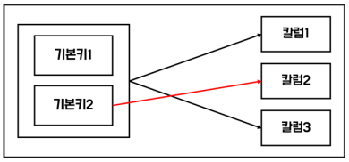
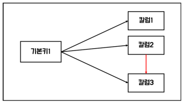

## 01. 성능 데이터 모델링의 개요
1. 성능 데이터 모델링: DB 성능향상을 위한 사항이 데이터 모델링에 반영되도록 하는 것
2. 수행 시점: 분석/설계 단계, 성능 데이터 모델링 시점이 늦어질수록 재업무 비용이 증가한다.
3. 고려 사항: 정규화 수행, DB 용량 산정과 트랜잭션 유형 파악을 통한 반정규화 수행, 정규화는 무조건 해야 된다.
## 02. 정규화와 성능
1. ``정규화``(Normalization): ``데이터 분해 과정``, ``이상현상(anomaly) 제거``
   * ``정규형``(NF; Normal Form): 정규화로 도출된 데이터 모델이 갖춰야 할 특성
2. 함수적 종속성(FD; Functional Dependency): 결정자와 종속자의 관계, 결정자의 값으로 종속자의 값을 알 수 있다.
   * 다치 종속(MVD; Multivalued Dependency): 여러 칼럼이 동일한 결정자의 종속자일 때
3. 정규화 이론: 1) 1차 2차 3차 보이스코드 정규화는 함수적 종속성에 근거 2) 4차 정규화는 다치 종속을 제거 3) 5차
   정규화는 조인에 의한 이상현상을 제거하여 정규화를 수행한다.
   * ``1차 정규화`` : 속성의 원자성 확보, 다중값 속성을 분리한다.
   * ``2차 정규화`` : 부분 함수 종속성 제거, 일부 기본키에만 종속된 속성을 분리한다. 기본키가 하나의 칼럼일 때 생략 가능하다.
     * 부분 함수 종속성 
   * ``3차 정규화``: 이행 함수 종속성 제거, 서로 종속관계가 있는 일반속성을 분리, 주식별자와 관련성이 가장 낮다.
     * 이행 함수 종속성 
   * ``보이스코드 정규화``(BCNF; Boyce-Codd Normal Form): 후보키가 기본키 속성 중 일부에 함수적 종속일 때
     다수의 주식별자를 분리한다.
   * ``4차 정규화``, ``5차 정규화``: 다치 종속 분리, 결합 종속 분리
4. ``정규화와 성능``: 정규화는 입출력 데이터의 양을 줄여 성능을 향상시킨다.
   * ``정규화로 인한 성능 향상``: 입력/수정/삭제 시 성능은 항상 향상된다.
     - 유연성 증가: High Cohesion & Loose Coupling 원칙에 충실해진다.
     - 재활용 가능성 증가: 개념이 세분화된다.
     - 데이터 중복 최소화
   * ``정규화로 인한 성능 저하``: 조회 시 처리 조건에 따라 성능 저하가 발생할 수도 있다.
     - 데이터 조회 시 조인을 유발하여 CPU와 메모리를 많이 사용하게 된다.
       + 반정규화로 해결 가능
       + 조인이 발생하더라도 인덱스를 사용하여 조인 연산을 수행하면 성능 상 단점이 거의 없고, 정규화를 통해 필요한 인덱스의 수를 줄일 수 있다.
       + 정규화를 통해 소량의 테이블이 생성된다면 성능 상 유리할 수 있다.
## 03.``반정규화와 성능``
1. 반정규화(Denormalization): ``데이터 중복을 허용하여 조인을 줄이는 DB 성능 향상 방법, 데이터의 무결성을 희생하고
   조회 성능 향상``
2. 절차
   1. 반정규화 대상 조사: 데이터 처리 범위 및 통계성 등 조사
   2. 다른 방법 검토: 1) 뷰 2) 클러스터링 3) 인덱스 4) 애플리케이션
   3. 반정규화 적용: 정규화 수행 후 반정규화 수행
3. 기법
   * ``***테이블 반정규화***``
     - ``테이블 병합``
       + 1:1 관계 테이블 병합
       + 1:N 관계 테이블 병합: 많은 데이터 중복 발생
       + 슈퍼타입/서브타입 테이블 병합 
     - ``테이블 분할``: 1) 수직분할 2) 수평분할
     - ``테이블 추가``
       + 중복 테이블: 업무나 서버가 다를 때 중복 테이블 생성 (원격조인 제거)
       + 통계 테이블
       + 이력 테이블
       + 부분 테이블: 자주 이용하는 칼럼으로 구성된 테이블 생성
   * ``***칼럼 반정규화***``
     - 중복 칼럼 추가
     - 파생 칼럼 추가: 필요한 값 미리 계산한 칼럼 추가
     - 이력 테이블 칼럼 추가
     - PK에 의한 칼럼 추가: PK의 종속자를 일반속성으로 생성
     - 응용 시스템의 오작동을 위한 칼럼 추가
   * ``***관계 반정규화***``: 데이터 무결성 보장 가능
     - 중복 관계 추가
## 04. ``대용량 데이터에 따른 성능``: 테이블 반정규화 중 테이블 분할 관련
1. ``블록``: ``테이블의 데이터 저장 단위``
2. ``대량 데이터 발생으로 인한 현상``: 블록 I/O 횟수 증가 → 디스크 I/O 가능성 상승 (디스크 I/O 시 성능 저하)
   * 로우 체이닝(Row Chaining): 행 길이가 너무 길어 여러 블록에 걸쳐 저장되는 현상
   * 로우 마이그레이션(Row Migration): 수정된 데이터가 해당 블록이 아닌 다른 블록의 빈 공간에 저장되는 현상
3. ``테이블 분할``: 반정규화 기법
   * 수직분할: 칼럼 단위로 테이블을 분할하여 I/O를 감소시키며, 너무 많은 수의 칼럼이 있는 경우 사용
   * 수평분할: 행 단위로 테이블을 분할하여 I/O를 감소시킨다.
4. ``파티셔닝(Partitioning)``: 테이블 수평분할 기법, 논리적으로는 하나의 테이블이지만 물리적으로 여러 데이터 파일에 분산 저장, 데이터 조회 범위를 줄여 성능 향상
   * Range Partition: 데이터 값의 범위를 기준으로 분할
   * List Partition: 특정한 값을 기준으로 분할
   * Hash Partition: 해시 함수를 적용하여 분할, DBMS가 알아서 분할 관리, 데이터 위치를 알 수 없다.
   * Composite Partition: 여러 파티션 기법을 복합적으로 사용하여 분할
   * 파티션 인덱스(Partition Index) 
     + Global Index, Local Index: 여러 파티션에서 단일 인덱스 사용, 파티션 별로 각자 인덱스 사용
     + Prefixed Index, Non-Prefixed Index: 파티션키와 인덱스키 동일, 파티션키와 인덱스키 구분
