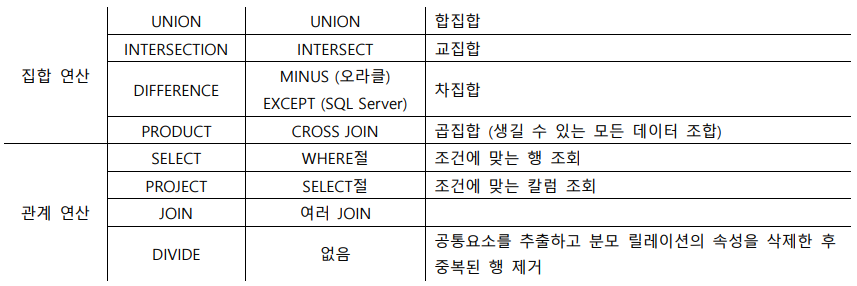
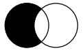
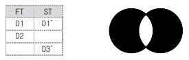
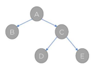
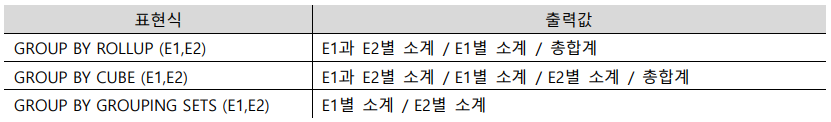
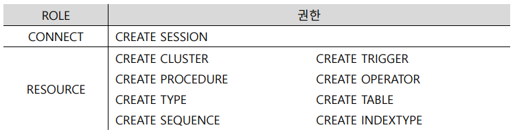

## 01. 표준조인
1. SQL에서의 연산

2. ANSI/ISO SQL의 조인 형태: INNER JOIN, NATURAL JOIN, CROSS JOIN, OUTER JOIN
3. NATURAL JOIN: 같은 이름을 가진 칼럼 전체에 대한 등가 조인, USING 조건절이나 ON 조건절 사용 불가, 같은
   데이터 유형 칼럼만 조인 가능, 앨리어스나 테이블명 사용 불가
   ```sql
    SELECT 칼럼s FROM 테이블1 NATURAL JOIN 테이블2;
   ```
4. INNER JOIN: 행에 동일한 값이 있는 칼럼 조인, JOIN의 디폴트 옵션, USING 조건절이나 ON 조건절 필수, CROSS JOIN이나 OUTER JOIN과 동시 사용 불가, 두 테이블에 동일 이름 칼럼이 있을 경우 SELECT절에 앨리어스 필수
   ```sql
   SELECT 칼럼s FROM 테이블1 A, 테이블2 B WHERE A.칼럼=B.칼럼; 
   SELECT 칼럼s FROM 테이블1 A INNER JOIN 테이블2 B ON A.칼럼=B.칼럼; (ANSI/ISO 표준)
   ```
   * USING 조건절: 같은 이름을 가진 칼럼 중 등가 조인 대상 칼럼 선택, SQL Server에서는 지원하지 않는다, 조건절에 앨리어스나 테이블명 불가
     ```sql
     SELECT 칼럼s FROM 테이블1 A JOIN 테이블2 B USING (칼럼명);
     ```
    * ON 조건절: 다른 이름을 가진 칼럼 간 조인 가능 (앨리어스나 테이블명 필수), 괄호는 의무사항 아니다
     ```sql
     SELECT 칼럼s FROM 테이블1 A JOIN 테이블2 B ON (A.칼럼=B.칼럼); 
     ```
5. CROSS JOIN: 가능한 모든 조합으로 조인
   ```sql
   SELECT 칼럼 FROM 테이블1, 테이블2; (조인 조건이 없을 때 발생 ↔ NATURAL JOIN은 명시해야 된다)
   ```
6. OUTER JOIN: 조인 조건에서 행에 동일한 값이 없는 칼럼 조인, USING 조건절이나 ON 조건절 필수 
   * LEFT OUTER JOIN: 좌측 테이블 데이터 조회 후 우측 테이블 조인 대상 데이터 조회 
     ```sql
     SELECT 칼럼s FROM 테이블1 A, 테이블2 B A.칼럼=B.칼럼(+);
     
     SELECT 칼럼s FROM 테이블1 A
     LEFT OUTER JOIN 테이블2 B
     ON (A.칼럼=B.칼럼);
     ```  
   * RIGHT OUTER JOIN 오른쪽 결과가 더 긴 것
   * FULL OUTER JOIN: LEFT와 RIGHT OUTER JOIN 포함
     ```sql
     SELECT 칼럼s FROM 테이블1 A
     FULL OUTER JOIN 테이블2 B
     ON (A.칼럼=B.칼럼);
     ```
     - 결과 : 
## 02. 집합 연산자
1. 집합 연산자: 조인 없이 여러 테이블의 관련 데이터를 조회하는 연산자 
2. UNION: 합집합, 칼럼 수와 데이터 타입이 모두 동일한 테이블 간 연산만 가능
   ```sql
   SELECT 칼럼명 FROM 테이블명 A WHERE 조건절 UNION SELECT 테이블명 WHERE 조건절;
   ```
   * UNION ALL: 중복된 행도 전부 출력하는 합집합, 정렬 안함 (↔ UNION은 정렬을 유발함), 집합 연산자에 속한다
     ```sql
     SELECT 칼럼명 FROM 테이블명 A WHERE 조건절 UNION ALL SELECT 테이블명 WHERE 조건절;
     ```   
3. INTERSECT: 교집합
   ```sql
   SELECT 칼럼명 FROM 테이블명 A WHERE 조건절MS INTERSECT SELECT 테이블명 WHERE 조건절;
   ```
4. MINUS, EXCEPT: 차집합
   ```sql
   SELECT 칼럼명 FROM 테이블명 A WHERE 조건절 MINUS SELECT 테이블명 WHERE 조건절;
   ```
## 03. 계층형 질의와 ۿ프 조인
1. 계층형 질의(Hierarchical Query): 계층형 데이터를 조회하기 위해 사용, Oracle에서 지원한다. 
   * 계층형 데이터: 엔터티를 순환관계 데이터 모델로 설계할 때 발생한다
   * CONNECT BY : 트리 형태의 구조로 쿼리 수행 (루트 노드부터 하위 노드의 쿼리를 실행한다) 상사 이름과 사람 이름을 조인하여 상사 밑에 넣기
     - START WITH : 시작 조건 지정
     - CONNECT BY PRIOR : 조인 조건 지정
       + LEVEL : 검색 항목의 깊이, 최상위 계층의 레벨은 1
       + CONNECT_BY_ROOT : 최상위 계층 값 표시
       + CONNECT_BY_ISLEAF : 최하위 계층 값 표시
       + SYS_CONNECT_BY_PATH : 계층 구조의 전개 경로 표시
     - CONNECT BY절의 루프 알고리즘 키워드
       + NOCYCLE : 순환구조의 발생지점까지만 전개
       + CONNECT_BY_ISCYCLE : 순환구조 발생지점 표시 (부모 노드와 자식 노드가 같을 때 1 아니면 0 출력)
   * LPAD : 계층형 조회 결과를 명확히 하기 위해 사용 (LEVEL 값을 이용하여 결과 데이터 정렬) 
2. SQL Server 계층형 질의: CTE(Common Table Expression)로 재귀 호출
3. 셀프 조인: 한 테이블 내에서 두 칼럼이 연관 관계가 있는 경우, 앨리어스 필수
## 04. 서브쿼리
1. 서브쿼리: 하나의 SQL문 안의 SQL문
2. 종류
   * 동작 방식에 따른 분류
     - 비연관 서브쿼리: 메인쿼리 칼럼을 가지고 있지 않는 서브쿼리, 메인쿼리에 값을 제공하기 위한 목적으로 주로 사용한다
       + Access Subquery: 제공자 역할
       + Filter Subquery: 확인자 역할
       + Early Filter Subquery: 데이터 필터링 역할
     - 연관 서브쿼리(Associative Subquery): 메인쿼리의 결과를 조건이 맞는지 확인하기 위한 목적으로 주로 사용한다
   * 반환 데이터 형태에 따른 분류 
     - 단일 행 서브쿼리: 실행 결과가 1건 이하인 서브쿼리, 단일 행 비교 연산자와 함께 사용
     - 다중 행 서브쿼리: 실행 결과가 여러 건인 서브쿼리, 다중 행 비교 연산자와 함께 사용
       + 다중 행 비교 연산자
         + IN : 서브쿼리의 결과 중 하나의 값이라도 동일하다는 조건
         + ANY : 서브쿼리의 결과 중 하나의 값이라도 만족한다는 조건
         + ALL : 서브쿼리의 모든 결과값을 만족한다는 조건
         + EXISTS : 서브쿼리의 결과를 만족하는 값이 존재하는지 여부를 확인하는 조건, ‘WHERE EXISTS (SELECT ~)’ (항상 연관 서브쿼리로 사용)
     - 다중 칼럼 서브쿼리: 실행 결과로 여러 칼럼 반환, 주로 메인쿼리의 조건과 비교하기 위해 사용 (비교하고자 하는 칼럼의 개수와 위치가 동일해야 한다)
3. 스칼라 서브쿼리: 값 하나를 반환하는 서브쿼리, SELECT절에 사용하는 서브쿼리
4. 뷰: 가상의 테이블, FROM절에 사용하는 뷰는 인라인 뷰(Inline View)라고 한다
   * 장점
     - 독립성: 테이블 구조 변경 자동 반영
     - 편리성: 쿼리를 단순하게 작성할 수 있다, 자주 사용하는 SQL문의 형태를 뷰로 생성하여 사용할 수 있다
     - 보안성: 뷰를 생성할 때 칼럼을 제외할 수 있다
5. WITH: 서브쿼리를 이용하여 뷰로 사용할 수 있는 구문 
   ```sql
   WITH 뷰명 AS (SELECT ~)
   ```
   
## 05. 그룹 함수
1. ANSI/ISO 표준 데이터 분석 함수: 집계 함수, 그룹 함수, 윈도우 함수
2. 그룹 함수(Group Function): 합계 계산 함수, NULL을 빼고 집계함 (~ 집계 함수), 결과값 없는 행은 출력 안한다
   * ROLLUP : GROUP BY로 묶인 칼럼의 소계 계산, 계층 구조로 GROUP BY의 칼럼 순서가 바뀌면 결과 값 바뀐다
   * CUBE : 조합 가능한 모든 값에 대해 다차원 집계
   * GROUPING SETS : 특정 항목에 대한 소계 계산, GROUP BY의 칼럼 순서와 무관하게 개별적으로 처리한다
     
3. GROUPING : 그룹 함수에서 생성되는 합계를 구분해주는 함수, 소계나 합계가 계산되면 1 아니면 0 반환
## 06. 윈도우 함수
1. 윈도우 함수(Window Function): 여러 행 간의 관계 정의 함수, 중첩 불가
   * 순위 함수
     - RANK : 중복 순위 포함
     - DENSE_RANK : 중복 순위 무시 (중간 순위를 비우지 않는다)
     - ROW_NUMBER : 단순히 행 번호 표시, 값에 무관하게 고유한 순위 부여
   * 일반집계 함수: SUM, MAX, MIN, AVG, COUNT
   * 행 순서 함수
     - FIRST_VALUE, LAST_VALUE : 첫 값, 끝 값
     - LAG, LEAD : 이전 행, 이후 행 (Oracle) 랙릿
       + ‘LEAD(E,A)’는 E에서 A번째 행의 값을 호출하는 형태로도 쓰임 (A의 기본값은 1)
   * 비율 관련 함수
     - PERCENT_RANK() : 백분율 순서
     - CUME_DIST() : 현재 행 이하 값을 포함한 누적 백분율
     - NTILE(A) : 전체 데이터 A등분
     - RATIO_TO_REPORT : 총합계에 대한 값의 백분율
2. 윈도우 함수 문법
   ```sql
   SELECT 윈도우함수(A) OVER (PARTITION BY 칼럼 ORDER BY 칼럼 윈도잉절) FROM 테이블명;
   ```
   * PARTITION BY : 그룹핑 기준
   * ORDER BY : 순위 지정 기준
   * 윈도잉절 : 함수의 대상이 되는 행 범위 지정
     - BETWEEN A AND B : 구간 지정
       + N PRECEDING, N FOLLOWING : N번째 앞 행, N번째 뒤 행
       + UNBOUNDED PRECEDING, UNBOUNDED FOLLOWING : 첫 행, 끝 행
       + CURRENT ROW : 현재 행
     - ROWS, RANGE : 행 지정, 값의 범위 지정
## 07. DCL
1. DCL: 유저를 생성하거나 권한을 제어하는 명령어, 보안을 위해 필요하다
   * GRANT: 권한 부여
     ```sql
     GRANT 권한 ON 오브젝트 TO 유저명;
     ```
   * REVOKE: 권한 제거 
     ```sql
     REVOKE 권한 ON 오브젝트 TO 유저명;
     ```   
2. 권한(Privileges)
   * SELECT, INSERT, UPDATE, DELETE, ALTER, ALL : DML 관련 권한
   * REFERENCES : 지정된 테이블을 참조하는 제약조건을 생성하는 권한
   * INDEX : 지정된 테이블에서 인덱스를 생성하는 권한
3. Oracle의 유저
   * SCOTT: 테스트용 샘플 유저
   * SYS: DBA 권한이 부여된 최상위 유저
   * SYSTEM: DB의 모든 시스템 권한이 부여된 DBA
4. ROLE: 권한의 집합, 권한을 일일이 부여하지 않고 ROLE로 편리하게 여러 권한을 부여할 수 있다
   * Oracle의 ROLE
   
## 08. 절차형 SQL
1. 절차형 SQL: 일반적인 개발언어처럼 절차지향적인 프로그램을 작성할 수 있도록 제공하는 기능
   * SQL문의 연속적인 실행 및 조건에 따른 분기처리를 이용하여 특정 기능을 수행하는 저장 모듈 생성 가능
   * PL/SQL (Oracle)
     - 블록 구조: 블록 내에 1) DML 2) 쿼리 3) IF나 LOOP 등을 사용할 수 있다
       + Declare(선언부): 블록에서 사용할 변수나 인수에 대한 정의
       + Begin(실행부): 처리할 SQL문 정의
       + Exception(예외 처리부): 블록에서 발생한 에러 처리 로직 정의, 유일한 선택 항목 
   * T-SQL (SQL Server)
2. 프로시저(Procedure) : 일련의 쿼리를 마치 하나의 함수처럼 실행하기 위한 쿼리의 집합, 즉 특정 작업을 위한 쿼리들의 블록을 뜻한다.
3. 사용자 정의 함수: 절차형 SQL을 로직과 함께 DB 내에 저장해 놓은 명령문 집합, RETURN을 통해 반드시 하나의 값 반환 (↔ 프로시저) 
4. 트리거(Trigger): DML문이 수행되었을 때 자동으로 동작하는 프로그램 (↔ 프로시저는 EXECUTE로 실행함), DCL와
   TCL 실행 불가 (↔ 프로시저는 사용 가능하다)