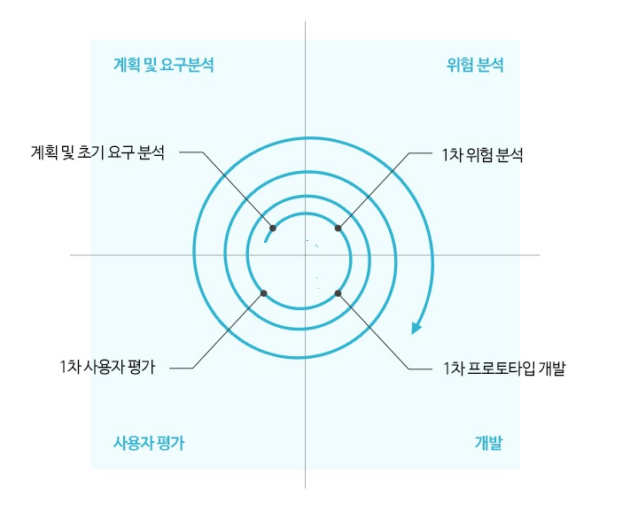
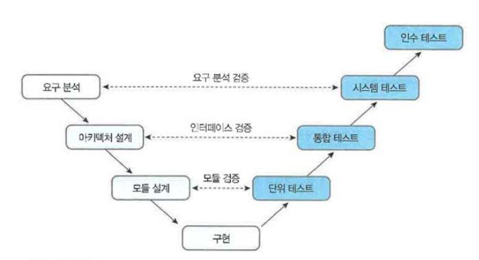

# Chapter01.소프트웨어 공학 개념
## Section01. 소프트웨어 공학
1. 소프트웨어 공학
   1) 소프트웨어 공학의 정의
      * 소프트웨어 위기를 극복하고 효율적으로 품질 높은 소프트웨어를 개발하기 위한 학문
      * 소프트웨어를 개발하는 데 있어서의 방법 도구, 이론을 모두 포함한 포괄적인 개념
   2) 소프트웨어의 위기의 원인
      * 소프트웨어 특성에 대한 이해 부족
      * 소프트웨어 관리 방법론 부재
      * 올바른 설계 없이 프로그래밍에만 치중
      * 소프트웨어 개발에 대한 전문적 교육 부족
      * 작업일정과 비용의 추정치가 부정확
   3) 소프트웨어의 위기의 결과
      * 개발 인력의 부족과 인건비 상승
      * 소프트웨어 성능 및 신뢰성 부족
      * 개발 기간 및 비용의 증가
      * 소프트웨어 품질저하 및 유지보수 비용 증가
      * 소프트웨어의 생산성 저하
2. 소프트웨어 공학의 3R
   1) 소프트웨어 공학의 3R의 정의
      * 완성된 소프트웨어를 기반으로 역공학, 재공학, 재사용을 통해 소프트웨어의 생산성을 극대화 하는 기법
   2) 소프트웨어 3R의 필요성
      * 소프트웨어 유지보수 효율성 향상 및 비용 절감
      * 소프트웨어 개발 생산성 향상
      * 소프트웨어 이해, 변경, 테스트 용이
      * 소프트웨어 변경 요구사항에 대한 신속한 대응
      * 소프트웨어 위기 극복
   3) 역공학(Reverse Engineering)
      * 기존 개발된 시스템을 CASE(Computer Adied Software Engineering) 도구를 이용하여 요구 분석서, 설계서 등의 문서로 추출하는 작업
      * 개발 단계를 역으로 올라가 기존 개발된 시스템의 코드나 데이터로부터 설계 명세서나 요구 분석서 등을 도출하는 작업
      * 역공학의 특징
        - 상용화되거나 기 개발된 소프트웨어의 분석을 도아줌
        - 기존 시스템의 자료와 정보를 설계 수준으로 분석해 유지보수성 향상
        - 기존 시스템 정보를 저장소(Repository)에 보관하여 CASE의 사용을 용이하게 함.
   4) 재공학(Re-Engineering)
      * 소프트웨어의 위기를 해결하기 위해 개발의 생산성이 아닌 유지보수의 생산성으로 해결하려는 방법
      * 기존 소프트웨어를 폐기하지 않고 기능을 개선시키거나 새로운 소프트웨어로 재활용하는 소프트웨어 재사용 공법
      * 재공학의 특징
        - 소프트웨어의 유지보수성과 품질을 향상시킴
        - 부작용을 미리 발견하여 위험부담을 제거하고, 복구비용을 절감시킴
        - 예방 유지보수(Preventive Maintenance) 측면에서 소프트웨어 위기 해결
      - 재공학 과정
        - |제목|내용|
          |---|---|
          |분석|기존 소프트웨어의 명세서를 확인하여 재공학 대상을 선정|
          |재구성|소프트웨어 구조를 향상시키기 위해 코드를 재구성, 소프트웨어의 외적인 기능은 변경되지 않음|
          |역공학|소프트웨어의 소스코드를 가지고 설계 수준을 분석|
          |이관|기존 소프트웨어를 다른 운영체재, 프레임워크 등에서 사용할 수 있도록 변환|
   5) 재사용(Reuse)
      * 이미 개발되어 있는 소프트웨어의 전체 또는 일부분을 다시 사용
      * 재사용의 특징
        - 소프트웨어 개발 시간과 비용 절감
        - 프로젝트 실패 위험률 감소
        - 소프트웨어 개발자의 생산성 증가
        - 소프트웨어 구축에 대한 지식 공유
      * 재사용의 특징
        - 소프트웨어 개발 시간과 비용 절감
        - 프로젝트 실패 위험률 감소
        - 소프트웨어 개발자의 생산성 증가
        - 소프트웨어 구축에 대한 지식 공유
      * 재사용의 범위
        - 함수와 객체 재사용 : 클래스나 함수 단위로 구현한 소스코드를 재사용
        - 컴포넌트 재사용
        - 애플리케이션 재사용
      * 재사용 방법
        1) 합성 중심(Conposition Based, 블록 구성)
           - 전자 칩과 같은 소프트웨어 부품, 즉 블록(모듈)을 만들어서 끼워 맞추어 소프트웨어를 완성시키는 방법
        2) 생성 중심(Generation Based, 패턴 구성)
           - 추상화 형태로 쓰여진 명세를 구체화하여 프로그램을 만드는 방법
3. 소프트웨어 개발 단계
    #### [계획] -> [요구사항 분석] -> [설계] -> [구현] -> [테스트] -> [유지보수]
   1) 계획
      * 무엇을 개발할 것인지 명확하게 정의
      * 개발 범위를 결정
      * 시스템의 성격을 파악하여 비용과 기간을 예측
   2) 요구사항 분석(Requirements Analysis)
      * 개발할 소프트웨어의 기능과 제약조건, 목표 등을 고객과 함께 정의
      * 요구사항의 정확한 이해 및 요구사항 유도
      * 과다하거나 불필요한 요구사항에 대한 협상 및 조율
      * 요구사항의 적합성 검토 및 향후 예측
      * 현재 실행 환경에 대한 분석
   3) 소프트웨어 설계(Design)
      * 시스템이 어떻게 동작하는지를 정의
      * 요구사항 분석 단게에서 산출된 요구사항을 기준으로 입력자료, 처리내용, 출력자료 등을 정의
      * 설계 구분
        - 시스템 구조 설계 : 모듈 간의 관계와 구조 설계
        - 프로그램 설계 : 각 모듈의 처리 절차나 알고리즘 설계
        - 사용자 인터페이스 설계 : 사용자가 시스템을 사용하기 위해 보여지는 부분을 설계
   4) 구현(Development)
      * 프로그래밍 언어를 이용하여 실제로 프로그램을 작성
      * 코딩과 디버깅이 이루어지며, 단위(모듈) 테스트를 진행
   5) 테스트(Test)
      * 구현된 소프트웨어가 요구사항을 만족하는지 검사
      * 실행 결과가 예상 결과와 맞는지 검사하고 평가
      * 테스트 계획, 통합 테스트 결과서 등을 작성
   6) 유지보수(Maintenance)
      * 소프트웨어를 사용하며 문제점을 수정하고, 새로운 기능을 추가
      * 소프트웨어를 좀 더 발전시키는 단계
## Section02. 소프트웨어 개발 방법론
1. 소프트웨어 개발 방법론 개념
   * 소프트웨어 개발에 필요한 과정(절차, 방법, 산출물, 기법, 도구)들을 체계적으로 정리한 것
2. 소프트웨어 개발 방법론 종류
   1) 구조적 방법론
      * 절차지향 소프트웨어 개발 방법론
      * 제한된 구조에서 코드 생성 및 순차적 실행
      * 구조적 방법론 기본 개발 과정
        * | 과정        | 설명                                 |
          |-----------|------------------------------------|
          | 요구사항 분석   | 고객의 요구사항을 끌어내며 명세화 하는 과정           |
          | 구조적 분석    | 고객이 원하는 기능/환경/데이터를 종합하여 데이터 흐름도 작성 |
          | 구조적 설계    | 모듈 중심 설계 과정                        |
          | 구조적 프로그래밍 | 순차, 선택, 반복의 논리 구조 구성으로 프로그램 작성     |
      * 구조적 방법론 구성요소 : 데이터 흐름도(DFD), 자료사전(DD), 상태전이도(STD), 소단위 명세서(Minispec)
   2) 정보공학 방법론
      * 기업의 주요 부분을 계획, 분석, 설계, 구축에 정형화된 기법들을 상호 연관성 있게 통합, 적용하는 데이터 중심 방법론
      * 빠른 결과물 확인이 가능하며 단순 S/W 개발이 아닌 기업의 경영전략에 초점을 둔다.
      * 정보공학 방법론 기본 개발 과정
        * | 과정          | 설명                                                                                                            |
          |-------------|---------------------------------------------------------------------------------------------------------------|
          | 정보전략계획 수립단계 | 기업의 중장기 정보화 전략 수립                                                                                             |
          | 업무영역 분석단계   | 업무 영역별 데이터와 프로세스 모델링 및 연관분석 데이터 모델링 : 개체 관계도(ERD) 프로세스 모델링 : 프로세스 계층도(PHD), 프로세스 의존도(PDD), 자료흐름도(DFD) |
          | 시스템 설계단계    | 프로세스와 데이터 설계                                                                                                  |
          | 시스템 구축단계    | 데이터 상세 설계 프로그램 코딩                                                                                         |
   3) 객체지향 개발 방법론
      * 현실세계의 개체(Entity)를 속성(Attribute)과 메서드(Method)형태로 표현
      * 객체, 클래스 간의 관계를 식별하여 설계 모델로 변환하는 방법론
      * 분석과 설계, 구현의 전 과정을 객체 중심으로 개발
      * 전체 프로세스 방향성 유지와 상속에 의한 재사용성 향상
      * 특징 : 캡슐화, 정보은닉, 상속, 다형성, 추상화
   4) CBD(Component Based Development) 분석 방법론
      * 재사용 가능한 컴포넌트의 개발 또는 상용 컴포넌트를 조합해 애플리케이션 개발
      * 새로운 기능 추가가 쉬운 확장성
      * 생산성 및 품질이 향상
      * 시스템 유지보수 비용 최소화
   5) 애자일 방법론
      * 기존 방법론들이 절차를 중시한 나머지, 변화에 빠른 대응을 할 수 없다는 단점 개선을 위해 등장
      * 애자일 방법론 종류 : XP(eXtreme Programming), SCRUM, FDD, Crystal 방법론 등
      * 애자일 선언문
        * | 공정과 도구보다 개인과 상호작용을 포괄적인 문서보다 작동하는 소프트웨어를 계약 협상보다 고객과의 협력을 계획을 따르기보다 변화에 대응하기를 왼쪽에 있는 것들도 가치가 있지만, 우리는 오른쪽에 있는 것들에 더 높은 가치를 둔다. |
          |----------------------------------------------------------------------------------------------------------------------------------------------------|
   6) 개발 방법론 선택 기준
      * 프로젝트 특성 및 규모
      * 프로젝트 참여자의 수준
      * 가용 자원의 정도(인력, 장비, 시간, 비용)
      * 요구사항의 명확도
      * 위험도
3. 소프트웨어 개발 모델
   1) 폭포수 모델(Waterfall Model)
      * 계획, 분석, 설계, 구현, 테스트, 운영 등 전 과정을 순차적으로 접근하는 개발모델
      * 각 단계의 검증 후에 다음 단계를 진행한다.
      * 각 단계가 순차적으로 진행되며, 병행되거나 거슬러 반복 진행되지 않는다.
      * 가장 오래된 모형으로 적용 경험과 성공사례가 많다.
      * 요구사항의 변경이 어렵다.
      * 단계별 정의가 분명하고, 단계별 산출물이 명확하다.
   2) 프로토타이핑 모델(Prototyping Model)
      * 고객이 요구한 주요 기능을 프로토타입으로 구현하여 완성해가는 모델
      * 개발자가 구축할 소프트웨어의 모델을 사전에 만들어 요구사항을 효과적으로 유도하고 수집한다.
      * 프로토타이핑에 의해 만들어진 프로토타입은 폐기될 수 있고, 재사용될 수도 있다.
      * 순서
        * [계획수립]->[프로토타입 개발]->[사용자 평가]->[구현]->[인수]
      * 장/단점
        * | 장점  | 사용자의 요구사항을 충실히 반영할 수 있다. 비교적 빠른 기간 안에 사용자가 평가할 수 있는 결과물이 만들어진다. 오류를 초기에 발견할 수 있다. 변경이 용이하다. |
          |-----|---------------------------------------------------------------------------------------------------------|
          | 단점  | 최종적으로 시간과 비용이 훨씬 많이 들 수 있다. 사용자가 실제 제품과 혼동할 수 있다. 문서작성이 소홀해질 수 있다. 프로토타입 폐기에 따른 비용이 든다      |
   3) 나선형 모델(Spiral Model)
      * 폭포수 모델과 프로토타이핑 모델의 장점을 수용하고, 위험 분석을 추가한 점증적 개발 모델
      * 프로젝트 수행 시 발생하는 위험을 관리하고 최소화하려는 것이 목적
      * 대규모 프로젝트 및 위험 부담이 큰 시스템 개발에 적합
      * 순서
        
      * 장/단점
        * | 장점  | 위험분석 과정으로 위험성이 큰 프로젝트를 수행할 수 있다. 고객의 요구사항을 보다 더 상세히 적용할 수 있다. |
          |-----|-------------------------------------------------------------------|
          | 단점  | 시간과 비용이 많이 들 수 있다. 반복 단계가 길어질수록 프로젝트 관리가 어렵다.                 |
   4) RAD(Rapid Application Development) 모델
      * 매우 짧은 개발 주기를 강조하는 점진적 소프트웨어 개발 방식
      * 강력한 소프트웨어 개발 도구를 이용하여 매우 짧은 주기로 개발을 진행하는 순차적 소프트웨어 개발 프로세스
      * CASE(Computer Adied Software Engineering) 도구를 이용해 시스템을 개발
      * 개발 기간이 60일~90일 정도로 짧다.
      * 기술적으로 위험이 적고 빠른 개발이 요구될 때 사용이 적합
   5) V모형
      * 폭포수 모델에 시스템 검증과 테스트 작업을 강조
      * 높은 신뢰성이 요구되는 분야에 적합함
        * 
   6) 4세대 기법(4th Generation Techniques)
      * 요구사항 명세서로부터 원시코드를 자동으로 생성할 수 있게 해주는 모델
4. 애자일(Agile) 방법론
   1) 애자일 방법론의 개념
      * 신속한 반복 작업을 통해 실제 작동 가능한 소프트웨어를 개발하여 지속적으로 제공하기 위한 소프트웨어 개발 방식
      * 작동하는 소프트웨어의 작은 구성 요소를 신속하게 제공
      * 애자일 개발 방법론이란 어느 특정 개발 방법론을 가리키는 말은 아니고 애자일 개발을 가능하게 해주는 다양한 방법론 전체를 일컫는 말
      * 경량(Lightweight) 프로세스라고도 함
   2) 애자일 프로세스의 등장배경
      * 기존 소프트웨어 개발 방법론의 문제점을 개선하기 위해서 등장
      * 기존 소프트웨어 개발 방법론의 주요 문제점
        - 계약과 계획준수를 중요시하는 갑과 을의 문화가 지배적
        - 문서를 중시함
        - 프로세스나 툴 적용을 중시함
        - 상과가 나쁠 때 계획 또는 통제의 실패로 인식함
   3) 애자일 선언문
      * 공정과 도구보다 개인과 상호작용을
      * 포괄적인 문서보다 작동하는 소프트웨어를
      * 계약 협상보다 고객과의 협력을
      * 계획을 따르기보다 변화에 대응하기를
      * 우리는 왼쪽 항목의 가치를 인정하면서도 오른쪽 항목을 더 중요하게 여긴다.
   4) 애자일 특징
      * 고객과 개발자의 지속적인 소통을 통하여 변화하는 요구사항을 신속하게 수용
      * 개발자 개인의 가치보다는 팀의 목적을 우선시하되 고객의 의견을 가장 우선
      * 팀원들과의 주기적인 회의와 제품을 시연함으로써 소프트웨어를 점검
      * 작업 계획을 짧게 세우고, 반복적으로 수행함으로써 변화에 유연하게 대처
   5) 애자일 방법론 종류
      1) XP(eXtream Programming)
         1) 특징
            * 문서보다는 코드를 중시하고, 5가지 핵심가치와 12개 실천 항목이 존재
            * 개발을 세분화하여 1~3주의 반복으로 개발을 진행
         2) XP 5가지 핵심가치
            * 용기 : 고객의 요구사항 변화에 능동적인 대처
            * 존중 : 개발자의 역량을 존중하고 충분한 권한과 권리를 부여
            * 의사소통 : 개발자, 관리자, 고객 간의 원활한 의사소통
            * 피드백 : 의사소통에 따른 즉각적인 피드백
            * 단순성 : 부가적 기능, 사용되지 않는 구조와 알고리즘 배제
         3) 12가지 실천사항
            * //TODO Add table!
      2) 스크럼(Scrum)
         1) 특징
            * 소프트웨어에 포함될 기능-개선점에 대한 우선순위를 부여
            * 개발 주기는 30일 정도로 조절하고 개발 주기마다 실제 동작할 수 있는 결과를 제공
            * 개발 주기마다 적용할 기능이나 개선에 대한 목록을 작성
            * 항상 팀 단위로 생각하고, 매일 15분 정도의 회의
         2) 스크럼의 주요개념
            * //TODO Add table!
      3) 그 외 애자일 방법론
         1) 크리스털(Crystal)
            * 프로젝트의 규모와 영향의 크기에 따라서 여러 종류의 방법론을 제공
         2) FDD(Feature-Driven Development)
            * feature마다 2주 정도의 반복 개발을 실시
            * 신규 기능 단위로 하는 개발 방법론
         3) ASD(Adaptive Software Development)
            * 합동 애플리케이션 개발을 사용하는 방법론
            * 소프트웨어 개발을 혼란 자체로 규정하고, 혼란을 전제로 그에 적응할 수 있는 소프트웨어 방법을 제시하기 위해 만들어진 방법론
         4) 린(Lean)
            * 도요타 린 시스템 품질기법을 소프트웨어 개발 프로세스에 적용해서 낭비 요소를 제거하여 품질을 향상시킨 방법론
5. IT 서비스 관리
   1) SLM(Service Level Management)
      * 서비스 수준을 정량적으로 측정하고, 실적을 평가하여 미흡한 부분을 개선함으로써 서비스의 품질을 높이는 일련의 관리 및 활동
   2) SLA(Service Level Agreement)
      * 소프트웨어 수요자와 공급자 사이의 상호 동의에 의해 서비스 수준을 명시적으로 정의한 문서
      * SLA 구성요소
         1) 업무 목표/범위 : 서비스 정의, 목적, SLA의 범위
         2) 성과 지표 : 최소한의 서비스 기준, 성과 기준 설정
         3) 조정 절차 : 약정의 변경 절차, 유효기간
   3) ITSM(Information Technology Service Management)
      * 최종 사용자를 위한 IT 서비스를 구현, 전달 및 관리하기 위한 일련의 정책과 관행
      * 최종 사용자의 요구사항과 비즈니스 목표에 부합하는 방식으로 제공됨
      * 기술 중심의 운영에서 벗어나 서비스화 및 비즈니스 중심으로 재설계하여 합의된 서비스 수준(SLA)에 맞는 IT 서비스를 제공하는 것
   4) ITIL(IT Infrastructure Library)
      * IT 서비스를 쉽게 제공하고 관리할 수 있는 가이드 혹은 프레임워크
      * ITSM을 실현하는 도구 또는 방법

