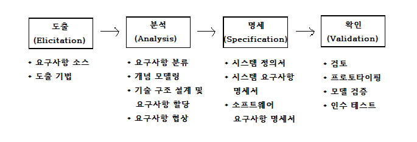
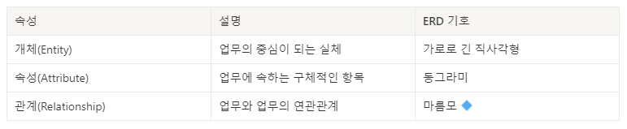
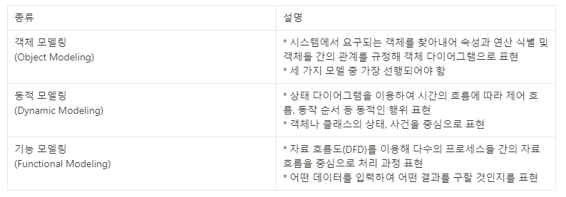

# Chapter02.프로젝트 계획 및 분석
## Section01. 프로젝트 계획
1. 프로젝트 관리
   1) 프로젝트 관리의 개념
      * 특정한 목적을 가진 프로젝트를 한정된 기간, 예산, 자원 내에서 사용자가 만족할 만한 제품을 개발하도록 행하는 기술적, 관리적 활동
   2) 프로젝트 관리의 목적
      * 납기준수, 예산준수, 품질 준수를 통한 고객 만족 달성
      * 고품질의 제품 개발 및 개발 절차 준수
   3) 프로젝트 핵심 관리대상(3P)
      1) 사람(People)
         * 프로젝트 관리에서 가장 기본이 되는 요소
      2) 문제(Problem)
         * 처리해야 할 내용을 분석하고 설계한다.
      3) 프로세스(Process)
         * 소프트웨어 개발에 필요한 골격을 제공한다.
   4) PMBOK(Project Management Body of Knowledge)
      * PMI(Project Management Institute)에서 제작한 프로젝트 관리 프로세스 및 지식 체계
      * PMBOK 5단계 프로세스 그룹
        1) 1단계 : 프로젝트 착수
           - 광범위한 프로젝트의 범위를 정하는 단계
        2) 2단계 : 프로젝트 계획
           - 프로젝트의 세부 범위를 정의하고, 프로젝트 관리 계획을 만드는 단계
           - 비용, 품질, 기간, 사용 가능한 자원이 포함됨
        3) 3단계 : 프로젝트 실행
           - 프로젝트가 개발되고 완료되는 단계
        4) 4단계 : 프로젝트 통제
           - 계획 대비 목표의 진척상황을 모니터링하고 성과를 측정하는 단계
        5) 5단계 : 프로젝트 종료
           - 프로젝트가 요구사항을 만족하는지 검증하고, 고객으로부터 확인받는 단계
2. 개발 비용 산정
   1) 소프트웨어 개발 비용 계획
      * 개발에 소요되는 인원, 자원, 기간 등으로 소프트웨어의 규모를 파악하여 필요한 비용을 산정한다.
      * 비용 계획 결정 요소
        - 개발자의 역량
        - 소프트웨어의 복잡도
        - 소프트웨어의 크기
        - 개발기간
        - 요구되는 신뢰도 수준
        - 기술 수준
      * 비용 산정 기법
        * | 기법        | 종류                                             |
          |-----------|------------------------------------------------|
          | 하향식 산정 기법 | 전문가 판단기법 델파이 기법                            |
          | 상향식 산정 기법 | 원시 코드 라인 수(LOC, Line Of Code) 개발 단계별 노력 기법 |
          | 수학적 산정 기법 | COCOMO 기법 PUTNAM 기법 FP(기능 점수) 기법       |
   2) 하향식 산정 기법(Top-Down)
      1) 전문가 기법
         * 조직 내 경험이 있는 전문가에게 비용 산정을 의뢰하여 산정하는 기법
      2) 델파이 기법
         * 여러 전문가의 의견을 종합하여 판단하는 기법
         * 특정 전문가의 주관적인 편견을 보완하기 위해 여러 명의 전문가로 구성된다.
   3) 상향식 산정 기법(Bottom-Up)
      1) LOC(원시코드 라인수) 기법
         * 각 기능의 원시 코드 라인 수의 비관치(가장 많은 라인 수), 낙관치(가장 적은 라인 수), 중간치(기대치, 평균 라인 수)를 측정 후 예측치를 구하고, 이를 이용해 비용을 산정하는 기법
         * 추정 LOC : (낙관치 + (4 * 중간치) + 비관치) / 6
      2) 단계별 인원수(M/M) 기법
         * 소프트웨어 개발 생명주기 각 단계뼐로 적용시켜 모든 단계의 비용을 산정하는 기법
         * LOC보다 정확성을 기하기 위한 기법
   4) 수학적 산정 기법
      1) COCOMO 기법
         * 개발할 S/W의 규모를 예측한 후 S/W 종류에 따라 각 비용 산정 공식에 대입하여 비용을 산정하는 기법
         * LOC 기법을 개발유형에 따라 다르게 적용한 기법
         * 개발 유형
           * | 개발 유형                        | 설명                                           |
             |------------------------------|----------------------------------------------|
             | 조직형 (Organic Mode)       | 5만 라인 이하의 프로젝트 일반 업무용 소프트웨어              |
             | 반분리형 (Semidetached Mode) | 30만 라인 이하의 프로젝트 운영체제, DBMS 등             |
             | 내장형 (Embedded Mode)      | 30만 라인 이상의 프로젝트 미사일 유도 시스템, 신호기 제어 시스템 등 |
      2) Putnam 기법
         * Putnam이 제안한 생명 주기 예측 모형
         * 소프트웨어 생명 주기의 전 과정 동안의 노력의 분포를 가정해주는 모형
         * 시간에 따른 함수로 표현되는 Rayleigh-Norden 곡선의 노력 분포도를 기초로 한다.
         * 대형 프로젝트에서 이용되는 기법이다.
         * 개발 기간이 늘어날수록 프로젝트 적용 인원의 노력이 감소한다.
         * SLIM : Rayleigh-Norden 곡선과 Putnam 예측 모형을 기초로 개발한 자동화 추정도구
      3) 기능 점수 기법(FP, Function Point)
         * 개요
           - 소프트웨어가 가지는 기능의 개수를 기준으로, 소프트웨어의 규모를 측정하는 기법
           - 1979년 IBM사의 A.J.Albrecht가 고안한 방식이다.
           - 객관적이고 정량적인 소프트웨어의 규모를 산출할 수 있게 되었다.
           - ESTIMACS : FP모형을 기초로 개발된 자동화 추정 도구
         * 소프트웨어 기능 분류
           1) 기능 점수
              1) 데이터 기능
                 1) 내부논리파일(ILF)
                 2) 외부연계파일(EIF)
              2) 트랜잭션 기능
                 1) 외부입력(EI)
                 2) 외부출력(EO)
                 3) 외부조회(EQ)
         * 비용산정에 이용되는 요소
           - 자료 입력(입력 양식)
           - 정보 출력(출력 보고서)
           - 명령어(사용자 질의수)
           - 데이터 파일
           - 필요한 외부 루틴과의 인터페이스
3. 개발 일정 산정
   1) 소프트웨어 개발 일정 계획
      * 소프트웨어를 개발하기 위해 어떤 작업이 필요한지 정의하고, 작업들의 우선순위를 정하여 프로젝트 일정에 대한 계획을 세우는 것
      * 작업 순서
        1) 작업분해(Work Breakdown Structure)
        2) CPM 네트워크 작성
        3) 최소 소요 기간을 구함
        4) 소요 M/M, 기간을 산정하여 CPM수정
        5) 간트 차트로 표현
   2) WBS(Work Breakdown Structure)
      * 프로젝트 목표를 달성하기 위해 필요한 활동과 업무를 세분화 하는 작업
      * WBS 작성방법
        - 전체를 큰 단위로 분할
        - 각각의 부분에 대해 좀 더 작은 단위로 분해하여 계층적으로 표현
        - 담당인원을 배치해 구성도 작성
      * WBS 역할
        - 프로젝트에서 수행할 업무를 식별
        - 일정계획과 우선순위 산정
        - 전체 일정 진행상황 파악
        - 이해당사자들 간의 의사소통
   3) Network Chart(PERT/CPM)
      1) PERT
         * 미 해군의 Polaris 미사일 개발 프로젝트의 일정계획 및 진행과정을 효율적으로 관리하기 위해 개발됨
         * 전체 프로젝트의 시간단축을 목표로 함
         * 개발기간을 낙관치, 기대치, 비관치로 나누어 예측치를 구한다.
         * 예측치 = ( 낙관치 + (4 * 기대치) + 비관치 ) / 6
      2) CPM
         * 미국의 듀폰(Du pont)사와 레밍톤(Remington)사의 화학공장 유지 및 관리를 위해 개발됨
         * 최소의 비용 추가 투입을 고려하여 전체 프로젝트의 시간단축을 목표로 함
      3) PERT/CPM
         * 작업의 선/후행 관계를 고려하여 전체작업의 완료시간을 결정하고(PERT), 추가비용 투입을 고려하여 전체작업 완료시간을 단축하는(CPM) 네트워크 분석 기법
         * 복잡한 대형 프로젝트를 효율적으로 계획 및 통제하기 위해 개발된 기법
         * 임계경로(Critical Path) : 프로젝트를 끝내기 위해 필요한 최소 소요기간
      4) CPM 소작업 리스트
         * | 작업  | 선행작업 | 소요기간(일) |
           |-----|------|---------|
           | A   | -    | 15      |
           | B   | -    | 10      |
           | C   | A, B | 10      |
           | D   | B    | 25      |
           | E   | C    | 15      |
      5) CPM 네트워크 작성
         * 사진 첨부!
      6) 소요기간 산정
         * 임계경로(Critical Path) : 40일
         * D의 가장 빠른 착수일 : 10일
         * D의 가장 늦은 착수일 : 15일
         * D의 여유기간 : 5일
   4) 간트 차트(Gantt chart)
      * 일정 계획의 최종 산출물
      * 프로젝트 일정관리를 위한 바(Bar) 형태의 도구
      * 각 업무별로 일정의 시작과 끝을 그래픽으로 표시하여 전체 일정을 한 눈에 볼 수 있다.
      * 각 업무 사이의 관계를 보여준다.
      * 예시 사진 첨부!
## Section02.요구사항 분석
01. 현행 시스템 분석
    1) 현행 시스템 파악
       1) 현행 시스템 파악의 정의
          * 현재 운영되는 시스템의 구성, 기능, 하드웨어, 네트워크, 데이터베이스 등을 파악하는 활동
       2) 현행 시스템 파악의 목적
          * 향후 개발하고자 하는 시스템의 개발범위 및 이행 방향성 설정에 도움을 주는 것이 목적
       3) 현행 시스템 파악 절차
          * 1단계 - 현행 시스템의 구성, 기능, 인터페이스 현황을 파악하는 단계
          * 2단계 - 현행 시스템의 아키텍처 및 소프트웨어 구성 현황을 파악하는 단계
          * 3단계 - 현행 시스템의 하드웨어 및 네트워크 구성 현황을 파악하는 단계
    2) 플랫폼 기능 분석
       1) 플랫폼 정의
          * 애플리케이션을 구동시키는 데 필요한 하드웨어와 소프트웨어의 결합
          * 생산자와 소비자가 서로 원하는 가치를 거래할 수 있는 매개체 역할을 수행
       2) 플랫폼 기능
          * | 기능        | 설명                                                |
            |-----------|---------------------------------------------------|
            | 연결기능      | 연결을 가능하게 하는 장소 제공하여 교류를 촉직 증권거래소, 오픈마켓, 백화점 등 |
            | 비용감소      | 플랫폼을 제공하여 각 그룹이 처리할 때 발생하는 비용 절감                  |
            | 브랜드 신뢰 기능 | 플랫폼의 브랜드가 사용자에게 신뢰감을 부여하여 일정수준의 질을 보장             |
            | 커뮤니티 형성   | 그룹 간 상호 작용을 통한 커뮤니티 형성                            |
       3) 플랫폼의 종류
          * | 종류        | 설명                                             |
            |-----------|------------------------------------------------|
            | 하드웨어 플랫폼  | 실제 생활의 다양한 부분에서 접하는 물리적 구조물                    |
            | 소프트웨어 플랫폼 | 다양한 애플리케이션이 작동하는 기반이 되는 운영체제                   |
            | 서비스 플랫폼   | 다른 서비스들이 나의 서비스를 쉽게 사용할 수 있게 해주는 인터넷 기반의 기술 환경 |
       4) 플랫폼의 유형
          * | 유형                                   | 설명                          |
            |--------------------------------------|-----------------------------|
            | 싱글 사이드 플랫폼 (Single-Side Platform | 제휴 관계를 통해 소비자와 공급자를 연결하는 형태 |
            | 투 사이드 플랫폼 (Two-Side Platform)    | 두 그룹을 중개하고 모두에게 개방하는 형태     |
            | 멀티 사이드 플랫폼 (Multi-Side Platform) | 다양한 이해관계 그룹을 연결하여 중개하는 형태   |
       5) CPND(Contents Platform Network Device)
          * 콘텐츠를 플랫폼에 맞게 가공하고 네트워크를 통해 사용자의 단말기로 서비스가 이루어짐을 표현하는 무선 인터넷 서비스의 가치사슬
          * CPND 요소
            - Content
            - Platform
            - Network
            - Device
    3) 운영체제 분석
       1) 운영체제 개념
          * 컴퓨터 시스템 자원을 효율적으로 관리하여 사용자가 컴퓨터를 편리하게 사용할 수 있도록 환경을 제공해주는 시스템 소프트웨어
          * 사용자가 하드웨어 및 소프트웨어를 사용할 수 있도록 해줌
          * 사용자와 하드웨어 간의 인터페이스를 담당
       2) 운영체제 종류
          * 유닉스(UNIX)
          * 리눅스(Linux)
          * 윈도우즈(Windows)
          * 맥 OS(Mac OS)
          * iOS
          * Android
          * 윈도우폰 OS
    4) 네트워크 분석
       1) 네트워크 개념
          * 노드(컴퓨터)들이 자원을 공유할 수 있게 하는 디지털 전기 통신망
          * 노드 간 연결을 통해 서로에게 데이터를 교환
       2) 프로토콜
          * 데이터를 교환하기 위해 사용하는 통신 규칙
          * 프로토콜의 3요소
            1) 구문(Syntax) : 데이터의 형식이나 부호화 및 신호 레벨을 규정
            2) 의미(Semantic) : 전송의 조작이나 오류 제어를 위한 제어 정보에 대한 규정
            3) 타이밍(Timing) : 접속되어 있는 개체 간의 통신 속도의 조정이나 메시지의 순서 제어 규정
    5) DBMS 분석
       1) DBMS(DataBase Management System) 개념
          * 사용자, 애플리케이션 등의 상호 작용을 위해 데이터를 저장하고 분석하는 소프트웨어
          * 데이터베이스 생성, 조회, 변경 등의 관리
       2) 현행 시스템 데이터베이스 분석
          * DBMS의 종류, 버전, 구성방식, 스토리지 크기, 백업 주기 분석
          * 테이블 수량, 데이터 증가 추이, 백업 방식 등을 분석
    6) 미들웨어(Middleware) 분석
       1) 미들웨어 개념
          * 양 쪽을 연결하여 데이터를 주고받을 수 있도록 중간에서 매개 역할을 하는 소프트웨어
       2) 미들웨어 종류
          1) 원격 프로시저 호출(RPC, Remote Procedure Call)
             * 클라이언트가 원격에서 동작하는 프로시저를 호출하는 시스템
          2) 메시지 지향 미들웨어(MOM, Message Oriented Middleware)
             * 응용 소프트웨어 간의 데이터 통신을 위한 소프트웨어
             * 메시지 기반의 비동기형 메시지를 전달하는 방식의 미들웨어
             * 다른 업무를 지속할 수 있도록 하는 비동기식 미들웨어
          3) ORB(Object Request Broker)
             * 객체지향 시스템에서 객체 및 서비스를 요청하고 전송할 수 있도록 지원하는 미들웨어
          4) DB 접속 미들웨어
             * 애플리케이션과 데이터베이스 서버를 연결해주는 미들웨어
          5) TP 모니터
             * 분산 시스템의 애플리케이션을 지원하는 미들웨어
             * 트랜잭션이 올바르게 처리되고 있는지 데이터를 감시하고 제어
          6) 웹 애플리케이션 서버(WAS, Web Application Server)
             * 동적인 콘텐츠를 처리하기 위한 미들웨어
          7) 엔터프라이즈 서비스 버스(ESB, Enterprise Service Bus)
             * 메시지 기반으로 느슨한 결합 형태의 표준 인터페이스 통신을 지원하는 미들웨어
             * 기업 안팎에 있는 모든 시스템 환경을 연동하는 미들웨어
02. 요구 공학
    1) 요구공학 개념
       * 고객 요구를 체계적으로 수집, 분석, 명세화, 검증하고 추적, 변경되는 요구사항을 도출하고 관리하는 기법
    2) 요구사항의 필요성
       1) 분석의 어려움
          * 이해부족, 의사소통, 잦은 요구사항의 변경
       2) 요구사항 변화
          * 요구사항은 개발초기에 불완전하고, 개발 동안 지속적으로 변화
       3) 관점별 차이 발생
          * 묵시적 요구사항, 변경과 추적에 대한 문제, 해당 업무에 대한 지식
    3) 요구사항의 분류
       1) 참여자 관점
          1) 사용자 요구사항
             * 사용자의 관점에서 소프트웨어에 대해 원하는 사항들
          2) 시스템 요구사항
             * 설계자의 관점에서 하드웨어와 소프트웨어가 갖춰야 하는 것들
          3) 소프트웨어 요구사항
             * 개발자의 관점에서 소프트웨어가 갖춰야 하는 사항들
       2) 요구사항 내용의 종류
          1) 기능적 요구사항
             * 소프트웨어를 구성하는 기능들이 무엇인지를 정희한 것
          2) 비기능적 요구사항
             * 소프트웨어의 기능들에 대한 조건과 제약 사항들이 무엇인지 정의한 것
             * 보안, 성능, 품질, 안정성 등
    4) 요구사항 개발 프로세스
       
       1) 도출(Eliciation)
          * 소프트웨어가 해결해야 할 문제를 이해하고 요구사항이 어디에 있고, 어떻게 수집할 것인가를 확인
          * 요구사항 도출 기법
            * | 기법                                   | 설명                                                 |
              |--------------------------------------|----------------------------------------------------|
              | 인터뷰(Interview)                       | 사용자들과의 이야기, 대답을 통해 요구사항 도출                         |
              | 관찰 또는 문화기술적 연구 (Ethnography) | 사용자의 모습을 지켜보고 사용자들이 무엇을 사용하는지, 어떻게 사용하는지 등을 살피는 기법 |
              | 사용자 스토리                              | 애자일에서 사용 사용자 요구사항을 간단하게 정리한 문서                 |
              | 시나리오                                 | 사용자의 요구사항을 이야기 형식으로 풀어내는 방법                        |
              | 설문조사                                 | 이해당사자들로부터 요구를 찾는 도구                                |
              | 브레인 스토밍                              | 여러 명으로부터 정보를 얻는 효과적인 방법                            |
              | 포커스 그룹                               | 제품의 요구사항에 대한 아이디어를 만들기 위해 소집된 사용자 대표 그룹        |
       2) 분석
          * 요구사항들 간에 상충되는 문제를 해결
          * 소프트웨어의 범위를 파악
          * 업무환경과의 상호작용 파악(도메인 분석)
          * 구조적 분석 도구
            - DFD(Data Flow Diagram) : 자료 흐름도
            - Data Dictionary : 자료 사전
            - Mini-Spec : 소단위 명세서
            - ERD(Entity Relationship Diagram) : 개체 관계도
            - STD(State Transition Diagram) : 상태 전이도
          * 객체지향 분석 도구
            - UML(Unified Modeling Language)
            - 모델링
       3) 명세
          * 체계적으로 검토, 평가, 승인될 수 있는 문서를 작성
          * 시스템 정의, 시스템 요구사항, 소프트웨어 요구사항을 작성
          * 요구사항 명세 기법
            * | 구분    | 정형 명세 기법               | 비정형 명세 기법                                            |
              |-------|------------------------|------------------------------------------------------|
              | 기반    | 수학, 논리학                | 자연어, 그림 중심                                           |
              | 작성기법  | 수학적 기호, 정형화된 표기법       | 일반 명사, 동사 등의 자연어를 기반으로 서술하거나 다이어그램으로 작성          |
              | 장점    | 명세 오류 및 모호성을 쉽게 파악     | 사용자/개발자 간 의사전달 용이                                    |
              | 단점    | 작성이 어렵고, 시간이 많이 소모됨    | 내용이 모호하고, 완전한 검증이 곤란                                 |
              | 언어 종류 | VDM, Z, Petri-net, CSP | FSM, Decision Table, ER 모델링, State Chart(SADT) 등 |
          * 산출물
            - 시스템 정의서
            - 시스템 요구사항 명세서
            - 소프트웨어 요구사항 명세서
       4) 확인
          * 분석가가 요구사항을 이해했는지 확인
          * 요구사항 문서가 일관성 있고 완전한지 검증
          * 이해 관계자들이 문서를 검토하고, 형상관리를 수행
       5) 요구사항 분석 기법
          1) 요구사항 분류(Requirement Classification)
             * 기능 / 비기능 분류
             * 요구사항이 소프트웨어에 미치는 영향 범위 파악
             * 생명주기 동안 변경이 발생하는지 확인
          2) 개념 모델링(Conceptual Modeling)
             * 요구사항을 더 쉽게 이해할 수 있도록 현실 세계 상황을 단순화하여 개념적으로 표현
             * 모델링 표기는 주로 UML, ERD를 사용
          3) 요구사항 할당(Requirement Allocation)
             * 요구사항을 만족시키기 위한 구성 요소를 식별
             * 식별된 구성 요소들이 어떻게 상호작용하는지 분석하는 과정에서 추가 요구사항 발견
          4) 요구사항 협상(Requirement Negotiation)
             * 요구사항이 서로 충돌될 경우 적절히 해결하는 과정
             * 요구사항이 서로 충돌되는 경우 우선순위를 부여하여 문제해결
          5) 정형 분석(Formal Analysis)
             * 구문(Syntax)과 의미(Semantics)를 갖는 정형화된 언어를 이용해 요구사항을 수학적 기호로 표현한 후 이를 분석하는 과정
       6) 요구사항 분석 도구
          1) 요구사항 분석 CASE(Computer Aided Software Engineering) 도구
             * 요구사항을 자동으로 분석하고, 요구사항 분석 명세서를 기술하는 도구
             * 소프트웨어 개발 전반에 걸쳐 적용된다.
             * CASE 도구의 분류
               * | 분류      | 설명                                                                                  |
                 |---------|-------------------------------------------------------------------------------------|
                 | 상위 CASE | 생명주기 전반부에 사용되며, 소프트웨어의 계획과 요구분석, 설계 단계를 지원한다. 모순검사, 오류검사, 자료흐름도 작성 등의 기능을 수행한다. |
                 | 하위 CASE | 생명 주기 후반부에 사용되며, 코드의 작성과 테스트, 문서화하는 과정을 지원한다. 구문 편집기, 코드 생성기 등의 기능을 수행한다.       |
                 | 통합 CASE | 소프트웨어 생명주기에 포함되는 전체 과정을 지원한다.                                                       |
             * 종류
               * | 종류      | 설명                                                                                                                                                                       |
                 |---------|--------------------------------------------------------------------------------------------------------------------------------------------------------------------------|
                 | SADT    | Structured Analaysis and Design Technique SoftTech사에서 개발 시스템 정의, 요구사항 분석, 시스템/소프트웨어 설계에 이용되는 구조적 분석 및 설계도구                                                       |
                 | SREM    | Software Requirements Engineering Methodology 실시간 처리 소프트웨어 시스템에서 요구사항을 명확히 기술하도록 할 목적으로 개발                                                                           |
                 | PSL/PSA | 미시간 대학에서 개발한 것으로 PSL과 PSA를 사용하는 자동화 도구 PSL(Problem statement Language) : 문제 기술언어 PSA(Problem Statement Analyzer) : PSL로 기술한 요구사항을 자동으로 분석하여 다양한 보고서를 출력하는 문제 분석기 |
                 | TAGS    | Technology for Automated Generation of Systems 시스템 공학 방법 응용에 대한 자동 접근 방법 개발 주기의 전 과정에 이용할 수 있는 통합 자동화 도구                                                         |
          2) HIPO(Hierarchy Input Process Output)
             1) HIPO의 개념
                * 하향식 소프트웨어 개발을 위한 문서화 도구
                * 시스템의 기능을 여러 개의 고유 모듈들로 분할하여 이들 가느이 계층구조를 표현한 도표
             2) HIPO의 기능
                * 분석 및 설꼐 도구로 사용된다.
                * 하향식 개발에 적합하다.
                * 체계적인 문서관리에 효율적이다.
                * 기능과 자료의 의존관계를 명시할 수 있다.
             3) HIPO Chart 종류
                * | 종류                                   | 설명                                                                                |
                  |--------------------------------------|-----------------------------------------------------------------------------------|
                  | 가시적 도표 (Visual Table of Content) | 시스템의 전체 기능과 흐름을 보여주는 Tree(계층) 구조 가시적 도표에는 입력, 처리, 출력 없음                       |
                  | 총체적 도표 (Overview Diagram)        | 프로그램을 구성하는 기능을 기술한 것 입력, 처리, 출력에 대한 전반적인 정보 제공                                |
                  | 세부적 도표 (Detail Diagram)          | 총체적 도표에 표시된 기능을 구성하는 기본 요소들을 상세히 기술하는 도표 총체적 도표와 같은 모양이지만 내용만 좀 더 복잡하게 들어간 형태 |
03. 요구사항 분석 모델링
    1) 모델링의 개념
       * 복잡한 시스템을 쉽게 이해하기 위해 간단한 모델로 표현하는 것을 의미
       * 소프트웨어를 구성하는 모듈들을 식별하고, 모듈들의 연결을 그림으로 표현
       * 요구분석 과정에 의해 수집된 개념과 정보를 분석하여 UML과 같은 방법을 이용하여 모델로 표현
    2) 모델링이 주는 도움
       * 소프트웨어를 이해하는 데 도움
       * 이해관계자들 사이에서 문제를 해결할 수 있또록 해준다.
       * 파악한 개념을 사용자와 고객에게 전달할 때 도움을 준다.
       * 설계, 구현, 테스팅, 유지보수에 개념적인 기준을 제공한다.
    3) 모델링 구분
       * | 구분      | 설명                                                               |
         |---------|------------------------------------------------------------------|
         | 기능적 모델링 | 시스템의 기능을 사용자 관점으로 표현 사용 사례 다이어그램, 액티비티 다이어그램                 |
         | 정적 모델링  | 시스템 구조를 파악하여 클래스 단위로 표현 클래스 다이어그램                            |
         | 동적 모델링  | 시스템이 어떤 기능을 수행하는지의 상호작용을 표현 순서 다이어그램, 상태 다이어그램, 커뮤니케이션 다이어그램 |
    4) 분석 모델의 종류
       * 구조적 분석 모델
       * 객체 지향 분석 모델
       * 정보공학 분석 모델
       * 정형화 분석 모델
    5) 구조적 분석 모델
       1) 구조적 분석 방법론
          * 도형화된 도구를 이용해 정형화된 분석 절차에 따라 사용자 요구사항을 파악하고 문서화하는 분석 기법
          * 하향식 기능 분해 기법 등을 사용하는 특성
       2) 구조적 분석 도구
          1) 자료 흐름도(DFD, Data Flow Diagram)
             * 가장 보편적으로 사용되는 시스템 모델링 도구로서, 기능 중심의 시스템을 모델링하는데 적합
             * 자료의 흐름과 처리 과정을 도형 중심으로 기술
             * 자료 흐름 그래프 또는 버블 차트라고도 함
             * 자료 흐름도 구성요소
               * | 구성요소               | 설명                             | 기호         |
                 |--------------------|--------------------------------|------------|
                 | 처리 과정(Process)     | 자료를 변환시키는 처리 과정을 나타낸다.         | 동그라미 ⚪     |
                 | 자료 흐름(Data Flow)   | 자료의 이동을 나타낸다.                  | 화살표 ->     |
                 | 자료 저장소(Data Store) | 파일, 데이터베이스 등 자료가 저장되는 곳을 나타낸다. | 가로 줄 두개. = |
                 | 단말(Terminator)     | 데이터의 입출력 주체(사용자)를 나타낸다.        | 가로로 긴 직사각형 |
             * 자료 흐름도 사례
               
          2) 자료사전(DD, Data Dictionary)
             * 자료흐름도에 기술된 모든 자료들에 대한 사항을 자세히 정의
             * 자료사전 사용 기호
               * | 기호  | 의미       | 설명            |
                 |-----|----------|---------------|
                 | =   | 자료의 정의   | ~로 구성되어 있다    |
                 | +   | 자료의 연결   | 그리고, 순차(and)  |
                 | ( ) | 자료의 생략   | 생략 가능한 자료     |
                 | [ㅣ] | 자료의 선택   | 여러 대안 중 하나 선택 |
                 | { } | 자료의 반복   | 자료의 반복        |
                 | * * | 자료의 설명   | 주석            |
             * 자료사전 예시
               * | 자료 흐름 | 쇼핑몰 회원정보는 회원번호, 회원성명, 전화번호, 휴대폰번호로 구성되어 있고, 전화번호와 휴대폰번호는 둘 중 하나만 선택이 가능하다. |
                 |-------|--------------------------------------------------------------------------------|
                 | 표기형식  | 회원정보 = 회원번호 + 회원성명 + [전화번호 ㅣ 휴대폰번호]                                            |
          3) 소단위 명세서(Mini-Specification)
             * 자료 흐름도에서 어떤 일이 수행되는지를 정의하기 위해 각 처리들이 수행하는 업무를 상세하게 작성
             * 프로세스 명세서라고도 한다.
             * 소단위 명세서는 구조적 언어이고, 선후 조건문, 의사결정표 등이 사용
          4) 개체 관계도(ERD, Entity Relationship Diagram)
             * 시스템에서 처리되는 구조인 개체와 속성, 개체 간의 관계를 표현하여 모델화하는데 사용
             * 개체 관계도 구성
               
          5) 상태 전이도(STD, State Transition Diagram)
             * 시스템에 어떤 일이 발생할 경우 시스템의 상태와 상태 간의 전이를 모델화한 것으로, 상태 전이도를 통해 개발자는 시스템의 행위를 정의
    6) 객체 지향 분석 모델
       1) 객체 지향 분석
          * 사용자의 요구사항을 분석하여 요구된 문제와 관련된 모든 클래스, 이와 연관된 속성과 연산, 그들 간의 관계 등을 정의하여 모델링하는 작업
       2) 객체지향 분석 방법론
          1) Rumbaugh(럼바우) 방법
             * 가장 일반적으로 사용되는 방법으로 분석 활동을 객체 모델, 동적 모델, 기능 모델로 나누어 수행
             * 분석 절차
               
          2) Booch(부치) 방법
             * 미시적 개발 프로세스와 거시적 개발 프로세스를 모두 사용하는 분석 방법
          3) Jacobson 방법
             * Use case를 강조하여 사용하는 분석 방법
          4) Coad와 Yourdon 방법
             * E-R 다이어그램을 사용하여 객체의 행위를 모델링, 객체 식별, 구조 식별, 주제 정의 등의 과정으로 구성하는 기법
          5) Wirfs-Brock 방법
             * 분석과 설계 간 구분 없음
             * 고객 명세서를 평가해서 설계 작업까지 연속적으로 수행