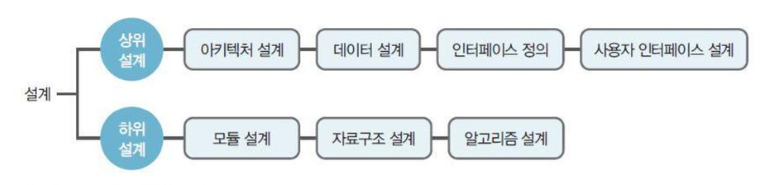
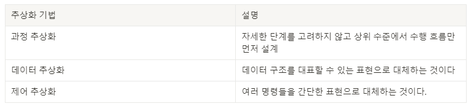
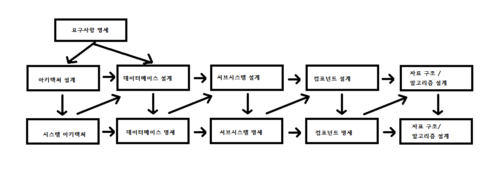
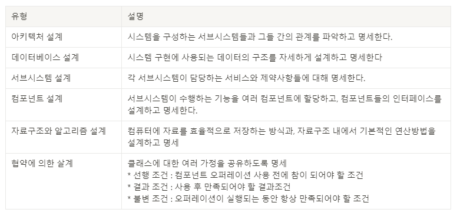
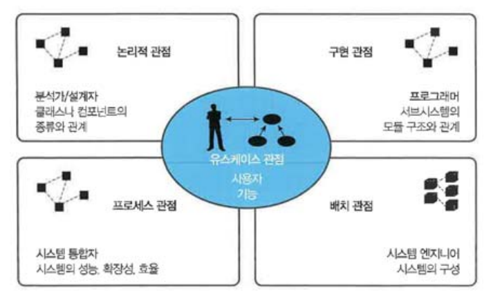

# Chapter03.소프트웨어 설계
## Section01. 소프트웨어 설계의 기본 원칙
01. 소프트웨어 설계
    1) 소프트웨어 설계의 개념
       * 요구사항 명세서를 참조하여 소프트웨어의 구체적인 설계서를 작성하는 단계
       * 물리적으로 구현이 가능하도록 시스템을 구체적으로 정의하는 단계
    2) 소프트웨어 설계의 종류
       
       1) 상위 설계
          1) 아키텍처 설계
             * 시스템의 전체적인 구조 설계
          2) 데이터 설계
             * 시스템에 필요한 정보를 설계
             * 데이터베이스 설계
          3) 인터페이스 정의
             * 시스템의 구조와 서브시스템들 사이의 인터페이스를 명확히 정의
          4) 사용자 인터페이스 설계
             * 사용자가 익숙하고 편리하게 사용하도록 인터페이스 설계
       2) 하위 설계
          1) 모듈 설계
             * 각 모듈의 실제적인 내부를 알고리즘 형태로 표현
          2) 자료구조 설계
             * 데이터의 저장 구조, 변수 등에 대한 상세한 정보를 설계
          3) 알고리즘 설계
             * 업무의 처리 절차 등을 설계
       3) 소프트웨어 설계의 원리
          1) 분할과 정복(Divide & Conquer)
             * 규모가 큰 소프트웨어를 여러 개의 작은 서브시스템으로 나누어 하나씩 완성시킨다.
          2) 추상화(Abstraction)
             * 실세계의 복잡한 상황을 간결하고 명확하게 핵심 위주로 단순화시킨다.
             * 자세한 구현 전에 상위 레벨에서 제품의 구현을 먼저 생각해보는 것
             * 추상화 기법
               
          3) 단계적 분해(Stepwise Refinement)
             * 기능을 점점 작은 단위로 나누어 점차적으로 구체화하는 방법
          4) 모듈화(Modulization)
             * 실제로 개발할 수 있는 작은 단위로 나눈다.
          5) 정보은닉(Information Hiding)
             * 다른 객체에게 자신의 정보를 숨기고, 자신의 연산만을 통해 접근이 가능하도록 한다.
             * 클래스 외부에서 특정 정보에 대한 접근을 막는다는 의미
             * 캡슐화와 밀접한 관계가 있다.
02. 설계 모델링
    1) 설계 모델링 개념
       * 소프트웨어를 구성하는 모듈들을 식별하고, 이것들의 연결을 그림으로 표현한 것
       * 소프트웨어를 만들기 위한 계획 또는 만들어야 할 기능을 의미 있게 표현한 것
       * 소프트웨어에 대하여 여러 작업자들의 공통된 개념을 공유하는 데 도움을 준다.
    2) 설계 모델링 원칙
       * 소프트웨어 설계는 변경이 용이하도록 구조화시켜야 한다.
       * 특정 기능을 수행하는 데 필요한 자료만을 사용한다.
       * 요구사항 분석에 얻은 정보를 이용하여 명확히 표현한다.
       * 모듈 단위로 설계한다.
    3) 설계 모델링 유형
       1) 구조 모델링
          * 시스템의 구성 요소들과 이들 사이의 구조적인 관계와 특성들을 모델링
          * UML 정적 다이어그램
       2) 행위 모델링
          * 소프트웨어의 구성요소들이 언제 어떠한 순서로 기능을 수행해야 작용하는지를 모델링
          * UML 동적 다이어그램
    4) 소프트웨어 설계 절차 및 유형
       
       
## Section02. 소프트웨어 아키텍처
01. 소프트웨어 아키텍처
    1) 소프트웨어 아키텍처(SoftWare Architecture) 개념
        * 소프트웨어의 골격이 되는 기본구조
        * 시스템의 컴포넌트 사이의 관계를 정의한 구조
    2) 소프트웨어 아키텍처의 특징
       * | 특징     | 설명                       |
         |--------|--------------------------|
         | 간략성    | 이해하고 추론할 수 있을 정도의 간결성 유지 |
         | 추상화    | 시스템의 추상적인 표현을 사용         |
         | 가시성    | 시스템이 표함해야 하는 것들을 가시화     |
         | 관점 모형  | 이해당사자의 관심사에 따른 모형 제시     |
         | 의사소통수단 | 이해당사자 간 원활한 의사소통 수단으로 이용 |
    3) 소프트웨어 아키텍처 프레임워크 구성요소
       1) 아키텍처 명세서(Architecture Description)
          * 아키텍처를 기록하기 위한 산출물
       2) 이해관계자(Stakeholder)
          * 소프트웨어 시스템 개발에 관련된 모든 사람과 조직
          * 고객, 개발자, 프로젝트 관리자 등
       3) 관심사(Concerns)
          * 동일한 시스템에 대해 서로 다른 이해관계자 의견
          *  예) 사용자 : 기본적인 기능, 신뢰성, 보안 등의 요구
       4) 관점(Viewpoint)
          * 서로 다른 역할이나 책임으로 시스템이나 산출물에 대한 서로 다른 관점
       5) 뷰(View)
          * 이해관계자들과 이들이 가지는 생각이나 견해로부터 전체 시스템을 표현
    4) 소프트웨어 아키텍처 4+1 뷰
       1) 소프트웨어 아키텍처 4+1 뷰 개념
          * 고객의 요구사항을 정리해 놓은 시나리오를 4개의 관점에서 바라보는 소프트웨어적인 접근 방법
          * 복잡한 소프트웨어 아키텍처를 다양한 이해관계자들이 바라보는 관점
          * View는 시스템의 여러 가지 측면을 고려하기 위한 다양한 관점을 바탕으로 정의
       2) 4+1 View Model과 구성요소
          
          * | 구성요소                               | 설명                                                                                                                     |
            |------------------------------------|------------------------------------------------------------------------------------------------------------------------|
            | 논리 뷰 (Logical View)            | 시스템의 기능적인 요구사항 시스템이 최종 사용자를 위해 해야 하는 것을 나타낸다.                                                                      |
            | 구현 뷰 (Implementation View) | 개발 환경 안에서 정적인 소프트웨어 모듈의 구성 개발자 관점에서 소프트웨어 구현과 관리적인 측면을 컴포넌트 다이어그램으로 표현                                             |
            | 프로세스 뷰 (Process View)          | 프로그램 실행 시의 시스템 표현 시스템의 동작을 중점적으로 표현 동시성, 분산처리, 시스템 통합, 오류 허용 등을 표현                                             |
            | 배치 뷰 (Deployment View)         | 컴포넌트가 물리적인 노드에 어떻게 배치되는가를 보여주는 매핑 물리적인 노드의 구성과 상호 연결 관계를 배치 다이어그램으로 표현 가용성, 신뢰성, 성능, 확장성 등의 시스템의 비기능적인 요구사항 고려 |
            | 유스케이스 뷰 (Use Case View)        | 아키텍처를 도출하고 설계하는 작업을 주도하는 뷰 다른 뷰를 검증하는 데 사용 Use Case Diagram이 사용 +1에 해당하며 유스케이스가 나머지 4개 뷰에 모두 참여하면서 영향을 준다. |
    5) 소프트웨어 아키텍처 품질 속성
       * | 품질 속성                         | 설명                                      |
         |-------------------------------|-----------------------------------------|
         | 정확성 (Correctness)         | 사용자가 요구한 기능을 정확히 수행해야 한다.               |
         | 신뢰성 (Reliability)         | 요구한 기능이 오차나 오류가 없이 동작해야 한다.             |
         | 효율성 (Efficiency)          | 기능이 수행되면서 자원(CPU, Memory)을 적절히 사용해야 한다. |
         | 무결성 (Integrity)           | 자료는 인가된 사용자만 변경할 수 있어야 한다.              |
         | 사용 용이성 (Usability)        | 쉽게 배우고 사용할 수 있어야 한다.                    |
         | 유지보수성 (Maintainability)   | 오류 수정 및 변경이 용이해야 한다.                    |
         | 시험 용이성 (Testability)      | 테스트를 하는 것이 용이해야 한다.                     |
         | 유연성 (Flexibility)         | 새로운 요구사항을 쉽게 적용할 수 있어야 한다.              |
         | 이식성 (Potability)          | 다양한 플랫폼 및 하드웨어에서 동작이 가능해야 한다.           |
         | 재사용성 (Reusability)        | 개발된 소프트웨어는 다른 목적으로 사용하기 용이해야 한다.        |
         | 상호 운용성 (Interoperability) | 다른 소프트웨어와 상호 교류가 용이해야 한다.               |
    6) 소프트웨어 아키텍처 평가
       1) 소프트웨어 아키텍처 평가 개념
          * 아키텍처의 접근법이 품질속성(보안, 선능, UI등)에 미치는 영향을 판단하여 아키텍처 적 합성을 판단하고 평가하는 표준 기법
       2) 소프트웨어 아키텍처 평가기법 유형
          * | 관점  | 유형      | 내용                                            |
            |-----|---------|-----------------------------------------------|
            | 가시성 | 가시적 평가  | Inspection, Review, Validation & Verification |
            | 가시성 | 비가시적 평가 | SAAM, ATAM, CBAM, ARID, ADR                   |
            | 시점  | 이른 평가   | 아키텍처 구축과정 중 어느 때나 평가 가능                       |
            | 시점  | 늦은 평가   | 기존 시스템의 요구사항에 대한 아키텍처의 적합성을 판단할 때 사용          |
02. 소프트웨어 아키텍처 패턴

          

