# Chapter03.소프트웨어 설계
## Section01. 소프트웨어 설계의 기본 원칙
01. 소프트웨어 설계
    1) 소프트웨어 설계의 개념
       * 요구사항 명세서를 참조하여 소프트웨어의 구체적인 설계서를 작성하는 단계
       * 물리적으로 구현이 가능하도록 시스템을 구체적으로 정의하는 단계
    2) 소프트웨어 설계의 종류
       
       1) 상위 설계
          1) 아키텍처 설계
             * 시스템의 전체적인 구조 설계
          2) 데이터 설계
             * 시스템에 필요한 정보를 설계
             * 데이터베이스 설계
          3) 인터페이스 정의
             * 시스템의 구조와 서브시스템들 사이의 인터페이스를 명확히 정의
          4) 사용자 인터페이스 설계
             * 사용자가 익숙하고 편리하게 사용하도록 인터페이스 설계
       2) 하위 설계
          1) 모듈 설계
             * 각 모듈의 실제적인 내부를 알고리즘 형태로 표현
          2) 자료구조 설계
             * 데이터의 저장 구조, 변수 등에 대한 상세한 정보를 설계
          3) 알고리즘 설계
             * 업무의 처리 절차 등을 설계
       3) 소프트웨어 설계의 원리
          1) 분할과 정복(Divide & Conquer)
             * 규모가 큰 소프트웨어를 여러 개의 작은 서브시스템으로 나누어 하나씩 완성시킨다.
          2) 추상화(Abstraction)
             * 실세계의 복잡한 상황을 간결하고 명확하게 핵심 위주로 단순화시킨다.
             * 자세한 구현 전에 상위 레벨에서 제품의 구현을 먼저 생각해보는 것
             * 추상화 기법
               
          3) 단계적 분해(Stepwise Refinement)
             * 기능을 점점 작은 단위로 나누어 점차적으로 구체화하는 방법
          4) 모듈화(Modulization)
             * 실제로 개발할 수 있는 작은 단위로 나눈다.
          5) 정보은닉(Information Hiding)
             * 다른 객체에게 자신의 정보를 숨기고, 자신의 연산만을 통해 접근이 가능하도록 한다.
             * 클래스 외부에서 특정 정보에 대한 접근을 막는다는 의미
             * 캡슐화와 밀접한 관계가 있다.
02. 설계 모델링
    1) 설계 모델링 개념
       * 소프트웨어를 구성하는 모듈들을 식별하고, 이것들의 연결을 그림으로 표현한 것
       * 소프트웨어를 만들기 위한 계획 또는 만들어야 할 기능을 의미 있게 표현한 것
       * 소프트웨어에 대하여 여러 작업자들의 공통된 개념을 공유하는 데 도움을 준다.
    2) 설계 모델링 원칙
       * 소프트웨어 설계는 변경이 용이하도록 구조화시켜야 한다.
       * 특정 기능을 수행하는 데 필요한 자료만을 사용한다.
       * 요구사항 분석에 얻은 정보를 이용하여 명확히 표현한다.
       * 모듈 단위로 설계한다.
    3) 설계 모델링 유형
       1) 구조 모델링
          * 시스템의 구성 요소들과 이들 사이의 구조적인 관계와 특성들을 모델링
          * UML 정적 다이어그램
       2) 행위 모델링
          * 소프트웨어의 구성요소들이 언제 어떠한 순서로 기능을 수행해야 작용하는지를 모델링
          * UML 동적 다이어그램
    4) 소프트웨어 설계 절차 및 유형
       
       
## Section02. 소프트웨어 아키텍처
01. 소프트웨어 아키텍처
    1) 소프트웨어 아키텍처(SoftWare Architecture) 개념
        * 소프트웨어의 골격이 되는 기본구조
        * 시스템의 컴포넌트 사이의 관계를 정의한 구조
    2) 소프트웨어 아키텍처의 특징
       * | 특징     | 설명                       |
         |--------|--------------------------|
         | 간략성    | 이해하고 추론할 수 있을 정도의 간결성 유지 |
         | 추상화    | 시스템의 추상적인 표현을 사용         |
         | 가시성    | 시스템이 표함해야 하는 것들을 가시화     |
         | 관점 모형  | 이해당사자의 관심사에 따른 모형 제시     |
         | 의사소통수단 | 이해당사자 간 원활한 의사소통 수단으로 이용 |
    3) 소프트웨어 아키텍처 프레임워크 구성요소
       1) 아키텍처 명세서(Architecture Description)
          * 아키텍처를 기록하기 위한 산출물
       2) 이해관계자(Stakeholder)
          * 소프트웨어 시스템 개발에 관련된 모든 사람과 조직
          * 고객, 개발자, 프로젝트 관리자 등
       3) 관심사(Concerns)
          * 동일한 시스템에 대해 서로 다른 이해관계자 의견
          *  예) 사용자 : 기본적인 기능, 신뢰성, 보안 등의 요구
       4) 관점(Viewpoint)
          * 서로 다른 역할이나 책임으로 시스템이나 산출물에 대한 서로 다른 관점
       5) 뷰(View)
          * 이해관계자들과 이들이 가지는 생각이나 견해로부터 전체 시스템을 표현
    4) 소프트웨어 아키텍처 4+1 뷰
       1) 소프트웨어 아키텍처 4+1 뷰 개념
          * 고객의 요구사항을 정리해 놓은 시나리오를 4개의 관점에서 바라보는 소프트웨어적인 접근 방법
          * 복잡한 소프트웨어 아키텍처를 다양한 이해관계자들이 바라보는 관점
          * View는 시스템의 여러 가지 측면을 고려하기 위한 다양한 관점을 바탕으로 정의
       2) 4+1 View Model과 구성요소
          
          * | 구성요소                               | 설명                                                                                                                     |
            |------------------------------------|------------------------------------------------------------------------------------------------------------------------|
            | 논리 뷰 (Logical View)            | 시스템의 기능적인 요구사항 시스템이 최종 사용자를 위해 해야 하는 것을 나타낸다.                                                                      |
            | 구현 뷰 (Implementation View) | 개발 환경 안에서 정적인 소프트웨어 모듈의 구성 개발자 관점에서 소프트웨어 구현과 관리적인 측면을 컴포넌트 다이어그램으로 표현                                             |
            | 프로세스 뷰 (Process View)          | 프로그램 실행 시의 시스템 표현 시스템의 동작을 중점적으로 표현 동시성, 분산처리, 시스템 통합, 오류 허용 등을 표현                                             |
            | 배치 뷰 (Deployment View)         | 컴포넌트가 물리적인 노드에 어떻게 배치되는가를 보여주는 매핑 물리적인 노드의 구성과 상호 연결 관계를 배치 다이어그램으로 표현 가용성, 신뢰성, 성능, 확장성 등의 시스템의 비기능적인 요구사항 고려 |
            | 유스케이스 뷰 (Use Case View)        | 아키텍처를 도출하고 설계하는 작업을 주도하는 뷰 다른 뷰를 검증하는 데 사용 Use Case Diagram이 사용 +1에 해당하며 유스케이스가 나머지 4개 뷰에 모두 참여하면서 영향을 준다. |
    5) 소프트웨어 아키텍처 품질 속성
       * | 품질 속성                         | 설명                                      |
         |-------------------------------|-----------------------------------------|
         | 정확성 (Correctness)         | 사용자가 요구한 기능을 정확히 수행해야 한다.               |
         | 신뢰성 (Reliability)         | 요구한 기능이 오차나 오류가 없이 동작해야 한다.             |
         | 효율성 (Efficiency)          | 기능이 수행되면서 자원(CPU, Memory)을 적절히 사용해야 한다. |
         | 무결성 (Integrity)           | 자료는 인가된 사용자만 변경할 수 있어야 한다.              |
         | 사용 용이성 (Usability)        | 쉽게 배우고 사용할 수 있어야 한다.                    |
         | 유지보수성 (Maintainability)   | 오류 수정 및 변경이 용이해야 한다.                    |
         | 시험 용이성 (Testability)      | 테스트를 하는 것이 용이해야 한다.                     |
         | 유연성 (Flexibility)         | 새로운 요구사항을 쉽게 적용할 수 있어야 한다.              |
         | 이식성 (Potability)          | 다양한 플랫폼 및 하드웨어에서 동작이 가능해야 한다.           |
         | 재사용성 (Reusability)        | 개발된 소프트웨어는 다른 목적으로 사용하기 용이해야 한다.        |
         | 상호 운용성 (Interoperability) | 다른 소프트웨어와 상호 교류가 용이해야 한다.               |
    6) 소프트웨어 아키텍처 평가
       1) 소프트웨어 아키텍처 평가 개념
          * 아키텍처의 접근법이 품질속성(보안, 선능, UI등)에 미치는 영향을 판단하여 아키텍처 적 합성을 판단하고 평가하는 표준 기법
       2) 소프트웨어 아키텍처 평가기법 유형
          * | 관점  | 유형      | 내용                                            |
            |-----|---------|-----------------------------------------------|
            | 가시성 | 가시적 평가  | Inspection, Review, Validation & Verification |
            | 가시성 | 비가시적 평가 | SAAM, ATAM, CBAM, ARID, ADR                   |
            | 시점  | 이른 평가   | 아키텍처 구축과정 중 어느 때나 평가 가능                       |
            | 시점  | 늦은 평가   | 기존 시스템의 요구사항에 대한 아키텍처의 적합성을 판단할 때 사용          |
02. 소프트웨어 아키텍처 패턴
    1) 소프트웨어 아키텍처 패턴의 개념
       * 소프트웨어 아키텍처의 공통적인 발생 문제에 대한 재사용 가능한 해결책
       * 소프트웨어 공학의 다양한 문제를 해결
         - 컴퓨터 하드웨어 성능
         - 비즈니스 위험의 최소화
         - 고가용성
       * 일부 아키텍처 패턴은 소프트웨어 프레임워크 안에 구현되어 있다.
    2) 소프트웨어 아키텍처 패턴 종류
       1) 계층화 패턴(Layered Pattern)
          * N-티어 아키텍처 패턴으로 부른다
          * 하위 모듈을 그룹으로 나눌 수 있는 구조화된 프로그램에서 사용
          * 각 서브시스템이 하나의 계층이 되고 하위층이 제공하는 서비스를 상위층의 서브시스템이 이용할 수 있는 구조
          * ex) OSI 7계층, TCP/IP 4계층
       2) 클라이언트-서버 패턴(Master-Slave Pattern)
          * 다수의 클라이언트와 하나의 서버로 구성
          * 서버는 클라이언트에게 서비스를 제공하며 데이터를 관리하는 역할
          * ex) 일반적인 웹 프로그램
       3) 마스터-슬레이브 패턴(Master-Slave Pattern)
          * 마스터 컴포넌트가 동등한 구조의 슬레이브 컴포넌트로 작업을 분산하고, 슬레이브가 결과 값을 반환하면 최종 결과값을 계산하는 구조
          * ex) 컴퓨터와 주변장치
       4) 파이프-필터 패턴(Pipe-Filter Pattern)
          * 데이터 스트림을 생성하고 처리하는 시스템에서 사용 가능한 패턴
          * 필터 컴포넌트에서 각 처리과정을 실행하며, 처리된 데이터는 파이프를 통해 전송
          * 서브시스템이 입력데이터를 받아 처리하고 결과를 다음 서브시스템으로 넘겨주는 과정을 반복
          * ex) Unix 쉘처리
       5) 브로커 패턴(Broker Pattern)
          * 분리된 컴포넌트로 구성된 분산 시스템에서 사용되는 패턴
          * 각 컴포넌트들은 원격 서비스를 통해 서로 상호작용을 할 수 있으며 브로커 컴포넌트가 컴포넌트 간의 통신을 조절
          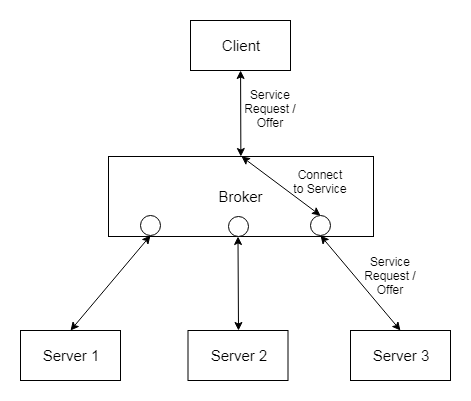
       6) 피어 투 피어 패턴(Peer to Peer Pattern)
          * 피어라 부르는 각 컴포넌트 간에 서비스를 주고받는 패턴
          * 피어 객체 하나가 클라이언트, 서버의 역할을 모두 수행하는 구조
          * ex) 파일 공유(P2P)
       7) 이벤트-버스 패턴(Event-Bus Pattern)
          * 이벤트 버스를 통해 특정 채널로 메시지를 발행
          * 리스너가 구독한 채널에 소스가 서비스를 제공하면 채널이 리스너에게 서비스를 제공
          * ex) 알림 서비스
       8) 모델-뷰-컨트롤러 패턴(MVC Pattern, Model-View-Controller Pattern)
          * 3개의 각 컴포넌트는 각자의 역할을 갖고 사용자에게 서비스를 제공
          * 자료의 저장, 제어, 표현 기능을 분리하여 재사용을 증진
          * 모델 : 도메인의 기능과 자료를 저장하고 보관
          * 뷰 : 사용자에게 결과를 표시
          * 컨트롤러 : 사용자로부터 입력을 받아 연산을 처리
          * ex) 일반적인 웹 애플리케이션 설계 아키텍처
       9) 블랙보드 패턴(Blackboard Pattern)
          * 명확히 정의된 해결 전략이 알려지지 않은 문제에 대해서 유용한 패턴
       10) 인터프리터 패턴(Interpreter Pattern)
           * 특정 언어로 작성된 프로그램을 해석하는 컴포넌트를 설계할 때 사용되는 패턴
## Section03. LIML
01. UML(Unified Modeling Language)
    1) UML 개념
       * 프로그램 설계를 표현하기 위해 사용하는 표기법
       * 시스템 개발 과정에서 이해관계자 사이에 의사소통을 원활하게 이루어지게 하기 위하여 표준화한 모델링 언어
       * 소프트웨어 시스템, 업무 모델링, 시스템의 산출물을 규정하고 시각화, 문서화하는 언어
       * 프로그램 언어가 아닌 기호와 도식을 이용하여 표현하는 방법을 정의한다.
    2) UML 특징
       1) 가시화 언어
          * 소프트웨어의 개념 모델을 시각적인 그래픽 형태로 작성한다.
       2) 명세화 언어
          * 분석, 설계, 구현 단계의 각 과정에서 필요한 모델을 명세화할 수 있는 언어
       3) 구축 언어
          * 명세화된 설계모델은 다양한 언어의 소스코드로 변환하여 구축할 수 있다.
       4) 문사화 언어
          * 일련의 과정을 문서로 남겨 계속 유지 보수한다.
2. UML 구성요소
   1) 사물(Things)
      * | 종류   | 설명                                          |
        |------|---------------------------------------------|
        | 구조사물 | 시스템의 개념적, 물리적 요소 ex) 클래스, 유스케이스, 컴포넌트 등 |
        | 행동사물 | 시간과 공간에 따른 요소들의 행위 ex)상호작용, 상태머신        |
        | 그룹사물 | 요소들을 그룹으로 묶는 것 ex)패키지                   |
        | 주해사물 | 부가적 설명이나 제약조건 ex)주석, 노트                 |
   2) 관계(Relationships)
      1) 일반화 관계(Generalization)
         * 한 클래스가 다른 클래스를 포함하는 상위 개념일 때의 관계
         * 객체지향 개념에서는 일반화 관계를 상속관계(Inheritance)라고 함
         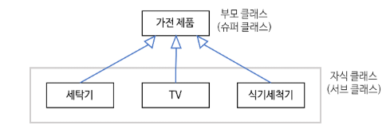
      2) 연관관계(Accociation)
         * 2개 이상 사물이 서로 관련된 관계
         * 한 클래스가 다른 클래스에서 제공하는 기능을 사용할 때 표시
         * ex) 사람 -> 휴대폰
      3) 의존관계(Dependency)
         * 연관 관계와 같이 한 클래스가 다른 클래스에서 제공하는 기능을 사용할 때 표시
         * 연관 관계와 차이점은 두 클래스의 관계가 한 메서드를 실행하는 동안과 같이 매우 짧은 시간만 유지
         * 한 클래스의 명세가 바뀌면 다른 클래스에 영향을 줌
         * 한 클래스가 다른 클래스를 오퍼레이션의 매개변수로 사용하는 경우
         * ex) 학생->색연필
      4) 실체화 관계(Realization)
         * 인터페이스를 구현받아 추상 메서드를 오버라이딩하는 것을 의미
         * 한 객체가 다른 객체에게 오퍼레이션을 수행하도록 지정
         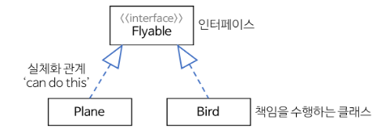
      5) 집합 관계 - 집약관계(Aggregation)
         * 한 객체가 다른 객체를 소유하는 "has a" 관계
         * 전체 객체의 라이프타입과 부분 객체의 라이프타입은 독립적
         * 전체 객체가 사라진다 해도 부분 객체는 사라지지 않음
      6) 집합 관계 - 합성관계(Composition)
         * 부분 객체가 전체 객체에 속하는 관계로 긴밀한 필수적 관계
         * 전체 객체의 라이프타임과 부분 객체의 라이프 타임은 의존적
         * 전체 객체가 없어지면 부분 객체도 없어짐
         
   3) 다이어그램(Diagram)
      1) 구조 다이어그램
         * | 종류         | 설명                                                  |
           |------------|-----------------------------------------------------|
           | 클래스 다이어그램  | 클래스의 속성과 클래스 사이의 관계를 표현 시스템 구조 파악 및 구조상 문제점을 도출 |
           | 객체 다이어그램   | 클래스에 속한 객체(인스턴스)를 특정 시점의 객체와 객체 사이 관계로 표현           |
           | 컴포넌트 다이어그램 | 컴포넌트 사이 관계나 인터페이스를 표현                               |
           | 배치 다이어그램   | 결과물, 프로세스,컴포넌트 등 물리적 요소들의 위치를 표현 노드와 통신 경로를 표현  |
           | 복합체 다이어그램  | 클래스나 컴포넌트가 복합구조를 가질 시 그 내부 구조를 표현                   |
           | 패키지 다이어그램  | 유스케이스나 클래스 등 모델 요소들을 그룹화한 패키지들의 관계 표현               |
      2) 행위 다이어그램
         * | 종류              | 설명                                                                                                                                                      |
           |-----------------|---------------------------------------------------------------------------------------------------------------------------------------------------------|
           | 유스케이스 다이어그램 | 사용자의 요구를 분석하여 기능 모델링 작업에 사용됨 시스템의 기능을 나타내기 위해 사용자의 요구를 추출하고 분석하는데 사용 외부에서 보는 시스템의 동작으로, 객체들이 어떻게 상호작용하는지 모델링 구성요소 : Actor, Use Case, System |
           | 시퀀스 다이어그램       | 특정 행동이 어떠한 순서로 어떤 객체와 상호작용하는지 표현 현재 시스템이 어떠한 시나리오로 움직이고 있는지를 나타냄 구성요소 : 활성객체, 메시지, 생명선, 제어사각형 메시지 유형 : 동기 메시지, 비동기 메시지, 반환 메시지, 자체 메시지      |
           | 커뮤니케이션 다이어그램    | 동작에 참여한 객체들이 주고받는 메시지와 객체 간 연관까지 표현                                                                                                                     |
           | 상태 다이어그램        | 객체가 자신이 속한 클래스의 상태 변화 및 다른 객체 간 상호작용에 따라 상태 변화 표현                                                                                                       |
           | 활동 다이어그램        | 시스템이 어떤 기능을 수행하는지에 따라 객체 처리 로직이나 조건에 따른 처리 흐름을 순서에 따라 표현                                                                                                |
           | 상호작용 다이어그램      | 상호작용 다이어그램 간 제어 흐름 표현                                                                                                                                   |
           | 타이밍 다이어그램       | 객체 상태 변화와 시간 제약을 명시적으로 표현                                                                                                                               |
3. 주요 다이어그램
   1) 클래스 다이어그램
      1) 클래스 다이어그램 개념
         * 자기만의 속성(Attribute)과 일정한 행동(Behavior)으로 구성
         * 여러 개의 클래스들은 서로 연관이나 상속, 의존 관계 등으로 서로 간의 상호작용을 표현
      2) 클래스 다이어그램 표현
         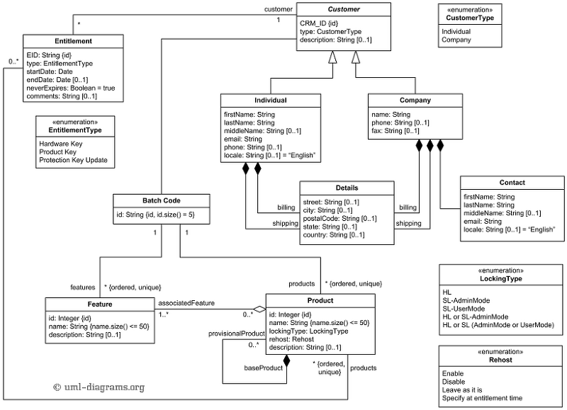
      3) 접근 제한자 표기법
         * | 표기법 | 접근 제한자    | 사용 범위                 |
           |-----|-----------|-----------------------|
           | -   | private   | 해당 클래스내에서만 접근 가능      |
           | #   | protected | 상속, 동일 패키지 내에서만 접근 가능 |
           | +   | public    | 어디서든 접근 가능            |
   2) 유스케이스 다이어그램
      1) 유스케이스 다이어그램 개념
         * 시스템과 사용자의 상호작용을 다이어그램으로 표현
         * 사용자의 관점에서 시스템의 서비스 혹은 기능 및 그와 관련한 외부 요소를 보여준다.
         * 프로젝트에 대한 요구사항을 정의하고 세부기능을 분석한다.
      2) 유스케이스 다이어그램 구성요소
         1) 시스템(System)
            * 만들고자 하는 프로그램 명칭
              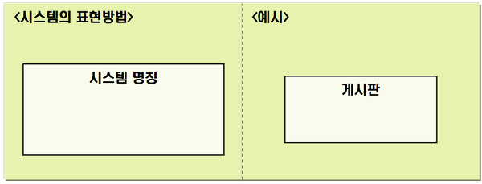
         2) 액터(Actor)
            * 시스템의 외부에 있고 시스템과 상호작용을 하는 사람, 시스템을 표현
              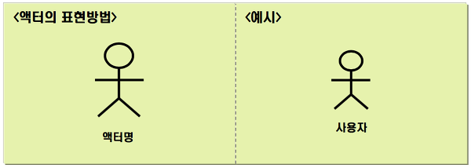
         3) 유스케이스(Usecase)
            * 사용자 입장에서 바라본 시스템의 기능
              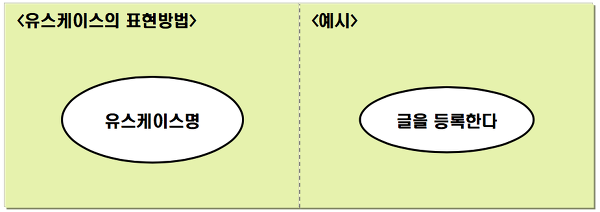
         4) 관계(Relation)
            * 액터와 유스케이스 사이의 의미있는 관계
              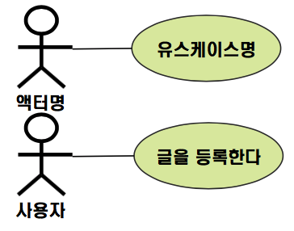
      3) 유스케이스 다이어그램 관계
         1) 연관관계(Association)
            * 유스케이스와 액터 간의 상호작용이 있음을 표현
            * 유스케이스와 액터를 실선으로 연결
              
         2) 표함 관계(Include)
            * 유스케이스를 수행할 때 반드시 실행되어야 하는 경우
              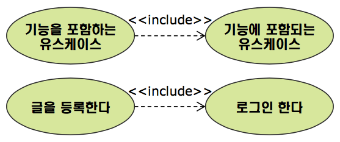
         3) 확장 관계(Extend)
            * 유스케이스를 수행할 때 특정 조건에 따라 확장 기능 유스케이스를 수행하는 경우
              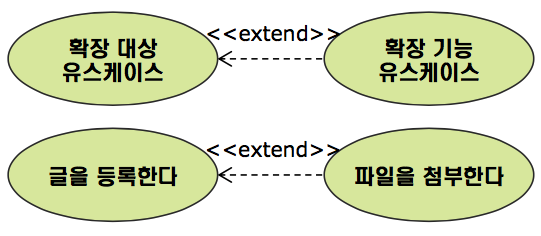
         4) 일반화 관계(Generalization)
            * 유사한 유스케이스 또는 액터를 모아 추상화한 유스케이스
              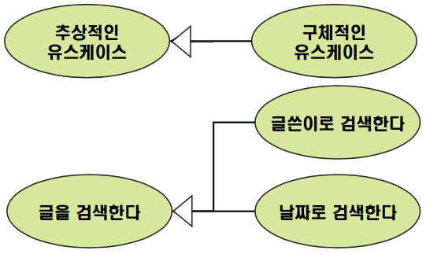
   3) 시퀀스 다이어그램
      1) 시퀀스 다이어그램 개념
         * 객체 간의 상호작용 메시지 시퀀스를 시간의 흐름에 따라 나타내는 다이어그램
      2) 시퀀스 다이어그램 구성요소
         1) 객체(Object)와 생명선(Lifeline)
            * 객체(활동 주체)는 직사각형으로 표현
            * 라이프라인은 객체에서 이어지는 점선으로 표현
            * 점선은 위에서 아래로 갈수록 시간의 경과를 의미
         2) 활성 박스(Activation Box)
            * 생명선상에서 기다란 직사각형으로 표현
            * 현재 객체가 어떤 활동을 하고 있음을 의미
         3) 메시지(Message)
            * 인스턴스 간 주고받은 데이터
            * 메시지의 유형
              * | 유형                           | 설명                              |
                |------------------------------|---------------------------------|
                | 동기 메시지(Sync Message)         | 요청을 보낸 후에 반환이 올 때까지 대기          |
                | 비동기 메시지(Async Message)       | 요청을 보낸 다음 반환을 기다리지 않고 다른 작업을 수행 |
                | 자체 메시지(Self Message)         | 자기 자신에게 요청을 보냄                  |
                | 반환 메시지(Reply/Return Message) | 요청에 대해 메시지를 반환                  |
            * 메시지의 표현
            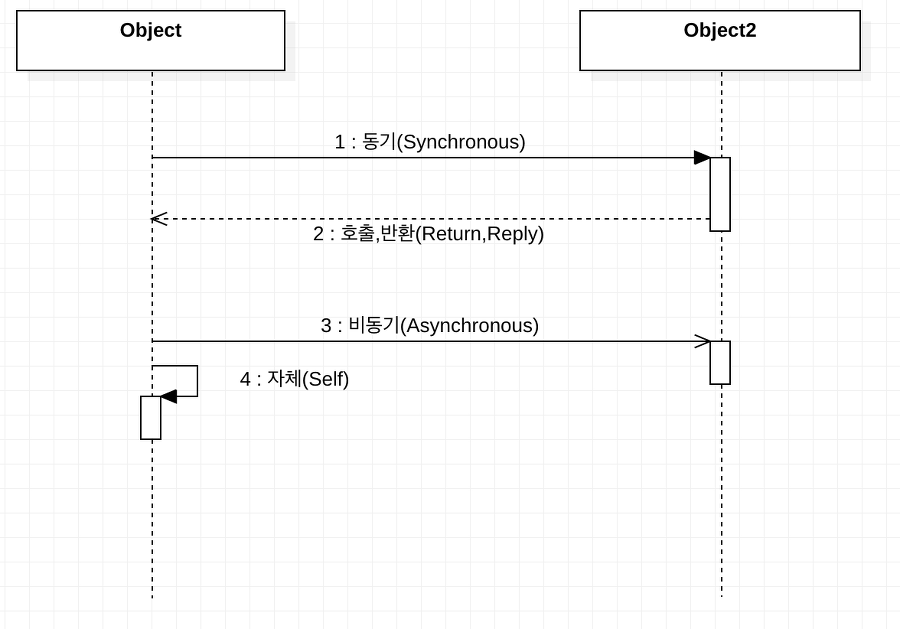
   4) 상태 다이어그램
      1) 상태 다이어그램 개념
         * 한 객체의 상태 변화를 나타내는 다이어그램
      2) 상태 다이어그램 예시
         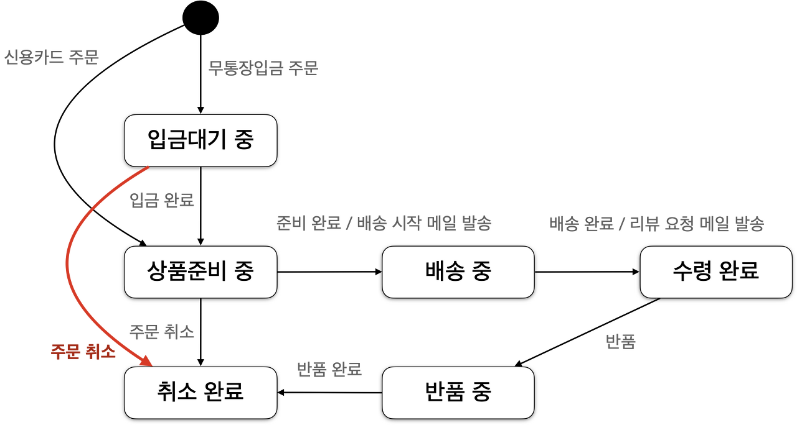