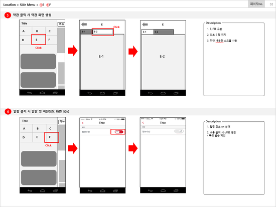
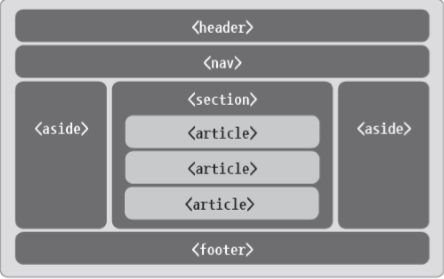

# Chapter04.화면 설계
## Section01. UI 설계
1. UI(User Interface) 개념
   1) UI 개념
      * 컴퓨터, 웹 사이트, 시스템등의 정보기기와 사용자가 서로 상호작용을 할 수 있도록 연결 해주는 매개체
      * 디스플레이 화면, 아이콘, 검색창, 키보드, 문자, 색상, 폰트 등의 여러 요소들이 포함
      * UI의 핵심은 특별한 설명 없이 사용자 누구나 알아보기 쉽고, 편리하게 이용할 수 있도록 만든 보편적이고 직관적인 디자인이어야 함
   2) UX(User eXperience) 개념
      * 사용자가 컴퓨터, 웹 사이트, 시스템 등 정보기기의 UI를 직/간접적으로 이용하여 경험한 모든 것
      * UI를 이용할 때, 만족감이나 불편함 등 사용할 때의 모든 행동, 느낌, 감정 등이 UX에 포함
      * 사용자들의 경험을 분석하여 사용자의 불만족을 최소화하고, 보다 편리하게 이용할 수 있도록 디자인
      * UI를 기반으로 사용자들의 공감과 만족을 이끌어내는 역할이 UX이다.
   3) UI 유형
      1) CLI(Command Line Interface)
         * 사용자가 컴퓨터 자판을 이용해 명령을 입력하여 컴퓨터를 조작하는 시스템
      2) GUI(Graphical User Interface)
         * 그래픽과 텍스트로 이루어져 있어, 사용자의 입력이나 출력이 마우스 등을 통해 이러우짐
      3) NUI(Natural User Interface)
         * 특별한 하드웨어 없이 인간의 자연스러운 움직임을 인식하여 정보를 제공
      4) OUI(Organic User Interface)
         * 현실의 모든 것이 입출력 장치가 됨
2. UI 설계
   1) UI 요구사항 구분
      1) 기능적 요구사항
         * 시스템이 제공해야 하는 기능에 대한 요구사항
         * 입력, 출력, 데이터, 연산에 관한 요구사항
      2) 비기능적 요구사항
         * 사용성, 효울성, 신뢰성, 유지 보수성, 재사용성 등 품질에 관한 요구사항
         * 플랫폼, 사용 기술 등 시스템 환경에 관한 요구사항
         * 비용, 일정 등 프로젝트 계획에 관한 요구사항
   2) UI 설계 절차
      * UI 개발목표 및 범위 수립 -> UI 전략 수립 -> 사용자 요구사항 분석 -> UI 상세 설계 -> 구현 -> 테스트
      1) UI 개발 목표 및 범위 수립
         * 해당 프로젝트의 UI 부분의 목표와 범위에 대한 계획을 수립하는 단계
         * 프로젝트 계획 전반에 UI 계획을 반영한다
         * 이해 당사자의 UI 요구사항을 조사하고, 정의한다.
         * UI 트랜드 및 해당 서비스의 사용자를 분석한다.
      2) UI 전략 수립
         * 서비스를 사용할 사용자 조사 및 시장 조사를 통해 UI, UX 전략을 수립하는 단계
         * 기술적 관점에서도 전략을 수립한다.
      3) 사용자 요구사항 분석
         * 사용자 조사 결과를 기반으로 사용자 요구사항을 추출하고 선별하여 요구사항을 분석하는 단계
         * 프로토타입(Prototype)을 제작
      4) UI 상세 설계
         * UI 기능에 대한 구조와 화면 간의 상호 흐름, 예외 처리 등의 UI 전반에 걸친 설계를 하는 단계
      5) 구현
         * HTML5, CSS3, JavaScript 등의 언어들로 구현하는 단계
      6) 테스트
         * UI의 사용성을 검증하는 단계
   3) UI 설계 원칙
      1) 직관성
         * 누구나 쉽게 이해하고 사용할 수 있어야 한다.
      2) 유효성
         * 사용자의 목적을 정확하게 달성해야 한다.
      3) 학습성
         * 누구나 쉽게 배우고 익힐 수 있어야 한다.
      4) 유연성
         * 사용자의 요구사항을 최대한 수용하며, 오류를 최소화해야 한다.
   4) UI 설계 도구
      1) 와이어프레임(Wireframe)
         * 와이어프레임의 개념
           - 선(Wire)으로 틀(Frame)을 잡는다는 뜻
           - 화면 단위의 레이아웃을 설계하는 작업
           - 간단한 모양만을 사용하여 인터페이스를 시각적으로 묘사
           - 와이어프레임에는 내용, 구조, 흐름, 기능 등이 포함
           - 제작 방법에 제한은 없지만, 실무에서는 손그림이나 파워포인트로 작성
      2) 스토리보드
         * 개발 후 완성된 콘텐츠의 최정 결과를 예상할 수 있는 기초 문서
         * 디자이너와 개발자가 최정적으로 참고하는 설계 산출 문서
         * 정책, 프로세스 및 콘텐츠 구성, 와이어 프레임, 기능 정의 등 서비스 구축을 위한 대부분의 정보를 수록
         * 스토리보드 작성 절차
           * | 작성문서                               | 설명                                                                                                |
             |------------------------------------|---------------------------------------------------------------------------------------------------|
             | 표지                                 | 프로젝트명, 문서버전, 최종 업데이트 일자, 작성자 등을 작성한다.                                                             |
             | 문서의 버전                             | 변경된 문서버전, 변경일, 변경된 내용, 작성자 등이 포함된다.                                                               |
             | Index 작성                           | 스토리보드를 빠르게 찾아갈 수 있는 차례를 작성한다.                                                                     |
             | IA(Information Architecture) 작성 | 소프트웨어의 사이트 맵을 작성한다.                                                                               |
             | 공통모듈 작성                            | 스토리보드 전반에서 사용될 공통 모듈을 작성한다. 웹의 경우 기본 구성화면(Header, Footer, GNB, LNB 등) 등의 내용을 공통 모듈 정의서로 작성한다. |
             | 화면설계와 설명서(Description) 작성       | 실제로 구현될 화면을 설계한다. 해당 화면에서 설명이 필요한 부분에 넘버링을 하고, 설명을 따로 적어둔다.                                   |
         * 스토리보드 작성 예시
           
      3) 프로토타입
         * 프로토타입은 실제 서비스와 흡사한 모형을 만드는 작업
         * 와이어프레임이나 스토리보드에 동적효과를 적용하여 실제 구현된 것처럼 시연할 수 있다.
         * 실제 개발하는 것보다 단시간에 구현이 가능하기 때문에 사용자 경험에 대한 테스트를 진행 할 수 있다.
      4) 목업(Mockup)
         * 와이어프레임보다 좀 더 실제 화면과 유사하게 만든 정적인 형태의 모형
         * 파워목업, 발사믹 목업 등
      5) 유스케이스
         * 사용자 측면의 요구사항
         * 사용자가 원하는 목표를 달성하기 위해 수행할 내용을 기술
         * 다이어그램 형태로 제작
03. 감성공학
    1) 감성공학의 개념
       * 인간의 심상을 구체적인 물리적 설계 요소로 번역하여 이를 실현하는 기술
       * 인간의 감성과 이미지를 물리적인 디자인 요소로 해석하여 구체적 제품으로 만들어내는 공학적 접근 방법
       * 감성공학 = 마음속의 이미지 파악(심리학) + 형상화(인간공학) + 구체적인 제품 생산(생산 공학)
       * 요소화 -> 형상화 -> 구현 -> 생산
    2) 제품과 관련된 인간의 감성
       1) 감각적 감성
          * 제품에 관하여 사용자가 느끼는 감성, 제품의 외관, 색상, 디자인에 관련된 것
       2) 기능적 감성
          * 제품의 성능과 사용 시 편리함에 대한 것
       3) 문화적 감성
          * 개인이 속한 사회나 문화에 관련된 것
    3) 감성공학의 접근 방법
       1) 1류 접근 방법
          * 인간의 어휘를 이용하여 제품에 대한 이미지를 조사하고 제품 디자인 요소와 연계시킴
       2) 2류 접근 방법
          * 문화적 감성의 일부를 반영한 개념
          * 1류와 함께 감성의 심리적 특성을 강조한 접근 방법
       3) 3류 접근 방법
          * 특정 시제품을 사용하여 감각 척도를 계측하고, 정량화된 값을 환산
          * 인간 감각계측과 이의 활용이 강조된 접근 방법
04. UI 설계 지침
    1) 한국 HCI 연구회 설계 지침
       1) 가기성의 원칙(Visibility)
          * 소프트웨어의 기능을 노출시켜 최대한 조작이 쉽도록 한다.
       2) 조작 결과 예측의 원칙(Natural Mapping)
          * 사용자가 소프트웨어를 조작하여 작동시킨 결과를 조작 부위만 보고도 예측 가능하게 설계한다.
       3) 일관성의 원칙(Consistency)
          * 소프트웨어의 조작방식에 일관성을 제공하여 사용자가 쉽게 기억하고 빠르게 적응할 수 있게 한다.
       4) 단순성의 원칙(Simplicity)
          * 소프트웨어의 기능구조를 단순화시켜 조작에 요구되는 노력을 최소화한다.
       5) 지식 배분의 원칙(Knowledge in World & Head)
          * 학습하기 쉽고 기억하기 쉽게 설계해야 한다.
       6) 조작오류의 원칙(Design for Error)
          * 사용 간 발생한 오류를 쉽게 발견하고 수정 또한 쉽게 이루어져야 한다.
       7) 제한사항 선택사용의 원칙(Constraints)
          * 소프트웨어를 조작할 때 선택의 여지를 줄여 조작 방법이 명확하도록 유도한다.
       8) 표준화의 원칙(Standardization)
          * 소프트웨어의 기능 구조와 디자인을 한 번 학습한 이후, 보다 효과적으로 서비스를 사용할 수 있어야 한다.
       9) 행동 유도성의 원칙(Affordance)
          * 사용자가 디자인을 보고 기능 및 조작법을 유추할 수 있도록 해야 한다.
       10) 접근성의 원칙(Accessibility)
           * 사용자의 성별, 연력 등 다양한 계층의 사용자가 받아들일 수 있는 사용자 인터페이스를 구축해야 한다.
    2) 전자정부 웹 사이트 UI, UX 설계 기준
       * 사용자에게 필요한 정보와 기능을 제공한다.
       * 작업에 소요되는 시간과 단계를 최소화 한다.
       * 직관적이고 일관성 있게 만든다.
       * 사용자가 원하는 방식으로 이용할 수 있게 만든다.
       * 사용자가 실수하지 않게 만든다.
       * 모든 유형의 사용자가 이용할 수 있게 만든다.
       * 원하는 서비스와 정보를 쉽게 찾을 수 있게 만든다.
## Section02. UI 구현
01. 화면 레이아웃 구성
    1) 레이아웃(Layout)의 개념
       * 특정 공간에 여러 구성 요소를 보기 좋게 효과적으로 배치하는 작업
       * 레이아웃 작성 방법
         - DIV 요소를 이용한 레이아웃
         - SPAN 요소를 이용한 레이아웃
         - TABLE 요소를 이용한 레이아웃
         - 시맨틱(Semantic) 태그를 이용한 레이아웃
    2) HTML5
       1) HTML5 개념
          * 월드와이드웹(World Wide Web)을 통해 제공되는 정보를 나타낼 목적으로 사용되는 마크업 언어
          * HTML의 5번째 버전을 의미한다.
          * 웹 페이지의 기본 구조를 담당
       2) HTML5 특징
          * 플러그인의 설치 없이 동영상이나 음악을 웹 브라우저상에서 재생
          * 다양한 2차원 그래픽 표현 가능(SVG 태그, CANVAS 이용)
          * 실시간으로 서버와 양방향 통신 가능
          * GPS를 통한 위치 확인 및 장치 접근이 가능
          * 오프라인 상태에서도 작업이 가능
       3) 시맨틱 요소
          
          * | TAG         | 설명                                |
            |-------------|-----------------------------------|
            | < header >  | 헤더 영역 제목, 내비게이션, 검색 등의 내용을 포함 |
            | < nav >     | 메인 메뉴나 목차 등을 정의                   |
            | < section > | 맥락이 같은 요소들을 주제별로 그룹화              |
            | < article > | 본문의 주요 내용이 들어가는 공간                |
            | < aside >   | 본문 외의 콘텐츠 영역 사이드 메뉴나 광고 등의 영역 |
            | < footer >  | 푸터 영역 작성자나 회사 정보 등을 포함        |
       4) INPUT 요소
          1) 텍스트 입력(text, textarea)
             * text : 한 줄의 텍스트 입력
             * textarea : 여러 줄의 텍스트 입력
          2) 비밀번호 입력(password)
             * 입력받은 문자를 별표나 작은 원으로 표시
          3) 라디오 버튼(radio)
             * 여러 개의 라디오 버튼 옵션 중에서 단 하나만의 값을 선택
          4) 체크 박스(checkbox)
             * 여러 개의 체크박스 중에서 여러 개의 옵션 값을 선택
          5) 파일 선택(file)
             * 사용자 컴퓨터의 파일을 입력
          6) 선택 입력(select)
             * 여러 개의 드롭다운 리스트(drop-down-list) 중에서 한 개의 옵션을 선택
          7) 버튼(button)
             * 사용자가 클릭했을 때 작업을 수행
          8) 전송(submit)
             * 입력받은 데이터를 서버로 전송
          9) 필드셋(fieldset)
             * 관련된 데이터를 하나로 묶어준다.
    3) CSS(Cascading Style Sheet)
        1) CSS 개념
           * HTML과 함께 웹을 구성하는 기본 프로그래밍 요소
           * 색상이나 크기, 이미지 크기나 위치, 배치 방법 등 웹 문서의 디자인 요소를 담당
        2) CSS 특징
           * HTML로부터 디자인적인 요소를 분리해 정의할 수 있다.
           * 잘 정의된 CSS는 서로 다른 여러 웹페이지에 적용할 수 있다.
           * 자바스크립트와 연계해 동적인 콘텐츠 표현이나 디자인 적용 가능
           * 다양한 기기(PC, 스마트폰, 태플릿 등)에 맞게 탄력적으로 바뀌는 콘텐츠(반응형 웹) 적용 가능
        3) CSS3
           * 이전 버전 CSS와 완전히 호환되는 CSS의 최신 표준 권고안
           * 차세대 웹 개발을 위한 새로운 표준
    4) JavaScript
        1) JavaScript 개념
           * 모질라 재단의 프로토타입 기반의 프로그래밍 언어로, 스크립트 언어에 해당된다.
           * HTML, CSS와 함께 웹을 구성하는 요소 중 하나이다.
           * 클라이언트 단에서 웹 페이지가 동작하는 것을 담당
        2) JavaScript 특징
           * 웹 문서에 삽입해서 사용하는 스크립트 언어
           * 이벤트 중심(event-driven)의 프로그래밍 언어
           * 프로토타입 기반 객체 지향 언어
           * 값에 따라 변수의 형변환이 자동으로 이루어지는 동적 형변환
           * 주로 웹 브라우저에서 사용되나, Node.js와 같은 프레임워크를 사용하면 서버측 프로그래밍도 가능
        3) JavaScript 프레임워크
           1) React
              * 유저 인터페이스를 만드는 데 사용되는 오픈 소스 자바스크립트 라이브러리
              * 페이스북에서 개발
              * 싱글 페이지 애플리케이션(SPA)이나 모바일 애플리케이션 개발에 사용될 수 있다.
           2) Vue.js
              * 자바스크립트로 개발된 컴포넌트 구조 기반 프론트엔드 프레임워크
              * 고성능의 싱글 페이지 애플리케이션(SPA)을 구축하는 데 이용가능하다.
              * Evan You에 의해 개발
           3) AngularJS
              * 자바스크립트 기반의 오픈 소스 프론트엔드 웹 애플리케이션 프레임워크
              * 구글에서 개발
           4) Ajax(Asynchronous JavaScript and XML)
              * 비동기적인 웹 애플리케이션의 제작을 위한 웹 개발 기법
2. UI 관련용어

| 용어                            | 설명                                                                                                                    |
|-------------------------------|-----------------------------------------------------------------------------------------------------------------------|
| 웹 표준                          | 월드 와이드 웹의 측면을 서술하고 정의하는 공식 표준이나 다른 기술 규격을 말한다.                                                                        |
| 웹 호환성                         | 이용자의 단말기(PC, 모바일 기기 등)의 하드웨어 및 소프트웨어 환경이 다른 경우에도 동등한 서비스를 제공할 수 있는 것을 말한다.                                            |
| 웹 접근성                         | 장애인과 비장애인 모두가 동등하게 웹 사이트에 접근하여 이용할 수 있도록 보장하는 방식을 말한다.                                                                |
| 반응형 웹                         | PC, Mobile 등 다양한 디바이스에서 화면크기에 맞춰 하나의 사이트를 보여준다.                                                                       |
| 인포그래픽 (Infographic)       | 정보(Information)와 그래픽(Graphic)의 합성어로, 복잡한 정보를 쉽고 빠르게 전달하기 위해 정보를 분석, 정리하여 차트, 그래프, 아이콘, 그래픽스, 이미지 등을 활용하여 시각화한 것을 말한다. |
| 브랜드 아이덴티티(BI)                 | 사용자에게 전달하고자 하는 특정 브랜드의 가치와 의미를 반영한 심적 표상을 말한다.                                                                        |
| 내비게이션 (Navigation)        | 하이퍼링크를 따라 웹 공간의 정보를 요청하고 받아오는 웹 브라우징을 의미하며, 웹 사이트를 탐색하기 위한 도구를 뜻하기도 한다.                                               |
| 아코디언(Accordion)               | 사용자가 원하는 정보만 선택적으로 볼 수 있게 접을 수 있는 내용 패널을 말한다.                                                                         |
| 플레이스 홀더 (Placeholder)     | 사용자가 값을 입력하는 데 참고할 수 있도록, 입력 필드에 제공되는 간략한 텍스트 도움말을 말한다.                                                               |
| 필터링(Filtering)                | 원하지 않는 데이터를 차단하거나, 원하는 데이터만 볼 수 있도록 해주는 기능을 말한다.                                                                      |
| 입력 폼(Input Form)              | 다양한 입력 필드로 구성되어, 사용자가 웹 서버로 전송할 정보를 입력 할 수 있는 웹 문서의 일부를 말한다.                                                          |
| 입력 필드(Input Field)            | 사용자가 정보를 입력하거나 선택하는 데 이용되는 사용자 인터페이스 요소를 말한다.                                                                         |
| 썸네일(Thumbnail)                | 커다란 이미지를 축소하여 제공한 이미지를 말한다.                                                                                           |
| 레이블(Label)                    | 입력폼을 구성하는 다양한 입력 필드를 식별하기 위해 사용하는 명칭을 말한다.                                                                            |
| 대체 텍스트 (Alternative Text) | 콘텐츠를 대신하기 위해 제공되는 텍스트를 의미한다.                                                                                          |
| 초점(Focus)                     | 웹 페이지에서 사용자가 선택한 해당 요소에 있을 때, 해당 요소에 Focus가 있다고 한다.                                                                   |

         

