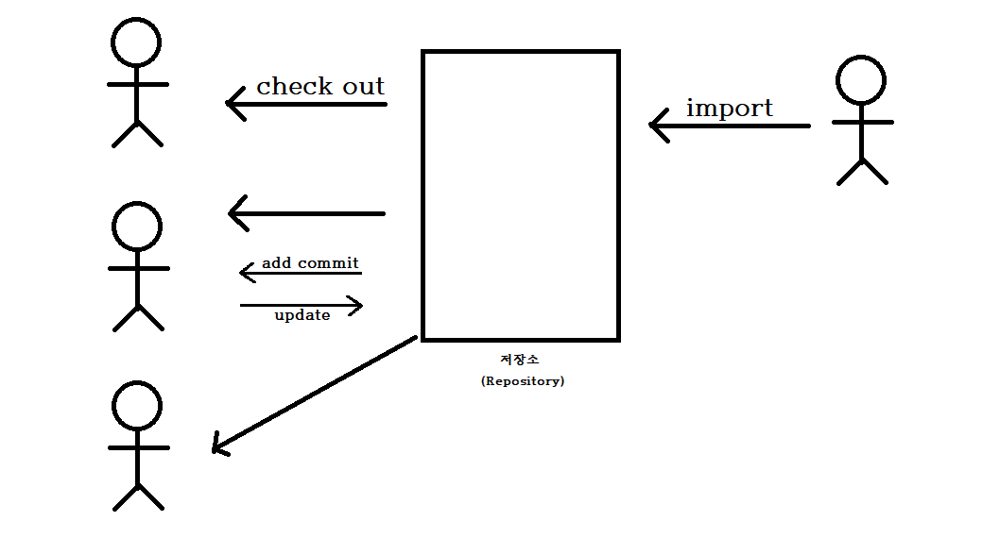
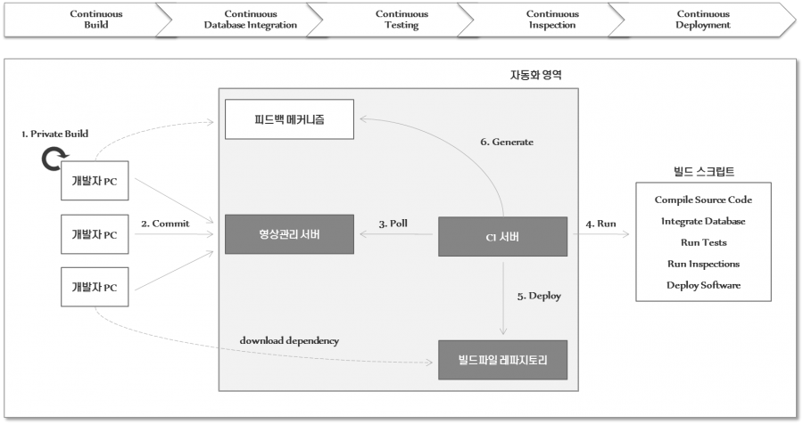

# Chapter05.서버 프로그램 구현
## Section01. 개발 환경 구축
01. 서버 환경 구축
    1) 웹 서버(Web Server)
       * 클라이언트에게 정적 파일(HTML, CSS, JS, 이미지)을 제공하는 웹서버 애플리케이션이 설치된 하드웨어
       * 이미지, CSS, JS, HTML 문서를 클라이언트에게 전달
       * Apache Web Server, IIS, Nginx, GWS 등
    2) 웹 애플리케이션 서버(WAS)
       * 동적인 웹 서비스를 제공하기 위한 미들웨어가 설치된 하드웨어
       * 클라이언트 요청에 맞는 동적인 콘텐츠를 생성한다.
       * 데이터베이스(DataBase) 조회나 다양한 로직을 처리한다.
       * WebLogic, WebSpere, Jeus, Tomcat 등
    3) 데이터베이스 서버(DBMS)
       * 데이터의 저장과 관리를 위한 데이터베이스 소프트웨어가 설치된 하드웨어
       * Oracle, MySQL, MS-SQL 등
    4) 파일서버
       * 사용자의 파일을 저장하고, 파일을 공유할 목적으로 구성된 하드웨어
    5) Load Balancer
       * 여러 대의 서버가 존재할 경우 요청을 적절히 분배해주는 역할
       * 분배 방식
         * | 종류           | 설명                                  |
           |--------------|-------------------------------------|
           | Random       | 요청을 랜덤으로 분배한다.                      |
           | Least loaded | 가장 적은 양의 작업을 처리하고 있는 서버에게 요청을 할당한다. |
           | Round Robin  | 순서를 정하여 돌아가며 작업 분배한다.               |
    6) CDN(Content Delivery Network)
       * 용량이 큰 콘텐츠 데이터(이미지, 비디오 등)를 빠른 속도로 제공하기 위해 사용자와 가까운 곳에 분산되어 있는 데이터 저장 서버
       * 클라이언트는 용량이 큰 콘텐츠 데이터를 가까운 CDN에 요청해 멀리 있는 웹서버에서 직접 받는 것보다 빠르게 받을 수 있다.
    7) 시스템 아키텍처 고려사항
       * | 고려사항  | 설명                                               |
         |-------|--------------------------------------------------|
         | 확장성   | 클라이언트 수가 늘어났을 때 무리 없이 요청을 처리할 수 있는 확장성을 고려한다.    |
         | 성능    | 요청한 내용을 정확하고 빠르게 돌려주어야 한다.                       |
         | 응답 시간 | 모든 요청은 클아이언트가 불편해하지 않을 정도로 빠른 시간 안에 돌려주어야 한다.    |
         | 처리량   | 같은 시간 안에 더욱 많은 요청을 처리해야 한다.                      |
         | 접근성   | 사용자가 언제든지 시스템에 요청을 보내서 응답을 받을 수 있어야 한다.          |
         | 일관성   | 사용자가 서버에 보낸 요청이 올바르게 반영되어야 하고, 일정한 결과를 돌려주어야 한다. |
02. 개발 소프트웨어 환경
    1) 시스템 소프트웨어
       1) 운영체제(OS, Operating System)
          * 하드웨어 운영을 위한 운영체제
          * Windows, Linux, UNIX 등의 환경으로 구성됨
       2) JVM(Java Virtual Machine)
          * JAVA 관련 프로그램을 기동하기 위한 환경
          * 모든 개발자가 동일한 버전을 적용하는 것이 좋다.
       3) Web Server
          * 정적 웹 서비스를 수행하는 미등뤠어
          * 웹 브라우저 화면에서 요청하는 정적 파일을 제공한다. (Image, CSS, Javascript, HTML 등)
          * Apache, Nginx, IIS(Internet Information Server), GWS(Google Web Server) 등
       4) WAS(Web Application Server)
          * 동적 웹 서비스를 수행하는 미들웨어
          * WebLogic, WebSpere, Jeus, Tomcat 등
       5) DBMS(DataBase Management System)
          * 데이터 저장과 관리를 위한 데이터베이스 소프트웨어
          * Oracle, DB2, Sybase, SQL Server, MySQL 등
    2) 개발 소프트웨어
       1) 요구사항 관리 도구
          * 고객의 요구사항을 수집, 분석, 추적을 쉽게 할 수 있도록 지원한다.
          * JFeature, JRequisite, OSRMT, Trello 등
       2) 설계/모델링 도구
          * 기능을 논리적으로 표현할 수 있는 통합 모델링 언어(UML) 지원
          * DataBase 설계를 지원하는 도구
          * ArgoUML, StarUML, DB Designer 등
       3) 구현도구
          * 소프트웨어 언어를 통해 구현 및 개발을 지원하는 도구
          * Eclipse, IntelliJ, Visual Studio 등
       4) 테스트 도구
          * 개발된 모듈들에 대하여 요구사항에 적합하게 구현되어 있는지 테스트를 지원하는 도구
          * 개발된 모듈들에 대한 오류가 없는지 테스트를 지원하는 도구
          * 개발된 모듈들에 대하여 성능을 테스트하는 도구
          * JUnit, CppUnit, JMeter, SpringTest 등
       5) 형상관리 도구
          * 산출물 및 소스코드의 변경사항을 버전별로 관리하여, 목표 시스템의 품질 향상을 지원하는 도구
          * Git, CVS, SVN 등
03. IDE(Integrated Development Environment) 도구
    1) IDE 도구의 개념
       * 소프트웨어 개발에 필요한 많은 도구의 기능을 하나로 묶어 활용하는 소프트웨어
       * 코딩, 디버그, 컴파일, 배포 등 프로그램 개발에 관련된 모든 작업을 하나의 프로그램 안에서 처리하는 환경을 제공하는 소프트웨어
       * 기존의 소프트웨어 개발에서는 컴파일러, 텍스트 편집기, 디버거 등을 따로 사용했으나, 편리한 개발을 위해 하나로 묶은 대화형 인터페이스를 제공
    2) IDE 도구의 기능
       * 소스코드를 작성하기 위한 텍스트 에디터
       * 작성한 코드를 기계어로 변환해주는 컴파일
       * 작성한 코드에 문제가 없는지 체크해주는 디버거
       * 완성된 프로그램을 서버에 업로드 하는 배포
       * 추가적인 기능을 제공하는 플러그인
    3) IDE 도구의 종류
       * 이클립스(Eclipse)
       * 비주얼 스튜디오(Visual Studio)
       * 엑스코드(X Code)
       * IntelliJ IDEA
    4) IDE 도구 선정 시 고려사항
       * | 고려사항 | 설명                 |
         |:----:|:-------------------|
         | 적정성  | 대상 업무에 적절한 도구 선정   |
         | 호율성  | 프로그래밍의 효율성 고려      |
         | 이식성  | 여러 OS에 개발환경 설치 가능  |
         | 친밀성  | 프로그래머가 익숙한 언어 및 도구 |
         | 범용성  | 다양한 개발 사례가 존재      |
04. 협업 도구
    1) 협업 도구의 개념
       * 여러 사용자가 각기 별개의 작업 환경에서 통합된 하나의 프로젝트를 동시에 수행할 수 있도록 도와주는 소프트웨어
       * 소프트웨어 개발을 진행하는 데는 개발자뿐만 아니라, 디자이너, 기획자, 현업 관리자 등 많은 사람들이 진행을 하게 되고, 공통의 주제인 소프트웨어 개발을 공유해야 한다.
       * 구성원 간 일어나는 모든 커뮤니케이션을 하나의 채널에서 가능하게끔 나들어 준다.
       * 협업툴의 주요 기능과 형태는 서비스마다 다르지만 대부분 소프트웨어형 클라우드 서비스(Saas)를 기반으로 한다.
    2) 협업 도구의 기능
       * 전사관리 : 전자결재, 조직도 등
       * 프로젝트 관리 : 캘린더, 타임라인, 간트차트, 대시보드 등
       * 자체 드라이브 공간
       * 문서 공유 지원
       * 커뮤니케이션
       * 다국어지원
       * 타 협업툴 간 연동 지원
    3) 협업 도구의 분류
       1) SNS 형
          * 슬랙, 야머, 아지트, 잔디, 워크플레이스 등
       2) 프로젝트 관리형
          * 트렐로, 구글 스프레드시트, 노션, 아사나 등
       3) 통합형
          * 콜라비, 플로우, 큅, 드롭박스 비즈니스 등
    4) 협업툴 도입 이유
       * 기존 사내 메신저가 불편하다.
       * 사용하는 툴이 너무 많다.
       * 프로젝트의 일정이 제대로 공유되지 못하여 스케줄에 이상이 생긴다.
       * 인수인계가 원할하지 못하다.
       * 자료를 각자 가지고 있어 다른 팀원에게 요청해야 한다.
       * 서로의 업무를 모른다.
    5) 협업 도구 도입 프로세스
       * 문제정의
       * 문제에 대한 솔루션, 기대효과 정의
       * 협업 도구 분석
       * 협업 도구 최종 선정
05. 형상 관리 도구
    1) 형상 관리 도구의 개념
       * 소프트웨어 생명주기 동안 발생하는 변경사항을 통제하기 위한 관리 방법
       * 소프트웨어의 변경사항을 체계적으로 관리하는 것
    2) 형상 관리의 필요성
       * 개발 도중 소스코드를 이전 상태로 되돌릴 필요가 있는 경우
       * 각 변경점에 대한 이력 확인
       * 여러 개발자의 동시 개발에 따른 충돌 해결
       * 버그 및 문제점 발생 시 추적이 용이
       * 기타 산출물의 이력관리도 용이
    3) 변경 관리/버전 관리/형상 관리
       1) 변경 관리
          * 소스의 변경 사항을 관리
          * 문서의 변경 이력과 복원 등의 기능이 제공
       2) 버전 관리
          * 변경을 관리하기 위한 효과적인 방법
          * 체크인, 체크아웃, 릴리즈, 퍼블리싱의 과정을 버전으로 관리할 수 있다.
       3) 형상 관리
          * 변경 관리와 버전 관리가 포함되고, 프로젝트 진행상황, 빌드와 릴리즈까지 모두 관리할 수 있는 통합 시스템
    4) 형상 관리 대상
       * 프로젝트 수행 계획서, 요구사항 관리대장, SW 기능 구조도
       * 엔티티 정의서, 데이터 흐름도, 용어집
       * 인터페이스, ERD, UI 정의서
       * 소스코드, 단위 테스트 관리 대장
       * 테스트 계획서/시나리오
       * 사용자/운영자 메뉴얼, 최종 산출물
    5) 형상 관리 절차
       1) 형상 식별
          * 형상 관리의 시작으로 시스템을 구성하는 요소들 중 형상 관리의 대상들을 구분하고 관리 목록의 번호를 정의하여 부여한다.
          * 형상 항목은 단순히 소스 파일 뿐만 아니라 산출물, 개발이력, 개발과정에서 작성되는 문서까지 모두 포함
       2) 형상 통제
          * 소프트웨어 형상 변경 요청을 검토하고 승인하여 현재의 베이스라인에 반영될 수 있도록 통제
          * 형상통제가 이루어지기 위해서는 형상 통제 위원회(CCB, Configuration Control Board)의 승인을 통한 변경 통제가 이루어져야 한다.
       3) 형상 감사
          * 형상 항목의 변경이 계획에 따라 제대로 이뤄졌는지를 검토하고 승인
       4) 형상 기록/보고
          * 프로젝트 팀, 회사, 클라이언트 등에게 소프트웨어 개발 상태에 대한 보고서를 제공
          * 베이스라인 산출물에 대한 변경과 처리 과정에서의 변경을 모두 기록
06. 버전 관리 도구
    1) 소프트웨어 버전 관리 도구 개념
       * 동일한 소스코드에 대한 여러 버전을 관리하는 것
       * 개발 중인 소스코드나, 설계 문서 등의 디지털 문서를 관리하는 데 사용
       * 문서의 변경 사항들에 숫자나 문자로 이뤄진 버전을 부여해서 구분
       * 버전을 통해서 변경된 시간과 변경된 내용, 작업자를 추적할 수 있다.
    2) 소프트웨어 버전 관리 도구 유형
       1) 공유 폴더 방식(RCSm SCCS)
          * 개발이 완료된 파일을 매일 약속된 위치의 공유 폴더에 복사
          * 담당자 한 명이 메일 공유 폴더의 파일을 자기 PC로 복사하고 컴파일하여 에러 확인과 정상 동작 여부 확인
          * 정상 동작일 경우 다음날 각 개발자들이 동작 여부 확인
       2) 클라이언트/서버 방식(CVS, SVN)
          * 중앙에 버전 관리 시스템이 항시 동작
          * 개발자들의 현재 작업 내용과 이전 작업내용 축적이 용이
          * 서로 다른 개발자가 같은 파일을 작업했을 때 경고 출력
          * Trac이나 CVS view와 같은 GUI 툴을 이용 모니터링 가능
       3) 분산 저장소 방식(Git)
          * 로컬 저장소와 원격 저장소 구조
          * 중앙의 저장소에서 로컬에 복사(Clone)한 순간 개발자 자신만의 로컬 저장소에 생성
          * 개발 완료한 파일 수정 이후 로컬 저장소에 커밋(Commit)한 이후 다시 원격 저장소에 반영(Push)하는 방식
    3) 버전 관리 도구별 특징
       1) CVS
          * 오랜 기간 사용된 형상 관리 도구로, 다양한 운영체제를 지원
          * 중앙에 위치한 Repository에 파일을 저장하고, 인가된 모든 사용자가 파일에 접근할 수 있다.
          * 파일의 히스토리를 보존하기 때문에 과거 이력을 확인할 수 있다.
          * Commit 중 오류가 발생하면 롤백되지 않는다.
          * 다른 개발자가 작업 중인 파일에 덮어쓰기가 방지된다.
          * 상대적으로 속도가 느리다.
          * 등록된 파일이나 디렉터리의 변동이 불편하다.
       2) SVN
          * CVS의 단점을 보완하기 위해 만들어졌다.
          * 최초 1회에 한해 파일 원본을 저장하고, 그 이후에는 실제 파일이 아닌 원본과 차이점을 저장하는 방식
          * 언제든지 원하는 시점으로 복구가 가능
          * Commit 실패 시 Rollback이 가능
          * Trunk, Branches, Tags의 폴더로 구성하여 형상 관리를 한다.
       3) Git
          * 리누스 토발즈가 리눅스 커널의 개발을 위해 만들었다.
          * 원격 서버 Git Repository에 push하지 않은 채 여러 branch 생성이 가능하다.
          * 로컬 우선 작업을 통해 성능이 SVN, CVS보다 우수하다.
          * 팀 개발을 위한 분산 환경 코딩에 최적화되어 있다.
          * 원격 Repository에 장애가 있어도 버전 관리가 가능하다.
       4) Clear Case
          * IBM에서 개발된 유료 버전의 형상 관리 툴
          * 서버가 부족할 때 서버를 하나씩 늘려 확장할 수 있따.
       5) BitKeeper
          * SVN과 비슷한 중앙 통제 방식으로 대규모 프로젝트에서 빠른 속도를 내도록 개발된 버전 관리 도구
       6) RCS(Revision Control System)
          * 소스 파일의 수정을 한 사람만으로 제한하여 다수의 사람이 파일의 수정을 동시에 할 수 없도록 파일을 잠금 처리하는 방식으로 버전 컨트롤을 수행
    4) 버전 관리 주요 용어
       * |     용어     | 설명                                  |
         |:----------:|:------------------------------------|
         | Repository | 저장소                                 |
         |  Checkout  | Repository에서 로컬로 프로젝트를 복사           |
         |   Commit   | 로컬의 변경된 내용을 Repository에 저장          |
         |   Update   | Repository에 잇는 내용을 로컬에 반영           |
         |    Add     | 로컬에서 새로운 파일이 추가되었을 때 Repository에 등록 |
         |   Trunk    | Root 프로젝트                           |
         |   Branch   | Root 프로젝트에서 파생된 프로젝트                |
         |   Merge    | Branch 에서 진행하던 작업을 Root 프로젝트와 합침    |
         |    Diff    | 파일의 비교                              |
    5) 버전 관리 소프트웨어 사용 방식
       
       * 프로젝트 시작 시 프로젝트에 사용될 프레임웍, 기본 문서들을 최초로 가져오기(Import)한다.
       * 프로젝트 참여자들은 각자의 계정을 생성하고, 모든 파일들을 인출(Checkout) 한다.
       * 참여자는 새로운 파일 생성 시 해당 파일을 버전 관리 시스템에 추가(Add) 한다.
       * 참여자는 기존 파일 수정 시 수정된 내용을 저장소에 저장(Commit) 한다.
       * 참여자는 로컬에 있는 파일과 다른 버전의 파일이나 신규 파일들을 동기화(Update) 한다.
       * 동기화 시 두 파일의 내용을 비교(Diff) 할 수 있다.
    6) 버전 관리 도구 사용 유의점
       * 형상 관리 지침에 의거, 버전에 대한 정보를 언제든지 접근할 수 있어야 한다.
       * 제품 소프트웨어 개발자, 배포자 이외에 불필요한 사용자가 소스를 수정할 수 없도록 해야 한다.
       * 동일한 프로젝트에 대해서 여러 개발자가 동시에 개발할 수 있어야 한다.
       * 에러 발생 시 최대한 빠른 시간 내에 복구한다.
07. 빌드 도구
    1) 빌드의 개념
       * 소스코드 파일들을 컴퓨터에서 실행할 수 잇는 소프트웨어로 변환하는 일련의 과정
       * 빌드의 단계 중 컴파일이 포함되어 있는데, 컴파일은 빌드의 부분집합
       * 빌드 과정을 도와주는 도구를 빌드 툴이라고 한다.
    2) 빌드 자동화 도구 특징
       * 빌드, 테스트, 배포를 자동으로 수행하는 도구
       * 소스코드를 컴파일, 테스트, 정적분석 등을 실시하여 실행 가능한 애플리케이션으로 자동 생성
       * 계속해서 늘어나는 라이브러리 자동 추가 및 관리
       * 프로젝트를 진행하며 시간이 지남에 따라 라이브러리의 버전을 자동으로 동기화 한다.
    3) 빌드 자동화 프로세스
       
       1) 빌드
          * 개발자가 저장장소에 코드를 커밋한다.
          * 코드 변경 사항은 운영 환경과 일치하는 환경에 통합한다.
       2) 테스트
          * JenKins나 Ansible과 같은 배포 자동화 툴에서 새로운 코드를 인삭하고 인련의 테스트를 수행한다.
          * 테스트를 통과한 빌드는 운영 환경으로 릴리즈할 수 있다.
       3) 배포
          * 소프트웨어를 운영 환경에 배포하여 사용자에게 제공한다.
    4) 빌드 자동화 도구 종류
       1) Make
          * 유닉스 계열 운영체제에서 주로 사용되는 프로그램 빌드 도구이다.
          * 파일 간 종속관계를 파악하여 기술파일(Makefile)에 적힌 내용을 컴파일러가 순차적으로 실행하게 한다.
       2) Ant
          * Java 기반의 빌드 도구로 다른 빌드 도구보다 역사가 오래되었다.
          * 개발자가 원하는 형태로 개발을 할 수 있다는 유연성에 장점이 있따.
          * XML 기반의 빌드 스크립트로 개발한다.
          * 스크립트의 재사용이 어렵다.
          * Remote Repository를 가져올 수 없다.
       3) Maven
          * 프로젝트에 필요한 모든 의존성(Dependency)을 리스트 형태로 Maven에게 알려 관리할 수 있도록 돕는 방식이다.
          * 필요한 라이브러리를 특정 파일(pom.xml)에 정의해 놓으면 해당 라이브러리와 관련된 라이브러리까지 네트워크를 통해 자동으로 다운받는다.
          * 정해진 라이프 사이클에 의하여 작업을 수행하며, 전반적인 프로젝트 관리 기능까지 포함한다.
       4) Jenkins
          * Java 기반의 오픈소스로, 소프트웨어 개발 시 지속적 통합(Continuous Integration) 서비스를 제공하는 툴
          * 서블릿 컨테이너에서 실행되는 서버 기반 도구
          * SVN, Git 등 대부분의 형상 관리 도구와 연동이 가능
          * 여러 대의 컴퓨터를 이용한 분산 빌드나 테스트가 가능
       5) Gradle
          * Groovy를 기반으로 한 오픈 소스 형태의 자동화 도구로 안드로이드 앱 개발 환경에서 사용
          * 안드로이드뿐만 아니라 플러그인을 설정하면 Java, C/C++, Python 등의 언어도 빌드가 가능
          * Groovy를 사용해서 만든 DSL(Domain Specific Language)을 스크립트 언어로 사용
          * Gradle은 실행할 처리 명령들을 모아 태스크로 만든 후 태스크 단위 실행