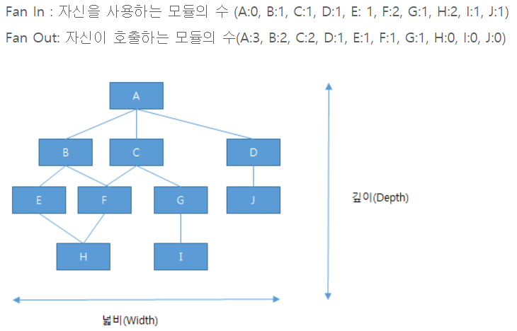
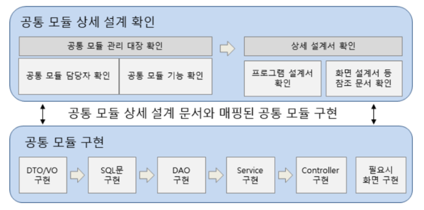

# Chapter05.서버 프로그램 구현
## Section02. 개발 프레임워크
01. 프레임워크의 개념
    * 소프트웨어 개발에 공통적으로 사용되는 구성 요소와 아키텍처를 일반화하여 송쉽게 구현할 수 있도록 여러 가지 기능들을 제공해주는 반제품 형태의 소프트웨어
    * 소프트웨어 개발에 바탕이 되는 템플릿과 같은 역할을 하는 클래스들과 인터페이스들의 집합
    * 소프트웨어 개발 시 공통적인 부분을 제공
02. 프레임워크의 특징
    1) 모듈화(Modularity)
       * 프레임워크는 구현을 인터페이스 뒤에 감추는 캡슐화를 통해서 모듈화를 강화
       * 설계와 구현의 변경에 따르는 영향을 최소화시킴으로써 쉽게 소프트웨어의 품질을 향상 시킴
    2) 재사용성(Reusability)
       * 프레임워크가 제공하는 인터페이스는 여러 애플리케이션에서 반복적으로 사용할 수 잇는 일반적인 컴포넌트를 정의할 수 있게 함으로써 재사용성을 높여준다.
       * 소프트웨어의 품질, 성능, 신뢰성, 상호 운용성을 향상시키고, 프로그래머의 생산성을 높여준다.
    3) 확장성(Extensibility)
       * 다형성(Polymorphism)을 통해 애플리케이션의 프레임워크의 인터페이스를 확장할 수 있게 한다.
    4) 제어의 역흐름(Inversion of Control)
       * 프레임워크가 외부의 이벤트에 대해 애플리케이션이 어떠한 메소드들을 수행해야 하는지 결정
03. 프레임워크의 구분
    1) Java 프레임워크
       * 전자정부 표준 프레임워크
       * 스트럿츠
       * 스프링
    2) ORM 프레임워크
       * 아이바티스(iBatis)
       * 마이바티스(myBatis)
       * 하이버네이트(Hibernate)
    3) 자바스크립트 프레임워크
       * 앵귤러제이에스(AngularJS)
       * ReactJS
       * ExtJS
    4) 프론트엔드 프레임워크
       * Bootstrap
       * Foundation
       * MDL
04. 라이브러리(Library)
    * 컴퓨터 프로그램에서 빈번하게 사용되는 루틴 또는 리소스(클래스, 템플릿, 설정 데이터 등)를 모아둔 것
    * 재사용이 필요한 기능으로 반복적인 코드 작성을 없애기 위해 언제든지 필요한 곳에서 호출하여 사용할 수 있도록 클래스(Class)나 함수(Function)로 만들어진 것
    * 라이브러리는 애플리케이션의 특정 기능, 프레임워크는 애플리케이션의 구조
05. API(Application Programming Interface)
    * 일종의 소프트웨어 인터페이스이며 다른 종류의 소프트웨어에 서비스를 제공한다.
    * API는 응용 프로그램에서 사용할 수 있도록, 운영 체제나 프로그래밍 언어가 제공하는 기능을 제어할 수 있게 만든 인터페이스
    * API 특징
      - 개발 비용 감축
      - 반복 작업 줄이기
      - 쉬운 유지 관리
      - 새로운 수익 채널의 확대
      - 비즈니스 파이의 확장
## Section03. 모듈 구현
01. 단위 모듈 구현
    1) 단위 모듈 구현의 개념
       * 소프트웨어를 기능 단위로 분해하여 구현하는 기법
       * 서브시스템, 서브루틴, 작업 단위 등으로 나누어 각 모듈이 독립적으로 활용될 수 있게 구현
       * 모듈의 크기는 작고, 하나의 일만을 수행해야 한다.
       * 모듈의 크기가 작으면 읽기 쉽고, 구현하기 쉬우며, 테스트 부담이 적어진다.
    2) 단위 모듈 구현 시 장점
       * 프로그램의 효율적인 관리 및 성능이 향상
       * 전체적인 소프트웨어 복잡성 감소 및 이해성 증대
       * 테스트, 모듈 통합, 변경 용이성 쉬움
       * 기능의 분리가 가능하고 인터페이스가 단순해짐
       * 오류의 파급효과 최소화
       * 모듈의 재사용으로 개발과 유지보수가 용이
    3) 효과적인 모듈화
       * 결합도를 낮추고 응집도를 높여 모듈의 독립성을 높임
       * FAN-OUT 최소화, FAN-IN 증가
       * 모듈 인터페이스를 평가하여 복잡성과 중복성을 줄이고 일관성을 높인다.
       * 기능 예측이 가능한 모듈을 정의
       * 하나의 입력과 하나의 출력을 유지
    4) 단위 모듈 설계의 원리
       1) 단계적 분해
          * 처음엔 간단히 작성하고, 점점 세밀하게 작성
       2) 추상화
          * 복잡한 문제를 일반화하여, 쉽게 이해할 수 있도록 한다.
       3) 독립성
          * 모듈은 응집도를 높이고, 결합도는 낮춰 독립성을 가져야 한다.
       4) 정보은닉
          * 모듈 내부의 데이터를 외부에 은폐
       5) 분할과 정복
          * 큰 문제를 작게 나누어 하나씩 해결
    5) 단위 모듈 작성 원칙
       1) 정확성(Correctness)
          * 해당 기능이 실제 시스템 구현 시 필요한지 여부를 알 수 있도록 정확하게 작성
       2) 명확성(Clarity)
          * 해당 기능에 대해 일관되게 이해되고 한 가지로 해석될 수 있도록 작성
       3) 완정성(Completeness)
          * 시스템이 구현될 때 필요하고 요구되는 모든 것을 기술
       4) 일관성(Consistency)
          * 공통 기능들 간에 상호 충돌이 없도록 작성
       5) 추적성(Traceability)
          * 공통 기능에 대한 요구사항 출처와 관련 시스템 등의 유기적 관계에 대한 식별이 가능하도록 작성
02. 결합도
    1) 결합도(Coupling)의 개념
       * 어떤 모듈이 다른 모듈에 의존하는 정도
       * 두 모듈 사이의 연관 관계
       * 결합도가 낮을수록 잘 설계된 모듈이다.
    2) 결합도 유형
       * |               구분               | 설명                                                            |
         |:------------------------------:|:--------------------------------------------------------------|
         |   자료 결합도<br/>(Data Coupling)   | 모듈 간의 인터페이스로 값이 전달되는 경우                                       |
         |  스탬프 결합도<br/>(Stamp Coupling)  | 모듈 간의 인터페이스로 배열이나 오브젝트, 스트럭처 등이 전달되는 경우                       |
         | 제어 결합도<br/>(Control Coupling)  | 단순 처리할 대상인 값만 전달되는 것이 아니라 어떻게 처리를 해야 한다는 제어 요소가 전달되는 경우       |
         | 외부 결합도<br/>(External Coupling) | 어떤 모듈에서 선언한 데이터(변수)를 외부의 다른 모듈에서 참조하는 경우                      |
         |  공통 결합도<br/>(Common Coupling)  | 파라미터가 아닌 모듈 밖에 선언되어 있는 전역 변수를 참조하고 전역 변수를 갱신하는 식으로 상호 작용하는 경우 |
         | 내용 결합도<br/>(Content Coupling)  | 다른 모듈 내부에 있는 변수나 기능을 다른 모듈에서 사용하는 경우                          |
03. 응집도
    1) 응집도(Cohesion)의 개념
       * 모듈의 독립성을 나타내는 개념으로, 모듈 내부 구성요소 간 연관 정도
       * 정보 윽닉 개념의 확장개념으로, 하나의 모듈은 하나의 기능을 수행하는 것을 의미
       * 응집도는 높을수록 좋고, 결합도는 낮을수록 이상적
    2) 응집도 유형
       * |                  구분                  | 설명                                                   |
         |:------------------------------------:|:-----------------------------------------------------|
         |  기능적 응집도<br/>(Functional Cohesion)   | 모듈 내부의 모든 기능이 단일한 목적을 위해 수행되는 경우                     |
         |  순차적 응집도<br/>(Sequential Cohesion)   | 모듈 내에서 한 활동으로부터 나온 출력값을 다른 활동이 사용할 경우                |
         | 통신적 응집도<br/>(Communication Cohesion) | 동일한 입력과 출력을 사용하여 다른 기능을 수행하는 활동들이 모여 있을 경우           |
         |  절차적 응집도<br/>(Procedural Cohesion)   | 모듈이 다수의 관련 기능을 가질 때 모듈 안의 구성 요소들이 그 기능을 순차적으로 수행할 경우 |
         |   시간적 응집도<br/>(Temporal Cohesion)    | 연관된 기능이라기보다는 특정 시간에 처리되어야 하는 활동들을 한 모듈에서 처리할 경우      |
         |    논리적 응집도<br/>(Logical Cohesion)    | 유사한 성격을 갖거나 특정 형태로 분류되는 처리 요소들이 한 모듈에서 처리되는 경우       |
         | 우연적 응집도<br/>(Coincidental Cohesion)  | 모듈 내부의 각 구성 요소들이 연관이 없을 경우                           |
04. 팬인(Fan-in), 팬아웃(Fan-out)
    1) 팬인(Fan-in), 팬아웃(Fan-out)의 개념
       * 소프트웨어의 구성요소인 모듈을 계층적으로 분석하기 위해 활용
       * 팬인과 팬아웃 분석을 통해 시스템의 복잡도를 측정
       * 시스템 복잡도를 최적화하기 위해서는 팬인은 높게, 팬 아웃은 낮게 설계
       * 팬인 : 얼마나 많은 모듈들이 현재 모듈을 호출하는지를 나타낸다. / 해당 모듈로 들어오는 상위 모듈 수
       * 팬아웃 : 해당 모듈에서 호출하는 하위 모듈 수
    2) 팬인/팬아웃 계산법
       
05. 공통 모듈 구현
    1) 공통 모듈 구현 순서
       
    2) 공통 모듈 구현요소
       * |             구현 요소              | 설명                                                                     |
         |:------------------------------:|:-----------------------------------------------------------------------|
         | DTO<br/>(Data Transfer Object) | 프로레스 사이에서 데이터를 전송하는 객체<br/>Getter, Setter 메서드만 포함된다.                   |
         |     VO<br/>(Value Object)      | 도메인에서 속성들을 묶어서 특정 값을 나타내는 객체<br/>DTO와 동일한 개념이나 차이점은 Read-Only 속성 객체이다. |
         |  DAO<br/>(Data Access Object)  | 실질적으로 DB에 접근하는 객체<br/>DataBase에 접근하기 위한 로직 & 비지니스 로직을 분리하기 위해 사용       |
         |            Service             | DAO 클래스를 호출하는 객체                                                       |
         |           Controller           | 비즈니스 로직을 수행하는 객체                                                       |
    3) 공통 모듈 구현
       1) DTO/VO 구현
       ```java
       package com.explain.vo;
       public class CodeVO{
            private String code;
            private String name;
            public String getCode() {
               return this.code;
            }
            public void setCode(String code) {
               this.code = code;
            }
            public String getName() {
               return this.name;
            }
            public void setName(String name) {
               this.Name = name;
            }
       }
       ```
       2) SQL 문 구현
       ```xml
       <?xml version="1.0" encoding="UTF-8"?>
       <!DOCTYPE mapper PUBLIC "-//ibatis.apache.org//DTD Mapper 3.0//EN"
       "http://ibatis.apache.org/dtd/ibatis-3-mapper.dtd">
       
       <mapper namespace="com.explain.sql">
            <select id="getCodeList" resultType="com.explain.vo.CodeVo">
                SELECT
                    code, name
                FROM tb_code
            </select>
       
            <update id="updateCodeInfo" parameterType="com.explain.vo.CodeVo">
                UPDATE tb_code
                SET
                    name = #{name, jdbcType=CHAR}
                WHERE code = #{code, jdbcType=INTEGER}
            </update>
       </mapper>
       ```
       3) DAO 구현
       ```java
       package com.explain.dao;
       import com.explain.vo.CodeVo;
       
       @Repository("codeDao")
       public class CodeDao{
            @Autowired
            private SqlSession sqlSession;
       
            public List<CodeVo> getCodeList() throws Exception {
                return sqlSession.selectList("com.explain.sql.getCodeList");
            }
       
            public int updateCodeIsUse(CodeVo code) {
                return sqlSession.update("com.explain.sql.updateCodeInfo", code);
            }
       }
       ```
       4) Service 구현
       ```java
       package com.explain.service;
       import com.explain.vo.CodeVO;
       import com.explain.dao.CodeDao;
       
       @Service("codeService")
       public class CodeService{
            @Resource(name="codeDao")
            private CodeDao codeDao;
       
            public List<CodeVo> getCodeList() throws Exception {
                return codeDao.getCodeList();
            }
       
            public int updateCodeIsUse(CodeDao codeDao) throws Exception {
                return codeDao.updateCodeIsUse(codeDao);
            }
       }
       ```
       5) Controller 구현
       ```java
       package com.explain.controller;
       import com.explain.vo.CodeVo;
       import com.explain.dao.CodeDao;
       import com.explain.service.CodeService;
       
       @Controller
       public class CodeController{
            @Autowired
            private CodeService codeService;
       
            @RequestMapping(value = "/code/list")
            public ResponseEntity<List<CodeVO>> list(){
                try{
                    List<CodeVO> list = codeService.getCodeList();
       
                    if(list != null){
                        return new ResponseEntity<List<CodeVO>>(list, HttpStatus.OK);
                    }
                    else{
                        return new ResponseEntity<List<CodeVO>>(list, HttpStatus.NO_CONTENT);
                    }
                }catch (Exception e){
                    logger.error(e.getMessage());
                }
            }
       }
       ```
    4) Annotation
       1) Annotation 개념
          * 사전적으로는 "주석"이라는 의미를 가지고 있다.
          * 자바코드에 주석처럼 달아 특수한 의미를 부여한다.
          * 컴파일 또는 런타임에 해석된다.
       2) Annotation 종류
          * |       종류        | 설명                                         |
            |:---------------:|:-------------------------------------------|
            |   @Controller   | 스프링 MVC의 컨트롤러 객체임을 명시                      |
            | @RequestMapping | 특정 URL에 매칭되는 클래스나 메소드임을 명시                 |
            |  @RequestParam  | 요청(request)에서 특정한 파라미터 값을 찾아낼 때 사용하는 어노테이션 |
            | @RequestHeader  | 요청(request)에서 특정 HTTP 헤더 정보를 추출할 때 사용      |
            |  @PathVariable  | 현재 URL에서 원하는 정보를 추출할 때 사용                  |
            |  @CookieValue   | 현재 사용자의 쿠키값을 추출할 때 사용                      |
            | @ModelAttribute | 자동으로 해당 객체를 뷰까지 전달하도록 한다.                  |
            |  @ResponseBody  | 리턴 타입이 HTTP의 응답 메시지로 전송                    |
            |  @RequestBody   | 요청 문자열이 그대로 파라미터로 전달                       |
            |   @Repository   | DAO 객체                                     |
            |    @Service     | 서비스 객체                                     |
            |   @Scheduled    | 스프링에서 지원하는 배치 어노테이션                        |