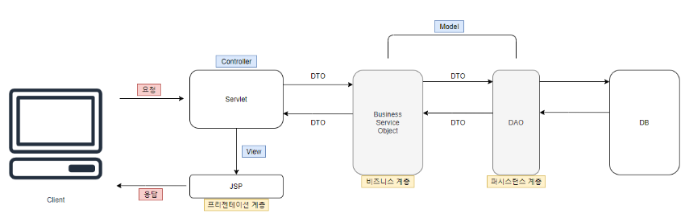

# Chapter05.서버 프로그램 구현
## Section04.서버 프로그램 구현
01. 서버 프로그램 구현
    1) 업무 프로세스 확인
       1) 업무 프로세스의 개념
          * 개인이나 조직이 한 개 이상의 자원 입력을 통해 가치 있는 산출물을 제공하는 활동
            - 공급자(Supplier) --(자원 / 입력)--> 프로세스(Process) --(제품,서비스 / 출력)--> 고객(Customer)
       2) 업무 프로세스 구성 요소
          * |     구성 요소     | 설명                                                                                 |
            |:-------------:|:-----------------------------------------------------------------------------------|
            |   프로세스 책임자    | 프로세스의 성과와 운영을 책임지는 구성원 프로세스를 설계하고 지속적으로 유지한다.                                  |
            |    프로세스 맵     | 상위 프로세스와 하위 프로세스의 체계를 도식화하여 업무의 청사진 표현 구조적 분석 기법 : 자료 흐름도 객체지향 분석 기법 : UML |
            | 프로세스 Task 정의서 | 결과물을 산출하기 위해 Task들의 운영방법을 문서화한다.                                                   |
            |  프로세스 성과 지표   | 프로세스의 과정과 결과를 고객 입장에서 정량적으로 표현한 성과 지표                                              |
            |    프로세스 조직    | 프로세스를 성공적으로 수행하기 위해 개인들의 업무를 유기적으로 수행하는 구성원                                        |
            |   경영자의 리더십    | 경영자는 프로세스의 중요성을 인식한다. 기업의 경영 방침을 확고하게 한다.                                      |
    2) 서버 프로그램 구현
       * 업무 프로세스(Business Logic)를 기반으로 개발언어, 도구를 이용하여 서버에서 서비스를 제공하는 데 필요한 기능을 구현하는 활동
       * 서버 프로그램 구현 절차
       
       * 구현 요소
         * |             구현 요소              | 설명                                                                     |
           |:------------------------------:|:-----------------------------------------------------------------------|
           | DTO (Data Transfer Object) | 프로세스 사이에서 데이터를 전송하는 객체 Getter, Setter 메서드만 포함한다.                   |
           |     VO (Value object)      | 도메인에서 속성들을 묶어서 특정 값을 나타내는 객체 DTO와 동일한 개념이나 차이점은 Read-Only 속성 객체이다. |
           |  DAO (Data Access Object)  | 실질적으로 DB에 접근하는 객체 DataBase에 접근하기 위한 로직 & 비지니스 로직을 분리하기 위해 사용       |
           |            Service             | DAO 클래스를 호출하는 객체                                                       |
           |           Controller           | 비즈니스 로직을 수행하는 객체                                                       |
    3) MVC 모델의 계층
       1) 프레젠테이션 계층(Presentation Layer)
          * 사용자 인터페이스
          * 사용자가 선택할 수 있는 기능 및 부가정보를 전달할 양식을 표현한다.
          * JSP와 JSTL 태그 라이브러리를 결합하는 방식(JAVA의 경우)
       2) 제어 계층(Control Layer)
          * 프레젠테이션 계층과 비즈니스 로직 계층을 분리하기 위한 컨트롤러를 제공
          * 어떤 요청이 들어왔을 때 어떤 로직이 처리해야 하는지를 결정한다.
          * 사용자 요청을 검증하고 로직에 요청을 전달하는 일과 로직에서 전달된 응답을 적절한 뷰에 연결하는 역할
       3) 비즈니스 로직 계층(Business Logic Layer)
          * 핵심 업무를 어떻게 처리하는지에 대한 방법을 구현하는 계층
          * 핵심 업무 로직의 구현과 그에 관련된 데이터의 적합성 검증, 트랜잭션 처리 등을 담당한다.
       4) 퍼시스턴스 계층(Persistence Layer)
          * 데이터 처리를 담당하는 계층
          * 데이터의 생성/수정/삭제/선택(검색)과 같은 CRUD 연산을 수행한다.
       5) 도메인 모델 계층(Domain Model Layer)
          * 각 계층 사이에 전달되는 실질적인 비즈니스 객체
          * 데이터 전송 객체(DTO) 형태로 개발자가 직접 제작해서 데이터를 넘기게 된다.
02. DBMS 접속기술
    1) DBMS 접속기술의 개념
       * 프로그램에서 DB에 접근하여 DML을 사용 가능하게 하는 기술
       * 프로그램이 DB를 사용할 수 있도록 연결해주는 인터페이스
    2) DBMS 접속기술 종류
       1) 소켓통신
          * 응용프로그램과 DBMS가 주고받는 통신
          * DBMS사에서 프로토콜을 공개하지 않기 때문에 개발은 어렵다.
       2) Vender API
          * DBMS사에서 공개한 API를 이용해 DBMS와 통신
          * DBMS사마다 API 사용법이 상이하다.
       3) JDBC(Java DataBase Connectivity)
          * Java에서 DB에 접속하고 SQL문을 수행할 때 사용되는 표준 API
          * JDBC는 Java SE(Standard Edition)에 포함되어 있다.
          * java sql 패키지와 javax.sql 패키지에 포함되어 있다.
          * 접속하려는 DBMS에 맞는 드라이버가 필요하다.
       4) ODBC(Open DataBase Connectivity)
          * 데이터베이스에 접근하기 위한 표준 규격
          * 개발언어에 관계없이 사용할 수 있따.
          * 모든 DBMS에 접근하는 방법을 통일시킴
          * 1990년대 초 MS사에서 개발됨
03. ORM(Object-Relational Mapping) 프레임워크
   1) ORM 프레임워크의 개념
      * 객체와 관계형 데이터베이스의 데이터를 자동으로 매핑(연결)해 주는 것
      * 객체지향 프로그램에서 클래스를 생성하고, 관계형 데이터베이스의 테이블의 내용을 매핑
      * 객체지향 프로그램을 통해 데이터베이스의 데이터를 다룬다.
   2) ORM의 장/단점
      * | 장점  | 비즈니스 로직에 더 집중할 수 있다. 재사용 및 유지보수의 편리성이 증가한다. DBMS에 대한 종속성이 줄어든다. |
        |:---:|:------------------------------------------------------------------------|
        | 단점  | 완벽한 ORM으로만 서비스를 구현하기 어렵다. 프로시저가 많은 시스템에선 ORM의 객체지향 장점을 활용하기 어렵다.    |
   3) 매핑 기술 비교
      1) SQL Mapper
         * SQL을 명시하여 단순히 필드를 매핑시키는 것이 목적
         * SQL 문장으로 직접 데이터베이스 데이터를 다룬다.
         * SQL 의존적인 방법
         * 종류 : iBatis, Mybatis, jdbc Templetes 등
      2) OR Mapping(=ORM)
         * 객체를 통해 간접적으로 데이터베이스를 다룬다.
         * 객체와 관계형 데이터베이스의 데이터를 자동으로 매핑
         * ORM을 이용하면 SQL Query가 아닌 직관적인 코드로 데이터를 조작할 수 있다.
         * 종류 : JPA(Java Persistent API), Hibernate
04. 시큐어 코딩(Secure Coding)
    1) OWASP(The Open Web Application Security Project)
       * 오픈소스 웹 애플리케이션 보안 프로젝트
       * 주로 웹에 관한 정보 노출, 악성 파일 및 스크립트 보안 취약점 등을 연구하며 10대 취약점을 발표했다.
       * OWASP Top 10
         - 웹 애플리케이션 취약점 중 빈도가 많이 발생하고, 보안상 영향을 줄 수 있는 10가지를 선정하여 발표
    2) 시큐어 코딩 가이드

          

