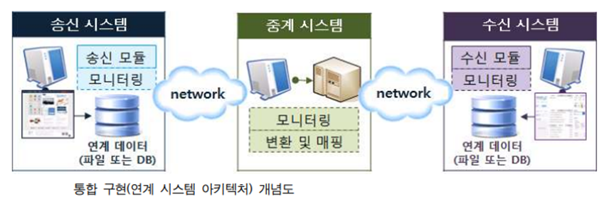

# Chapter06.인터페이스 구현
## Section01.인터페이스 개요
1. 인터페이스 시스템
   1) 인터페이스 시스템의 개념
      * 서로 다른 시스템, 장치 사이에서 정보나 신호를 주고받을 수 있도록 도움을 주는 시스템
   2) 인터페이스 시스템 구성
      
      1) 송신 시스템
         * 연계할 데이터를 생성하여, 연계 테이블 또는 파일 형태로 송신하는 시스템
         * 단계뼐 작업
           1) 연계 데이터 생성 및 추출
           2) 코드 매핑 및 데이터 변환
           3) 인터페이스 테이블 / 파일 생성
           4) 로그 기록
           5) 데이터 전송
      2) 수신 시스템
         * 수신한 데이터를 데이터 형식에 맞게 저장하고 활용하는 시스템
         * 단계별 작업
           1) 데이터 수신
           2) 코드 매핑 및 데이터 변환
           3) 로그 기록
           4) 연계 데이터 반영
      3) 중계 서버
         * 송신 시스템과 수신 시스템 사이에서 데이터를 송수신하고 송수신 현황을 모니터링 하는 시스템
         * 연계 데이터의 보안 강화 및 다중 플랫폼 지원 등이 가능
2. 연계 시스템 분류와 데이터 식별
   1) 시스템 분류 체계
      * 기업 내부에서 사용하고 잇는 시스템 분류 체계를 기반으로 대내외 인터페이스 시스템의 식별자를 정의
      * 기업이 수행하는 업무를 파악하여 상위 시스템과 하위 시스템을 구분
      * 업무를 기준으로 인터페이스 시스템에 식별 코드를 부여
   2) 연계 시스템 식별 정보
      * |    구분     | 설명                                   |
        |:---------:|:-------------------------------------|
        | 대내외 구분 정보 | 기업 내부 시스템인지 외부 기관 시스템인지 구분           |
        |    기관명    | 대외 기관일 경우 기관명을 기술                    |
        |  시스템 ID   | 시스템 분류 체계에 따라 부여된 식별 번호              |
        |    한글명    | 시스템 한글명                              |
        |    영문명    | 시스템 영문명(영문 코드)                       |
        |  시스템 설명   | 시스템에 대한 업무, 위치 등에 대한 부가 정보           |
        |  시스템 위치   | 시스템이 설치된 위치(노드) 정보                   |
        |  네트워크 특성  | 네트워크 속도, 대역폭, 유의사항 등 네트워크 특성         |
        | 전용 회선 정보  | 전용 회선을 사용할 경우 전용 회선 연결 방법과 속도 등의 정보  |
        |  IP/URL   | 시스템 접속에 필요한 IP 또는 URL 정보             |
        |   Port    | 접속에 필요한 Port 정보                      |
        | Login 정보  | 시스템 로그인 ID와 암호                       |
        |   DB 정보   | 데이터베이스 연계 시 필요한 DBMS 유형, DBMS 로그인 정보 |
        |  담당자 정보   | 해당 시스템의 인터페이스 담당자 연락처                |
   3) 송수신 데이터 식별
      * 송수신 시스템 사이에서 교환되는 데이터는 규격화된 표준 형식에 따라 전송
      * 인터페이스 설계 단계에서는 송수신 시스템 간에 전송되는 표준 항목과 업무 처리용 데이터 및 공통 코드 정보 등을 누락 없이 식별하고 인터페이스 명세서를 작성
      * 송수신 전문 구성
        - |   구성   | 설명                                           |
          |:------:|:---------------------------------------------|
          | 전문 공통부 | 인터페이스 표준 항목을 포함 인터페이스 ID, 서비스 코드, 접속 IP등 |
          | 전문 개별부 | 업무처리에 필요한 데이터를 포함                            |
          | 전문 종류부 | 전송 데이터의 끝을 표시하는 문자 포함                        |
## Section02.인터페이스 설계서 확인
1.인터페이스 설계서 구성
   1) 인터페이스 목록
      * 연계 업무와 연계에 참여하는 송수신 시스템의 정보, 연계 방식과 통신 유형 등에 대한 정보
      * 주요 항목
        * |    주요 항목    | 설명                                                                                   |
          |:-----------:|:-------------------------------------------------------------------------------------|
          |  인터페이스 ID   | 인터페이스를 구분하기 위한 식별자, 명명 표준에 맞게 부여                                                     |
          |   인터페이스 명   | 인터페이스의 목적을 나타내는 이름                                                                   |
          |   송신 시스템    | 인터페이스를 통해 데이터를 전송하는 시스템                                                              |
          |   수신 시스템    | 인터페이스를 통해 전송된 데이터를 이용하는 시스템                                                          |
          |   대내외 구분    | 인터페이스가 기업 내부 시스템 간 또는 내,외부 시스템 간에 발생하는지 여부                                           |
          |    연계 방식    | 웹 서비스, FTP, DB Link, Socket 등 아키텍처에서 정의한 인터페이스 방식                                    |
          |    통신 유형    | 동기, 비동기 등 아키텍처에서 정의한 통신 유형                                                           |
          |    처리 유형    | 실시간, 배치, 지연 처리 등 인터페이스 처리 유형 처리유형이 실시간인 경우, 수시, 그 외 상세 주기를 표시(매일 오전 10시, 매시 10분) |
          |     주기      | 인터페이스가 발생하는 주기                                                                       |
          |   데이터 형식    | 고정 길이, XML 등 인터페이스 항목의 데이터 포맷                                                        |
          | 관련 요구 사항 ID | 해당 인터페이스와 관련된 요구 사항 식별 정보                                                            |
   2) 인터페이스 정의서
      * 데이터 송신 시스템과 수신 시스템 간의 속성과 제약조건 등을 상세히 포함한다.
      * 주요 항목
        * |     주요 항목     | 설명                                      |
          |:-------------:|:----------------------------------------|
          |   인터페이스 ID    | 인터페이스를 구분하기 위한 식별자, 명명 표준에 맞게 부여        |
          |   최대 처리 횟수    | 단위 시간당 처리될 수 있는 해당 인터페이스 최대 수행 건수       |
          | 데이터 크기(평균/최대) | 해당 인터페이스 1회 처리 시 소요되는 데이터의 평균 크기와 최대 크기 |
          |    시스템 정보     | 시스템명, 업무, 서비스명, 연계방식, 담당자/연락처           |
          |    데이터 정보     | 번호, 필드, 식별자 여부, 데이터 타입, 크기, 설명 등        |
   3) 인터페이스 설계서 명세화
      * 인터페이스 설계 가이드와 인터페이스 설계서 작성 양식을 준비
      * 분석 단계에서 정의된 정보를 인터페이스 목록 양식에 맞춰 작성
      * 인터페이스 정의서 작성 양식에 맞춰 송수신 시스템의 정보를 각각 작성
      * 인터페이스 식별 당시 작성한 서비스의 프로그램 명세서를 확인하고 보완이 필요한 경우 수정
      * 인터페이스 설계서 작성 양식에 맞춰 송수신 데이터 항목 상세를 작성
      * 인터페이스 설계 내용을 검토하고 보완
2. 데이터 표준 확인
   1) 인터페이스 데이터 표준 개념
      * 인터페이스를 위해 인터페이스가 되어야 할 범위의 데이터들의 형식과 표준을 정의하는 것
      * 데이터의 공통 영역을 추출하여 정의하는 경우와, 한 쪽의 데이터를 변환하는 경우가 있다.
   2) 인터페이스 데이터 표준 확인
      * 인터페이스에 필요한 데이터 포맷의 표준을 표현한다.
      * 데이터 포맷은 Json, DB, XML 등 다양한 형태로 표현이 가능
   3) 인터페이스 데이터 표준 확인 절차
      * 식별된 데이터 인터페이스를 통해 인터페이스 데이터 표준을 확인
      * 식별된 인터페이스 기능을 통해 인터페이스 데이터 표준을 확인
      * 데이터 인터페이스 및 식별된 인터페이스 기능을 통해 데이터 표준을 확인
## Section03.인터페이스 기능 구현

    

