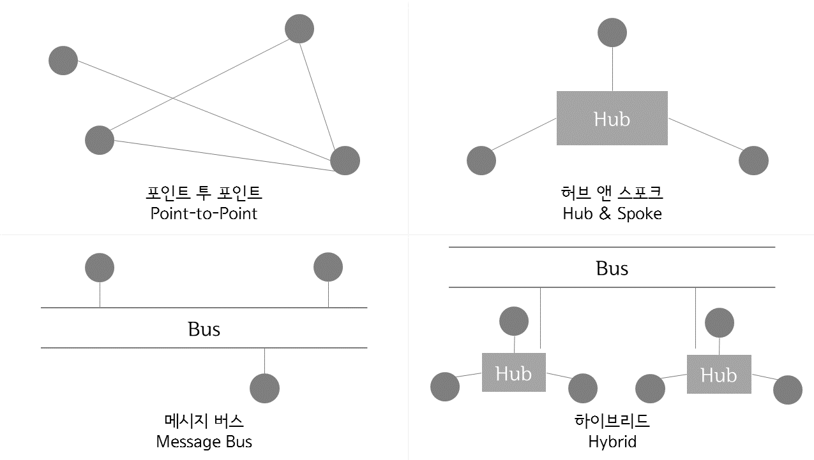
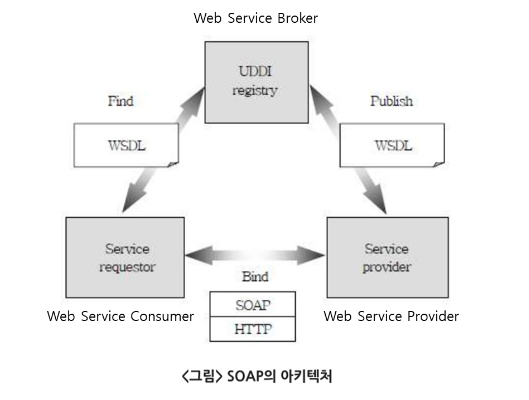

# Chapter06.인터페이스 구현
## Section01.인터페이스 개요
1. 인터페이스 시스템
   1) 인터페이스 시스템의 개념
      * 서로 다른 시스템, 장치 사이에서 정보나 신호를 주고받을 수 있도록 도움을 주는 시스템
   2) 인터페이스 시스템 구성
      
      1) 송신 시스템
         * 연계할 데이터를 생성하여, 연계 테이블 또는 파일 형태로 송신하는 시스템
         * 단계뼐 작업
           1) 연계 데이터 생성 및 추출
           2) 코드 매핑 및 데이터 변환
           3) 인터페이스 테이블 / 파일 생성
           4) 로그 기록
           5) 데이터 전송
      2) 수신 시스템
         * 수신한 데이터를 데이터 형식에 맞게 저장하고 활용하는 시스템
         * 단계별 작업
           1) 데이터 수신
           2) 코드 매핑 및 데이터 변환
           3) 로그 기록
           4) 연계 데이터 반영
      3) 중계 서버
         * 송신 시스템과 수신 시스템 사이에서 데이터를 송수신하고 송수신 현황을 모니터링 하는 시스템
         * 연계 데이터의 보안 강화 및 다중 플랫폼 지원 등이 가능
2. 연계 시스템 분류와 데이터 식별
   1) 시스템 분류 체계
      * 기업 내부에서 사용하고 잇는 시스템 분류 체계를 기반으로 대내외 인터페이스 시스템의 식별자를 정의
      * 기업이 수행하는 업무를 파악하여 상위 시스템과 하위 시스템을 구분
      * 업무를 기준으로 인터페이스 시스템에 식별 코드를 부여
   2) 연계 시스템 식별 정보
      * |    구분     | 설명                                   |
        |:---------:|:-------------------------------------|
        | 대내외 구분 정보 | 기업 내부 시스템인지 외부 기관 시스템인지 구분           |
        |    기관명    | 대외 기관일 경우 기관명을 기술                    |
        |  시스템 ID   | 시스템 분류 체계에 따라 부여된 식별 번호              |
        |    한글명    | 시스템 한글명                              |
        |    영문명    | 시스템 영문명(영문 코드)                       |
        |  시스템 설명   | 시스템에 대한 업무, 위치 등에 대한 부가 정보           |
        |  시스템 위치   | 시스템이 설치된 위치(노드) 정보                   |
        |  네트워크 특성  | 네트워크 속도, 대역폭, 유의사항 등 네트워크 특성         |
        | 전용 회선 정보  | 전용 회선을 사용할 경우 전용 회선 연결 방법과 속도 등의 정보  |
        |  IP/URL   | 시스템 접속에 필요한 IP 또는 URL 정보             |
        |   Port    | 접속에 필요한 Port 정보                      |
        | Login 정보  | 시스템 로그인 ID와 암호                       |
        |   DB 정보   | 데이터베이스 연계 시 필요한 DBMS 유형, DBMS 로그인 정보 |
        |  담당자 정보   | 해당 시스템의 인터페이스 담당자 연락처                |
   3) 송수신 데이터 식별
      * 송수신 시스템 사이에서 교환되는 데이터는 규격화된 표준 형식에 따라 전송
      * 인터페이스 설계 단계에서는 송수신 시스템 간에 전송되는 표준 항목과 업무 처리용 데이터 및 공통 코드 정보 등을 누락 없이 식별하고 인터페이스 명세서를 작성
      * 송수신 전문 구성
        - |   구성   | 설명                                           |
          |:------:|:---------------------------------------------|
          | 전문 공통부 | 인터페이스 표준 항목을 포함<br/>인터페이스 ID, 서비스 코드, 접속 IP등 |
          | 전문 개별부 | 업무처리에 필요한 데이터를 포함                            |
          | 전문 종류부 | 전송 데이터의 끝을 표시하는 문자 포함                        |
## Section02.인터페이스 설계서 확인
1.인터페이스 설계서 구성
   1) 인터페이스 목록
      * 연계 업무와 연계에 참여하는 송수신 시스템의 정보, 연계 방식과 통신 유형 등에 대한 정보
      * 주요 항목
        * |    주요 항목    | 설명                                                                                   |
          |:-----------:|:-------------------------------------------------------------------------------------|
          |  인터페이스 ID   | 인터페이스를 구분하기 위한 식별자, 명명 표준에 맞게 부여                                                     |
          |   인터페이스 명   | 인터페이스의 목적을 나타내는 이름                                                                   |
          |   송신 시스템    | 인터페이스를 통해 데이터를 전송하는 시스템                                                              |
          |   수신 시스템    | 인터페이스를 통해 전송된 데이터를 이용하는 시스템                                                          |
          |   대내외 구분    | 인터페이스가 기업 내부 시스템 간 또는 내,외부 시스템 간에 발생하는지 여부                                           |
          |    연계 방식    | 웹 서비스, FTP, DB Link, Socket 등 아키텍처에서 정의한 인터페이스 방식                                    |
          |    통신 유형    | 동기, 비동기 등 아키텍처에서 정의한 통신 유형                                                           |
          |    처리 유형    | 실시간, 배치, 지연 처리 등 인터페이스 처리 유형<br/>처리유형이 실시간인 경우, 수시, 그 외 상세 주기를 표시(매일 오전 10시, 매시 10분) |
          |     주기      | 인터페이스가 발생하는 주기                                                                       |
          |   데이터 형식    | 고정 길이, XML 등 인터페이스 항목의 데이터 포맷                                                        |
          | 관련 요구 사항 ID | 해당 인터페이스와 관련된 요구 사항 식별 정보                                                            |
   2) 인터페이스 정의서
      * 데이터 송신 시스템과 수신 시스템 간의 속성과 제약조건 등을 상세히 포함한다.
      * 주요 항목
        * |     주요 항목     | 설명                                      |
          |:-------------:|:----------------------------------------|
          |   인터페이스 ID    | 인터페이스를 구분하기 위한 식별자, 명명 표준에 맞게 부여        |
          |   최대 처리 횟수    | 단위 시간당 처리될 수 있는 해당 인터페이스 최대 수행 건수       |
          | 데이터 크기(평균/최대) | 해당 인터페이스 1회 처리 시 소요되는 데이터의 평균 크기와 최대 크기 |
          |    시스템 정보     | 시스템명, 업무, 서비스명, 연계방식, 담당자/연락처           |
          |    데이터 정보     | 번호, 필드, 식별자 여부, 데이터 타입, 크기, 설명 등        |
   3) 인터페이스 설계서 명세화
      * 인터페이스 설계 가이드와 인터페이스 설계서 작성 양식을 준비
      * 분석 단계에서 정의된 정보를 인터페이스 목록 양식에 맞춰 작성
      * 인터페이스 정의서 작성 양식에 맞춰 송수신 시스템의 정보를 각각 작성
      * 인터페이스 식별 당시 작성한 서비스의 프로그램 명세서를 확인하고 보완이 필요한 경우 수정
      * 인터페이스 설계서 작성 양식에 맞춰 송수신 데이터 항목 상세를 작성
      * 인터페이스 설계 내용을 검토하고 보완
2. 데이터 표준 확인
   1) 인터페이스 데이터 표준 개념
      * 인터페이스를 위해 인터페이스가 되어야 할 범위의 데이터들의 형식과 표준을 정의하는 것
      * 데이터의 공통 영역을 추출하여 정의하는 경우와, 한 쪽의 데이터를 변환하는 경우가 있다.
   2) 인터페이스 데이터 표준 확인
      * 인터페이스에 필요한 데이터 포맷의 표준을 표현한다.
      * 데이터 포맷은 Json, DB, XML 등 다양한 형태로 표현이 가능
   3) 인터페이스 데이터 표준 확인 절차
      * 식별된 데이터 인터페이스를 통해 인터페이스 데이터 표준을 확인
      * 식별된 인터페이스 기능을 통해 인터페이스 데이터 표준을 확인
      * 데이터 인터페이스 및 식별된 인터페이스 기능을 통해 데이터 표준을 확인
## Section03.인터페이스 기능 구현
1. 내,외부 모듈 연계 방식
   1) EAI(Enterprise Application Integration)
      1) EAI의 개념
         * 기업에서 운영되는 서로 다른 플랫폼 및 애플리케이션들 간의 정보 전달, 연계, 통합을 가능하게 해주는 솔루션
         * EAI를 사용함으로써 각 비즈니스 간 통합 및 연계성을 증대시켜 효율성을 높여 줄 수 있으며 각 시스템 간의 확장성을 높여줄 수 있다.
      2) EAI의 구축유형
         1) Point-to-Point
            * 중간에 미들웨어를 두지 않고 각 애플리케이션 간 Point to Point 형태로 연결
            * 솔루션 구매 없이 통합
         2) Hub & Spoke
            * 단일 접점이 허브 시스템을 통해 데이터를 전송하는 중앙 집중적 방식
            * 모든 데이터 전송 보장
            * 확장, 유지 보수 용이
            * 허브 장애 시 전체 영향
         3) Message Bus(ESB 방식)
            * 애플리케이션 사이 미들웨어(버스)를 두어 처리
            * 미들웨어 통한 통합
            * 어댑터가 각 시스템과 버스를 두어 연결하므로 뛰어난 확장성, 대용량 처리 가능
         4) Hybrid
            * 그룹 내에는 Hub & Spoke 방식을 그룹 간 메시징 버스 방식을 사용
            * 표준 통합 기술, 데이터 병목 현상 최소화
            
   2) ESB(Enterprise Service Bus)
      * 다양한 시스템과 연동하기 위한 멀티 프로토콜 지원
      * 버스를 통해 이기종 애플리케이션을 유연(loosely-coupled)하게 통합하는 핵심 플랫폼
      * ESB는 애플리케이션 간의 통합 측면에서 EAI와 유사하지만, 애플리케이션보다는 서비스 중심으로 통합을 지향하는 아키텍처 또는 기술이다.
2. 인터페이스 연계 기술
   1) Link
      * 데이터베이스에 제공하는 DB Link 객체를 이용
      * 수신 시스템에서 DB Link를 생성하고 송신 시스템에서 해당 DB Link를 직접 참조하는 방식
   2) DB Connection
      * 수신 시스템의 WAS에서 송신 시스템 DB로 연결하는 DB Connection Pool을 생성하고 연계 프로그램에서 해당 DB Connection Pool명을 이용
   3) JDBC
      * 수신 시스템의 프로그램에서 JDBC 드라이버를 이용하여 송신 시스템 DB와 연결
      * DBMS 유형, DBMS 서버 IP와 Port, DB instance 정보가 필요함
   4) API / OpenAPI
      * 송신 시스템의 애플리케이션 프로그래밍 인터페이스 프로그램
      * API명, 입출력 파라미터 정보가 필요함
   5) Web Service
      * WSDL(Web Services Description Languager), UDDI(Universal Description, Discovery and Integration), SOAP(Simple Object Access Protocol) 프로토콜을 이용하여 연계
   6) Hyper Link
      * 웹 애플리케이션에서 하이퍼링크(Hyper Link) 이용
   7) Socket
      * 통신을 위한 소켓(Socket)을 생성하여 포트를 할당하고 클라이언트의 통신 요청 시 클라이언트와 연결하고 통신하는 네트워크 기술
3. 인터페이스 전송 데이터
   1) JSON(JavaScript Object Notation)
      * javascript 객체 문법으로 구조화된 데이터를 표현하기 위한 문자 기반의 표준 포맷
      * Javascript에서 객체를 만들 때 사용하는 표현식
      * JSON 표현식은 이해하기 쉽고 용량이 작아서, 최근에는 JSON이 XML을 대체해서 데이터 전송 등에 많이 사용한다.
      * 프로그래밍 문법이 아닌 단순히 데이터를 표시하는 표현 방법일 뿐이다.
      * JSON 데이터는 이름과 값의 쌍으로 이루어 진다.
      * JSON 문법
      ```json
      {
        "firstName" : "peace",
        "lastName" : "thes",
        "email" : "thespeace1@gmail.com",
        "hobby" : ["camping","learning"]
      }
      ```
   2) XML(eXtensible Markup Language)
      * 웹에서 구조화한 문서를 표현하고 전송하도록 설계한 마크업 언어
      * XML은 문서내용에 대한 구조와 의미를 기술하기 위한 언어
      * 특수한 목적을 갖는 마크업 언어를 만드는 데 사용하도록 권장하는 다목적 마크업 언어
      * 다양한 표현이 가능하고, 확장성이 뛰어나며 간단하다.
      * HTML처럼 데이터를 보여주는 목적이 아닌 데이터를 저장하고 전달할 목적으로 만들어졌다.
      * HTML처럼 태그가 정해져 있지 않고, 사용자가 직접 정의할 수 있다.
      * XML 예제
      ```xml
      <?xml version="1.0" encoding="utf-8" ?>
      <information type="필기">
        <subject>
            <no>1</no>
            <name>소프트웨어 설계</name>
            <point>80</point>
        </subject>
        <subject>
            <no>2</no>
            <name>소프트웨어 개발</name>
            <point>60</point>
        </subject>
      </shop>
      ```
   3) YAML(YAML Ain't Markup Language)
      * 구성 파일 작성에 자주 사용되는 데이터 직렬화 언어
      * JSON과 비슷하게 사람이 읽기 쉬운 형태의 데이터 표현 형식
      * YAML은 XML과 문법적으로 유사하지만, 태그를 사용하지 않고 공백 위주로 데이터를 구분
      * YAML 예제
      ```yaml
      firstName: peace
      lastName: thes
      email: thespeace1@gmail.com
      hobby:
        - camping
        - learning
      ```
   4) CSV(Comma Separated Values)
      * 몇 가지 필드를 쉼표(,)로 구분한 텍스트 데이터 및 텍스트 파일
      * 표 형태의 데이터를 저장하는 파일 형식
      * CSV 예제
      ```csv
      1,소프트웨어설계,80
      2,소프트웨어개발,60
      3,데이터베이스구축,85
      ```
4. 인터페이스 구현
   1) AJAX(Asynchronous JavaScript and XML)
      1) AJAX의 개념
         * 자바스크립트를 이용해 서버와 브라우저가 비동기 방식으로 데이터를 교환할 수 있는 통신 가능
         * 브라우저가 가지고 있는 XMLHttpRequest 객체를 이용
         * 전체 페이지를 새로고침하지 않고, 페이지의 일부만을 변경할 수 있는 기법
      2) 비동기 방식
         * 웹 페이지를 리로드하지 않고 데이터를 불러오는 방식
         * 페이지 리로드 시 전체 리소스를 다시 불러와야 하지만, 비동기 방식을 이용할 경우 필요한 부분만을 불러와 사용하므로 불필요한 리소스가 발생하지 않는다.
      3) AJAX의 장/단점
         1) 장점
            * 웹 페이지의 속도향상
            * 서버의 처리가 완료될 때까지 기다리지 않고 처리가 가능하다.
            * 서버에서 필요한 데이터만 전송하면 되므로 전체적인 코딩의 양이 줄어든다.
            * 기존 웹에서는 불가능했던 다양한 UI를 가능하게 해준다.
         2) 단점
            * 히스토리 관리가 되지 않는다.
            * 사용자에게 아무런 진행 정보가 주어지지 않는다.
            * AJAX를 쓸 수 없는 브라우저에 대한 문제 이슈가 있다.
            * 다른 도메인과는 통신이 불가능하다.
            * 페이지 이동이 없는 통신으로 인한 보안상의 문제가 있다.
      4) AJAX 예제
         ```javascript
         $.ajax({
            url: 'https://www.website.com/url',
            type : 'GET',
            success: function onData (data){
              console.log(data);
            },
            error: function onError (error){
              console.log(error);
            }  
         });
         ```
   2) SOAP(Simple Object Access Protocol)
      1) SOAP의 개념
         * HTTP, HTTPS, SMTP 등을 통해 XML 기반의 메시지를 컴퓨터 네트워크상에서 교환하는 프로토콜
         * SOAP은 웹 서비스에서 기본적인 메시지를 전달하는 기반이 된다.
         * 보통 RPC(Remote Procedure Call)패턴을 많이 사용한다.
         * 클라이언트에서 서버 쪽으로 메시지를 요청하고, 서버는 그 메시지에 반응한다.
         * 레스트풀(RESTful)보다 상대적으로 개발이 어렵다.
         * DCOM이나 CORBA의 호환성과 보안 문제로 등장했다.
         * SOA 개념을 실현하기 위한 기술이다.
      2) SOAP 구성
         
         1) SOAP(Simple Object Access Protocol)
            * HTTP, HTTPS, SMTP 등을 사용하여 XML 기반의 메시지를 네트워크상에서 교환하는 형태의 프로토콜
            * XML을 근간으로 헤더와 바디를 조합하는 디자인 패턴으로 설계되어 있다.
         2) UDDI(Universal Description, Discovery and Integration)
            * 인터넷에서 전 세계의 비즈니스 업체 목록에 자신의 목록을 등록하기 위한, XML기반의 규격
         3) WSDL(Web Service Description Language)
            * 웹 서비스 기술언어 또는 기술된 정의 파일의 총칭으로 XML로 기술
            * 서비스 제공 장소, 서비스 메시지 포맷, 프로토콜 등이 기술된다.
      3) SOAP 보안 프로토콜
         1) SAML(인증/권한관리)
            * 이기종 시스템 간 권한 확인
            * 인증 및 권한 정보 명세
            * 보안 토큰
         2) XKMS(키관리)
            * 부인방지
            * 기존 PKI 연동 용이
         3) XACML(접근언어
            * 정보 접근을 위한 XML 명세
            * UDDI 및 WSDL 항목 접근 제어
         4) SOAP 장/단점
            1) 장점
               * 기본적으로 HTTP 기반 위에서 동작하기 때문에, 프록시와 방화벽에 구애받지 않고 통신이 가능하다.
               * HTTP 이외의 다른 전송 프로토콜들(SMTP)을 사용할 수 있다.
               * 플랫폼 및 프로그래밍 언어에 독립적이다.
            2) 단점
               *  XML 포맷의 형태로 보내기 때문에 다른 기술과 비교해서 상대적으로 느리다.
         5) SOAP 기본 구조
            ```xml
            <?xml version="1.0" ?>
            <soap:Envelope
            xmlns:soap="http://www.w3.org/2001/12/soap-envelope"
            soap:encodingStyle="http://www.w3.org/2001/12/soap-encoding">
            
            <soap:Header>
            ...
            </soap:Header>
            
            <soap:Body>
            ...
            <soap:Fault>
            ...
            </soap:Fault>
            </soap:Body>
            
            </soap:Envelope>
            ```
   3) REST
      1) REST의 개념
         * HTTP URL를 통해 자원을 명시하고, HTTP Method(POST, GET, PUT, DELETE)를 통해 해당 자원에 대한 CRUD Operation을 적용하는 것을 의미한다.
         * 자원 기반의 구조(ROA, Resource Oriented Architecture)의 개념으로 구현되었다.
      2) REST 구성요소
         1) 자원(Resource), URI
            * 서버에 존재하는 데이터의 총칭
            * 모든 자원은 고유의 URI를 가지며 클라이언트는 이 URI를 지정하여 해당 자원에 대해 CRUD 명령을 수행한다.
         2) 행위(Verb), Method
            * 클라이언트는 URI를 이용해 자원을 지정하고 자원을 조작하기 위해 Method를 사용한다.
            * HTTP 프로토콜에서는 GET, POST, PUT, DELETE 같은 Method를 제공한다.
         3) 표현(Representation)
            * REST에서 하나의 자원은 JSON, XML, TEXT, RSS 등 여러 형태로 나타낼 수 있다.
      3) CRUD Operation, HTTP Method
         * Create : POST(자원 생성)
         * Read : GET(자원의 정보 조회)
         * Update : PUT(자원의 정보 업데이트)
         * Delete : DELETE(자원 삭제)
      4) REST 특징
         1) 유니폼 인터페이스
            * HTTP 표준만 따르면 어떤 언어나 플랫폼에서 사용해도 사용이 가능한 인터페이스 스타일
            * 특정 언어에 상관없이 사용이 가능하다.
         2) Stateless(상태 정보 유지 안함)
            * REST는 상태 정보를 유지하지 않는다.
            * 서버는 각각의 요청을 완전히 다른 것으로 인식하고 처리를 한다.
         3) Cacheable(캐시 가능)
            * HTTP가 가진 캐싱 기능이 적용 가능
         4) Self-descriptiveness(자체 표현 구조)
            * REST API 메시지만 보고도 쉽게 이해할 수 있는 자체 표현 구조로 되어있다.
      5) REST 장/단점
         1) 장점
            * 별도의 인프라 구축이 필요없다.
            * 클라이언트와 서버의 분리
            * 플랫폼에 독립적
            * 쉬운 사용
         2) 단점
            * 표준이 존재하지 않음
            * HTTP Method의 한계
      6) REST API 예제
         1) 강의 생성
            ```
            HTTP POST, http://website.com/lecture
            {
                "lec":{
                    "name":"정보처리실기"
                    "price":"70,000"
                }
            }
            ```
         2) 강의 조회
            ```
            HTTP GET, http://website.com/lecture/정보처리실기
            ```
         3) 강의 수정
            ```
            HTTP PUT, http://website.com/lecture
            {
                "lec":{
                    "name":"정보처리실기"
                    "price":"65,000"
                }
            }
            ```
         4) 강의 삭제
            ```
            HTTP DELETE, http://website.com/lecture/정보처리실기
            ```
      7) RESTful
         * REST의 원리를 따르는 시스템
5. 인터페이스 보안
   1) 인터페이스 보안 취약점 분석
      1) 인터페이스의 보안 취약점을 분석
         * 인터페이스 각 구간의 구현 현황을 분석
         * 인터페이스 각 구간의 보안 취약점을 분석
      2) 분석된 보안 취약점을 근거로 인터페이스 보안 기능을 적용
         * 네트워크 구간에 보안 기능을 적용
         * 애플리케이션에 보안 기능을 적용
         * 데이터베이스에 보안 기능을 적용
   2) 인터페이스 보안 기능 적용
      1) 네트워크 영역
         * 인터페이스 송/수신 간 스니핑 등을 이용한 데이터 탈취 및 변조 위협 방지 위해 네트워크 트래픽에 대한 암호화 설정
         * IPSec, SSL, S-HTTP 등 다양한 방식으로 적용
      2) 애플리케이션 영역
         * 시큐어코딩 가이드를 참조하여 애플리케이션 코드상 보안 취약점을 보완하는 방향으로 보안 기능 적용
      3) DB 영역
         * DB, 스키마, 엔티티의 접근 권한과 프로시저, 트리거 등 DB 동작 객체의 보안 취약점에 보안 기능을 적용
         * 민감 데이터를 암호화, 익명화 등을 통해 데이터 자체 보안 방안도 고려
## Section04.인터페이스 구현 검증
1. 인터페이스 검증
   1) 인터페이스 구현 검증 도구
      1) xUnit
         * 다양한 언어를 지원하는 단위 테스트 프레임 워크
      2) STAF
         * 서비스 호출 및 컴포넌트 재사용 등 다양한 환경을 지원하는 테스트 프레임워크
      3) FitNesse
         * 웹 기반 테스트케이스 설계, 실행, 결과 확인 등을 지원하는 테스트 프레임워크
      4) NTAF
         * FitNesse의 장점과 STAF의 장점을 통합한 Naver의 테스트 자동화 프레임워크
      5) Selenium
         * 다양한 브라우저 및 개발 언어를 지원하는 웹 애플리케이션 테스트 프레임워크
      6) watir
         * Ruby를 사용하는 애플리케이션 테스트 프레임워크
   2) 인터페이스 구현 감시 도구
      * APM(Application Performance Management)을 사용하여 동작상태 감시
      * 데이터베이스, 웹 애플리케이션의 다양한 정보를 조회하고 분석하여 시각화 함
      * 종류 : 스카우터(Scouter), 제니퍼(Jennifer) 등
2. 인터페이스 오류 처리
   1) 인터페이스 오류 발생 알림
      * 화면을 통한 오류 메시지 표시
      * 오류 발생 시 SMS 발송
      * 오류 발생 시 이메일 발송
   2) 인터페이스 오류 발생 확인
      * 인터페이스 오류 로그 확인
      * 인터페이스 오류 테이블 확인
      * 인터페이스 감시도구로 확인