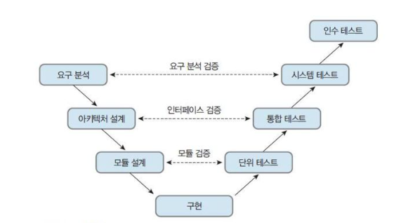

# Chapter08.애플리케이션 테스트 관리
## Section01.애플리케이션 테스트케이스 설계
1. 소프트웨어 테스트
   1) 소프트웨어 테스트의 개념
      * 구현된 소프트웨어의 동작과 성능, 사용성, 안정성 등을 만족하기 위하여 소프트웨어의 결함을 찾아내는 행동
      * 노출되지 않은 숨어잇는 결함(Fault)을 찾기 위해 소프트웨어를 작동시키는 일련의 행위와 절차
      * 오류 발견을 목적으로 프로그램을 실행하여 품질을 평가하는 과정
      * 개발된 소프트웨어의 결함과 문제를 식별하고 품질을 평가하며 품질을 개선하기 위한 일련의 활동
   2) 소프트웨어 테스트의 필요성
      * 오류 발견 관점
      * 오류 예방 관점
      * 품질 향상 관점
   3) 소프트웨어 테스트의 기본 원칙
      * 테스팅은 결함이 존재함을 밝히는 활동이다.
      * 완벽한 테스팅은 불가능하다.
      * 테스팅은 개발 초기에 시작해야 한다.
      * 결함 집중(Defect Clustering)
        - 애플리케이션 결함의 대부분은 소수의 특정한 모듈에 집중되어 존재한다.
        - 파레토 법칙 : 전체 결과의 80%가 전체 원인의 20%에서 일어나느 현상
      * 살충제 패러독스(Presticide Paradox)
        - 동일한 테스트 케이스로 반복 실행하면 결함을 발견할 수 없으므로 주기적으로 테스트 케이스를 리뷰하고 개선해야 한다.
      * 테스팅은 정황(Context)에 의존한다.
        - 정황과 비즈니스 도메인에 따라 테스트를 다르게 수행하여야 한다.
      * 오류-부재의 궤변(Absence of Errors Fallacy)
        - 사용자의 요구사항을 만족하지 못하는 오류를 발견하고 그 오류를 제거하였다 해도, 해당 애플리케이션의 품질이 높다고 말할 수 없다.
   4) 테스트 프로세스
      * 테스트 계획
      * 테스트 분석 및 디자인
      * 테스트 케이스 및 시나리오 작성
      * 테스트 수행
      * 테스트 결과 평가 및 리포팅
   5) 테스트 산출물
      1) 테스트 계획서
         * 테스트 목적과 범위 정의
         * 대상 시스템 구조 파악
         * 테스트 수행 절차
         * 테스트 일정
         * 조직의 역할 및 책임 정의
         * 종류 조건 정의
      2) 테스트 케이스
         * 기능 테스트를 위한 입력 값, 테스트 조건, 기대 결과로 구성된 테스트 항목의 명세서
         * 케이스를 작은 단위로 나누어 각 단위의 입력 값, 테스트 조건, 기대 결과를 기술한다.
      3) 테스트 시나리오
         * 테스트를 위한 절차를 명세한 문서
         * 테스트 수행을 위한 여러 개의 테스트 케이스의 집합으로 테스트 케이스의 동작 순서를 기술한 문서
      4) 테스트 결과서
         * 테스트 결과를 정리한 문서
         * 테스트 프로세스를 리뷰하고, 테스트 결과를 평가하고 리포팅하는 문서
2. 테스트 오라클
   1) 테스트 오라클의 개념
      * 테스트의 결과가 참인지 거짓인지를 판단하기 위해서 사전에 정의된 참 값을 입력하여 비교하는 기법 및 활동
   2) 테스트 오라클의 유형
      1) 참(True) 오라클
         * 모든 테스트 케이스 입력값의 개디 결과를 확인
         * 항공기, 임베디드, 발전소 소프트웨어 등 크리티컬한 업무
      2) 샘플링(Sampling) 오라클
         * 특정한 몇 개의 입력 값에 대해서만 기대하는 결과를 제공해 주는 오라클
         * 일반, 업무용, 게임, 오락 등의 일반적인 업무
      3) 휴리스틱(Heuristic) 오라클
         * 샘플링 오라클을 개선한 오라클로, 특정 입력 값에 대해 올바른 결과를 제공하고, 나머지 값들에 대해서는 휴리스틱(추정)으로 처리하는 오라클
      4) 일관성 검사(Consistency Check) 오라클
         * 애플리케이션 변경이 있을 때, 수행 전과 후의 결과 값이 동일한지 확인하는 오라클
3. 테스트 레벨
   

